#### 10.攻击与防御（Attack and Defence）

* ##### 10.1 概述

  * ##### 动机

    * 应用范围应该更广
    * 应该能够应付来自人类的恶意攻击
    
  * Attack

    * 举例

      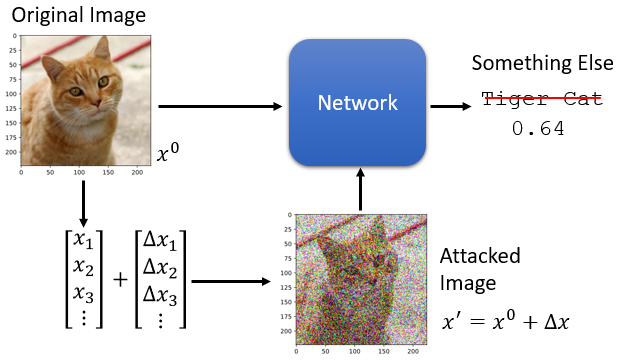

    * Loss Function

      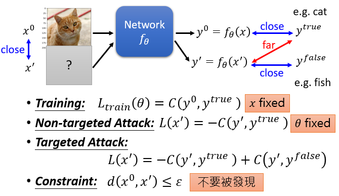

      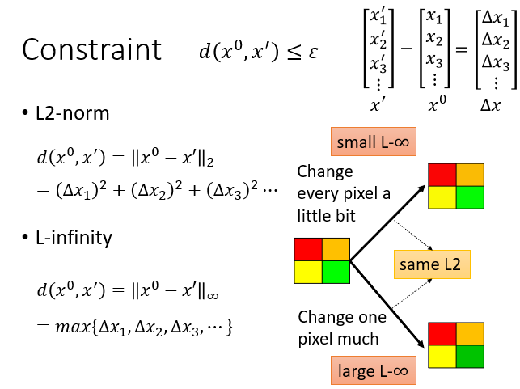

    * 如何攻击

      * 就像训练一个神经网络，但是网络参数 $\theta$ 被输入 x' 代替

        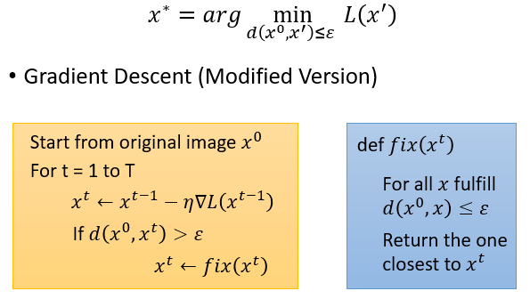

      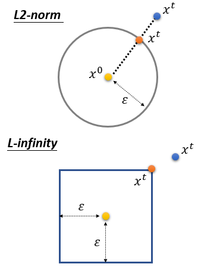

    * 攻击方法

      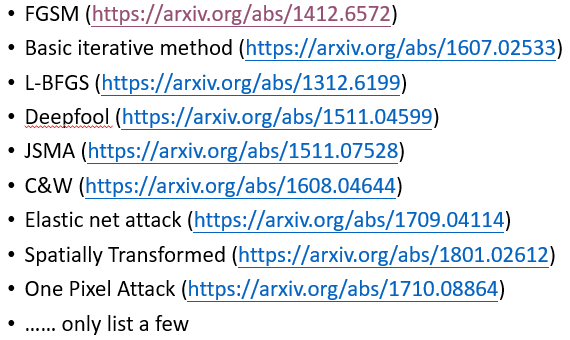

      

    * White Box v.s. Black Box
      * 在之前的攻击中，我们修正网络参数 $\theta$ 是为了找到可选 x'
      * 为了攻击，我们需要知道网络参数 $\theta$
        * 这被叫做白盒攻击
      * 在大多数 on-line API 中无法获取模型参数
      * 黑盒攻击是不可能的
        * 如果你有目标网络的训练资料
          * 训练一个代理网络
          * 使用这个代理网络生成攻击对象
        * 另外，从目标网络中获取输入-输出对
    * 普遍对抗性攻击 Universal Adversarial Attack
      * 对抗性攻击 Adversarial Attack

  * Defence

    * 对抗性攻击不能通过权重正则化、退出和模型集成来防御

    * 两种防御类型

      * 被动防御：不修改模型而找到攻击的图片，异常检测的特殊情况

        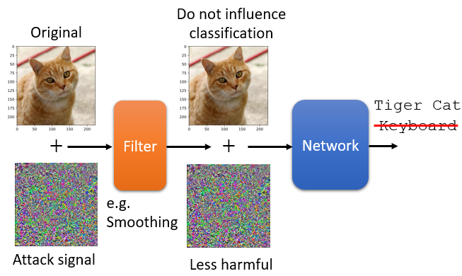

        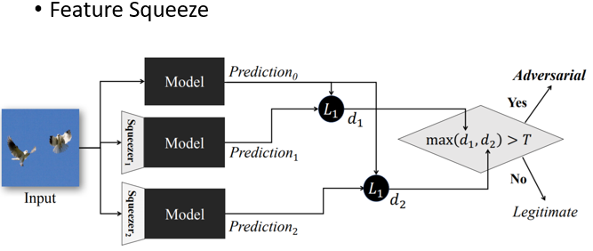

      * 主动防御：对于对抗性攻击具有健壮性的训练模型

        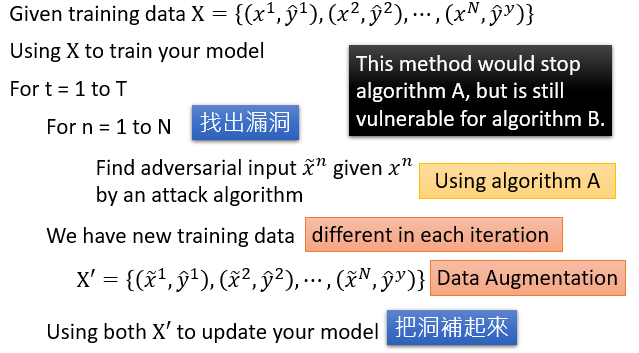

---

* **10.2 对抗性攻击（Adversarial Attack）**
  * Attack on Images

    * one pixel attack

      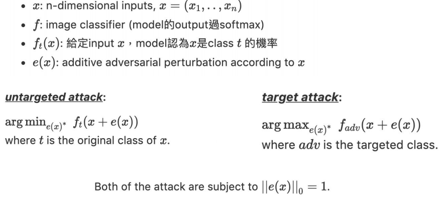

      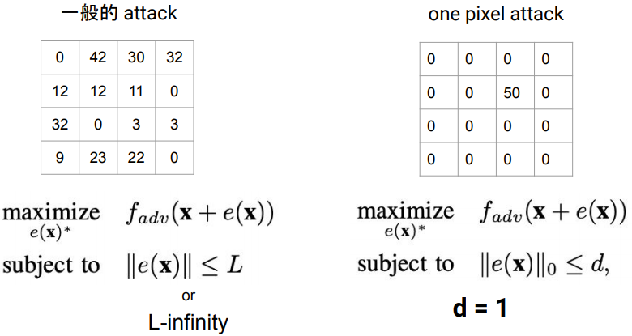

    * 微分进化 differential evolution

      * 更有可能找到全局最优
        * 由于多样性保持机制和使用了一组候选解决方案
      * 从目标系统要求更少的信息
        * 相比 FGSM，DE 不需要算 gradient，因此不需要攻击对象 model 太多的细节
        * 独立于所使用的分类器
      * 步骤
        * Initialize Candidates
        * Select Candidates and Generate
        * Test Candidates and Substitute

  * Attacks on Audio

    * Attacks on ASR

      Automatic Speech Recognition, ASR

      "Good" + "???" = "Hello"

    * Attacks on ASV

      Wake Up Words	~	google home

    * Hidden Voice Attack

      * 心里声学

        * 研究人對於聲音的感知程度跟反應
        * 感知極限：人只能聽到 20 Hz (0.02 kHz) 到 20,000 Hz (20 kHz) 範圍的波段
        * 聲音定位：人藉由雙耳所聽到的聲音的時間差或是響度差來辨識出聲音的方位

      * 摄动 Perturbation

        * Time Domain Inversion(TDI)

          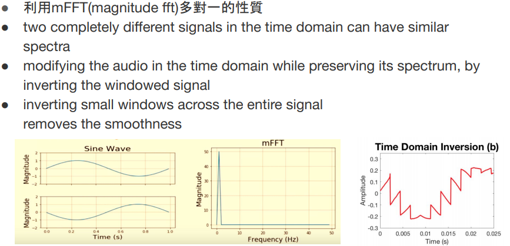

        * Random Phase Generation(RPG)

          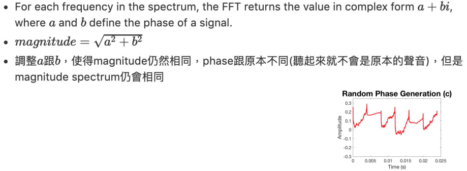

        * High Frequency Addition(HFA)

          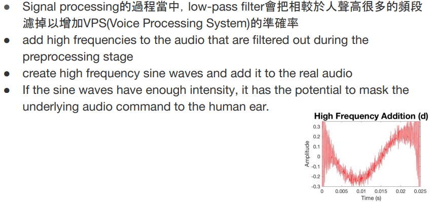

        * Time Scaling(TS)

          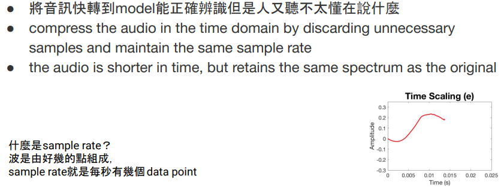

