#### 13.半监督学习（Semi-supervised Learning）

* ##### 13.1 概述

  * 监督学习 (Supervised Learning)

    * $\{(x^r, \widehat{y}^r)\}^R_{r=1}$
    * $E.g.x^r:image, \widehat{y}_r:class\ labels$

  * 半监督学习

    * $\{(x^r, \widehat{y}^r)\}^R_{r=1}, \{x^u\}^{R+U}_{u=R}$
    * 定义
      * 一组未标记的数据，通常为U >> R
      * 转导学习 : 未标记数据为测试数据
      * 归纳学习 : 未标记数据不是测试数据
    * 性质
      * 收集数据是容易的，但是收集带“标签”的数据代价是很大的
      * 在生活中，我们都在做半监督学习

---

* **13.2 模型**

  * 生成模型的半监督学习(Semi-supervised Learning for Generative Model)

    * 给带标签的训练例子  $x^r \isin C_1, C_2$

      * 寻找最可能的先验概率 P(C_i) 和 基于类别的概率 P(x|C_i)
      * P(x|C_i) 是一个通过 u^i 和 $\sum$ 的高斯参数化

    * 步骤

      * 初始化：$\theta = \{{P(C_1), P(C_2), \mu^1, \mu^2, \sum}\}$

      * 第一步：计算未带标签数据的后验概率 $P_{\theta}(C_1|x^u)\ (取决于模型 \theta)$ 

      * 第二部：更新数据
        $$
        P(C_1) = \frac{N_1 + \sum{_{x^u}}P(C_1|x^u)}{N} \\
        \mu^1 = \frac{1}{N_1}\sum_{x^r \isin C_1}x^r + \frac{1}{\sum_{x^u}}P(C_1|x^u)x^u ...
        $$
        N : 例子的总数量

        N_1 : 属于 C_1 的例子数量

    * 分析

      * 该算法收敛，但是初始化影响结果

        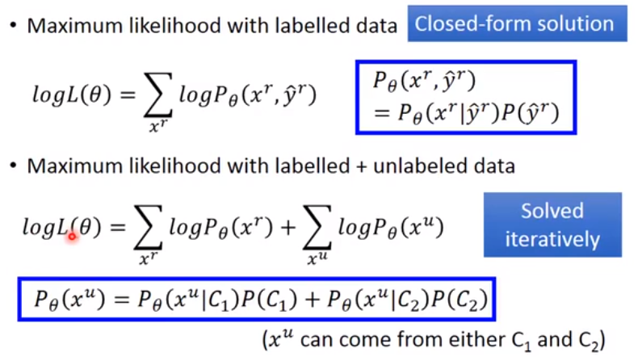

  * 低密度分离的假设 (Low-density Separation Assumption)【“非黑即白”】

    * 自我训练

      * Give

        * 带标签的数据：$set = \{(x^r, \widehat{y}^r)\}^R_{r=1}$
        * 不带标签的数据：$set = {x^u}^{R+U}_{u=l}$

      * Repeat

        * 来自带标签数据 set 的训练模型 f^*(独立于模型)

        * 添加 f^* 到未带标签的数据 set

          获取 $\{(x^u, y^u)\}^{R+U}_{u=l}$ (Pseudo-label)

        * 从未带标签的数据 set 中删除一组数据，然后将他们添加到带标签的数据 set

      * 类似生成模型的半监督学习

      * Hard label v.s. Soft label

        考虑使用神经网络

        $\theta^*$ (网络参数) 来自代表数据

    * 熵正则 （Entropy-based Regularization）

      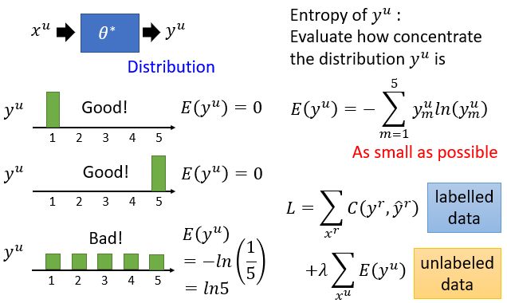

    * Semi-supervised SVM

  * 平滑的假设 (Smoothness Assumption) 【“近朱者赤，近墨者黑”】

    * 定义

      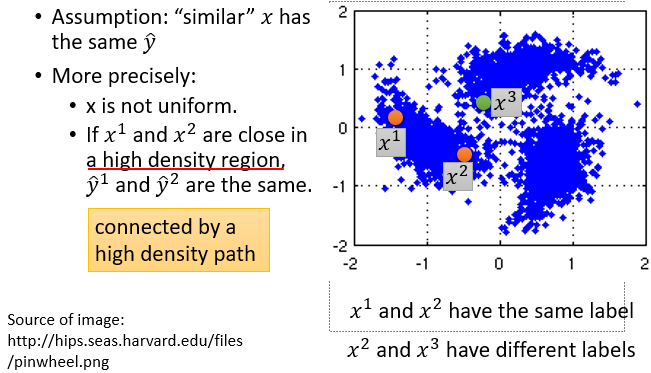

    * 方法

      * 集群然后标记（Cluster and then Label）

      * 基于图的方法（Graph-based Approach）

        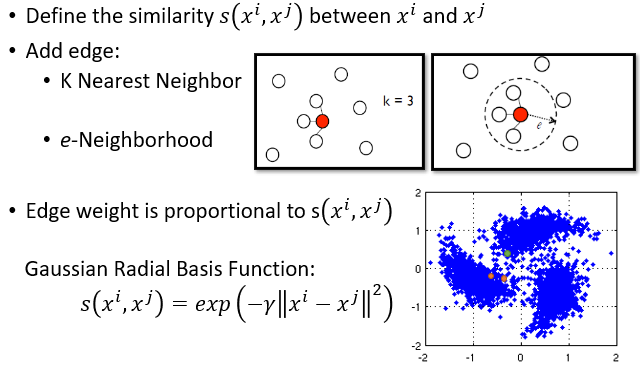

        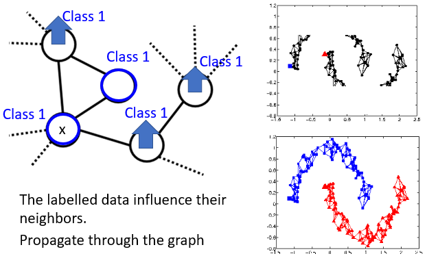

        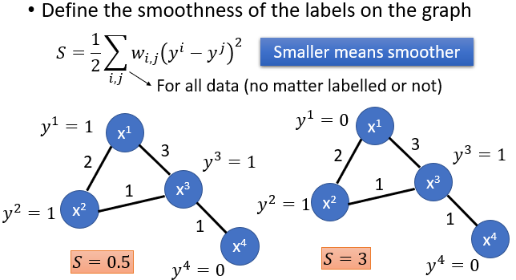

        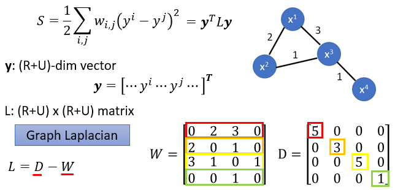

        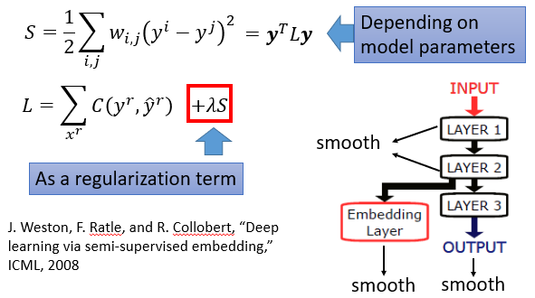

  * 更好的表现 (Better Representation) 【“去芜存菁，化繁为简”】

    * 找到一个更好的（例子）代表从未标记的数据中
    * 初试的代表
    * 更好的代表

---

* **13.3 Putting Words into Computers**

  * 类比

    * 1-of-N Encoding

      apple      = [1 0 0 0 0]

      bag          = [0 1 0 0 0]

      cat           = [0 0 1 0 0]

      dog          = [0 0 0 1 0]

      elephant = [0 0 0 0 1]

    * Word Class

      class 1 : dog, cat, bird

      class 2 : ran, jumped, walk

      class 3 : flower, tree, apple

    * Woed Embedding

      每个词汇都用向量表示

    * 一组词可能有多种意思
    * 更符合实际的词嵌入 （Contextualized Word Embedding）
      * 每个工作标记都有自己的嵌入 (即使它有相同的单词类型)
      * 单词标记的嵌入也取决于它的上下文

  * 语言模型中的嵌入 (Embeddings from Language Model, ELMO)

    * 基于 RNN 的语言模型（通过大量的句子训练）

    * 在深度 LSTM 中每层都能生成一个潜在的表示

      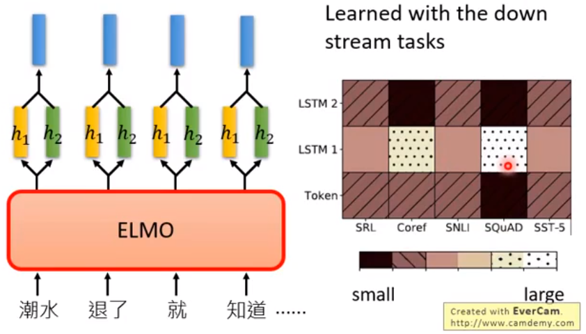

  * 来自转换器的双向编码器表示 (Bidirectional Encoder Representations from Transformers, BERT)

    * Transformer Encoder

    * 定义

      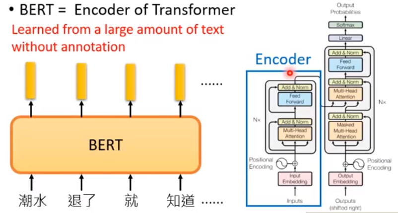

    * BERT 的训练
      * 法一：Masked LM
      * 法二：Next Sentence Prediction
        * [SEP] : the boundary of two sentences
        * [CLS] : the position that outputs classification results
      * 法一和法二同时使用
    * 如何使用 BERT
      * Case 1 
        * 输入：单个句子
        * 输出：类
        * 举例：情绪分析、文档分类
      * Case 2
        * 输入：单个句子
        * 输出：每组词的分类
        * 举例：Slot filling
      * Case 3
        * 输入：两个句子
        * 输出：类
        * 举例：自然语言
      * Case 4
        * 基于提取的问题回答 (QA)
        * 阅读理解
    * 通过知识集成增强表示 (Enhanced Representation through Knowledge Integration, ERNIE)
      * 为中文设计
      * BERT
      * ERNIE

  * 生成训练 (Generative Pre-Training, GPT)

    * Transformer Decoder

      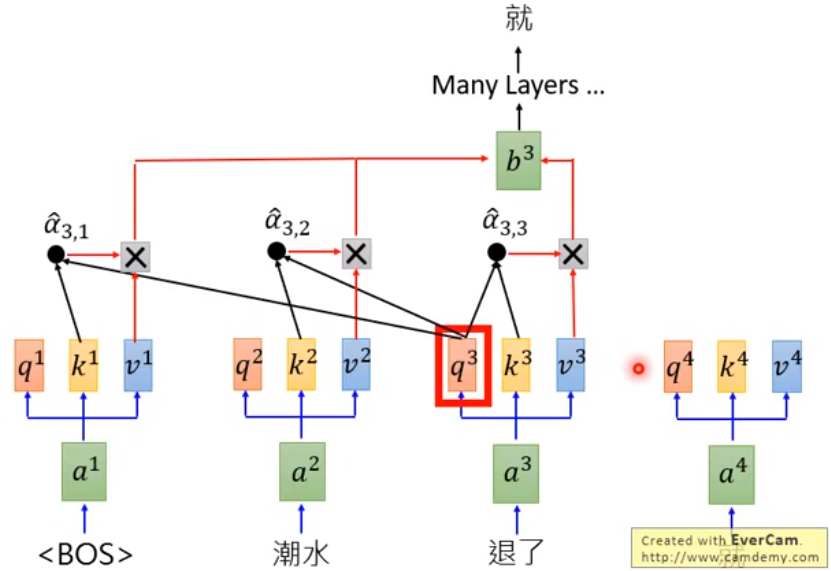

    * 应用
      * 综合阅读
      * 总结
      * 翻译

