#### 20.终身学习（Life Long Learning, LLL）

* ##### 20.1 概述

  * 定义

    * 不断学习
    * 永不停止学习
    * 增量学习

  * 重点

    * Knowledge Retention

      * but NOT Intransigence

      * Catastrophic Forgetting 灾难性的忘记

        * 多任务训练能解决问题

          * 使用所有的数据来训练  ->  计算问题
          * 始终保存数据  ->  存储问题

        * Elastic Weight Consolidation (EWC)

          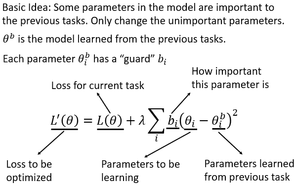

          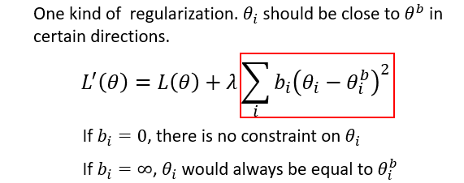

      * Generating Data

        

    * Knowledge Transfer

      * 为每一个任务训练一个模型

        * 知识不能转换处理其他任务

        * 最终我们不能存储所有的模型

          

      * Gradient Episodic Memory (GEM)

        

    * Model Expansion

      * but Parameter Efficiency

      * Progressive Neural Networks

        

      * Net2Net

        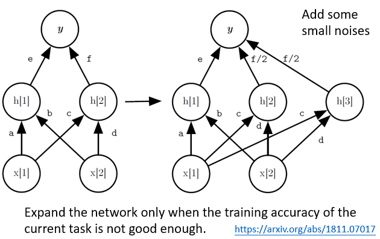

---

* **20.2 More About Life Learning**

  * Hebbian Theory

    * 长期增强效应 Long-term Potentiation (LTP)

      * 学习和记忆通常被认为是通过突触强度的变化而起作用的
      * LTP 与构成、强化学习和记忆有关
      * 突出可塑性说明突触强度是会改变的
      * 例子：透过长期高频率的刺激让突触强度增强的现象

    * 赫布理论 Hebbian Theory

      * 解释了在学习过程中脑神经所产生的变化的神经科学理论

      * 突出可塑性：突出前神经元向突出后神经元的持续重复刺激，可以导致突出传导效能的增加

      * 在 NN 中，可将神经突出间传导作用的变化看作是 weight 的变化
        $$
        \large w_{ij} = x_ix_j\\
        \large w_{ij} : weight\ between\ node\ j\ and\ node\ i\\
        \large x_i : input\ of\ node\ i \\
        \large or \\
        \large w_{ij} = \frac{1}{p} \sum^p_{k=1}x^k_ix^k_j \\
        \large p : number\ of\ training\ patterns
        $$
      
    * Competitive Hebbian Learning
    
      * 非监督学习，input 传入后，神经元群体会竞争对外界刺激的反应能力
      * 竞争取胜的神经元的 weight 变化对这个刺激模式竞争更为有力的方向进行
      * 任何时候的 output layer 的神经元中有恰好一个是 active（output 最大者）
      * 只有一个 active：适合用于 classification 和 clustering
    
  * 知识蒸馏 Knowledge Distillation

    * 训练 model 和使用 model 的需求不同
      * 训练时想达到好成效的方法：
        * 利用多种不同的方法、再平均各方法的结果
        * 单一模型使用大量的 dataset
      * 使用时期望：
        * real-time
        * computation 越少越好
    * 结论
      * 可由大 model 产生的 soft target 当成小 model 的 ground truth 训练小 model
      * 而 soft targets 含有更高的咨询量，故能使小 model 用更少的样本、更大的 learning rate 去学到接近大 model 的表现

  * Memory Aware Synapses : Learning what (not) to forget (MAS)

    * 概念

      过去包含EWC等论文，importance的定义通常和参数改变对loss
      的敏感程度相关，而MAS则有所不同：
      $$
      \large F_{(X_K;\theta+\delta)}-F(x_k;\theta)\approx\sum_{i,j}g_{ij}(x_k)\delta_{ij}
      $$
      上式中的 F 为此 model 训练出的学习函数；$x_k$ 为 input 的点；$\theta$ 为此 model F 的各个参数；$\delta$ 为微小的参数改变

      根据泰勒展开的公式，可完成上面的简化：
      $$
      \large g_{ij}(x_k)=\frac{\partial(F(x_k;\theta))}{\partial \theta_{ij}}
      $$
      意思为：改动参数对「model 自己学得 learning function」影响是否敏感

      根据计算上的方便和后续推展（左右都取 L2-square）：
      $$
      \large g_{ij}(x_k)=\frac{\partial[l^2_2(F(x_k;\theta))]}{\partial \theta_{ij}}
      $$
      对 Scalar 加总比对 vector 加总容易处理，而其重要性权重为：
      $$
      \large \Omega=\frac{1}{N}\sum^N_{k=1}||g_{ij}(x_k)||,N 为所有点的数量
      $$
      最终可得到：
      $$
      \large L(\theta)=L_n(\theta)+\lambda \sum_{i,j}\Omega(\theta_{ij}-\theta^*_{ij})^2
      $$

    * 联系 Hebbian Learning

      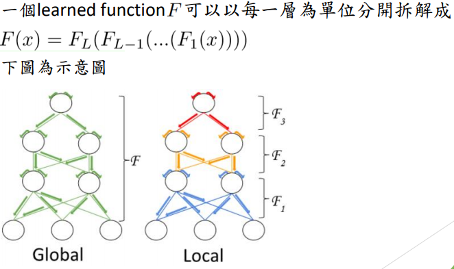

  * Learning without Forgetting (LwF)

    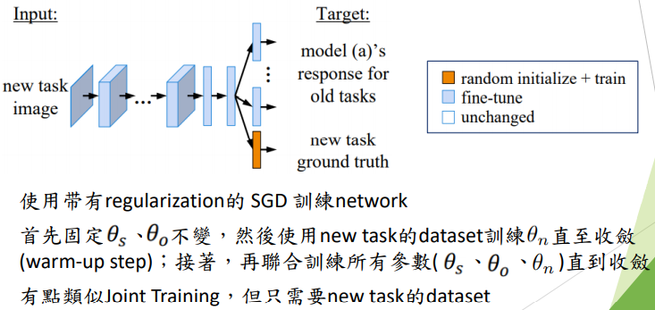

    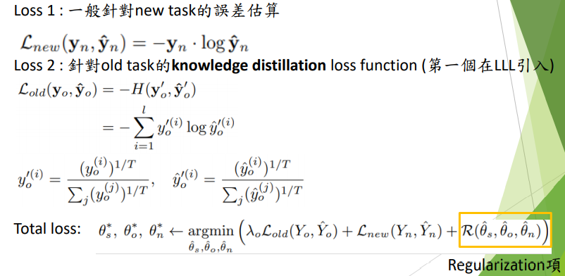

    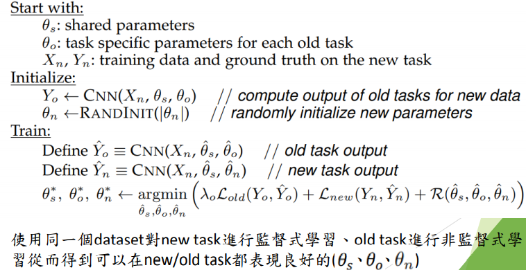

  * Large Scale Incremental Learning (BiC)

    * 概念

      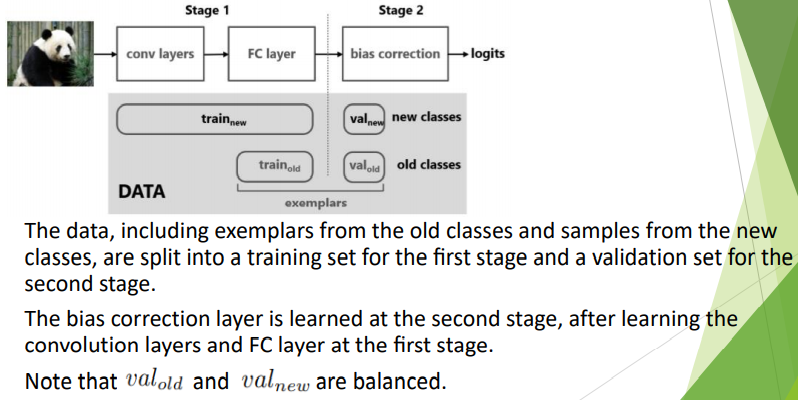

      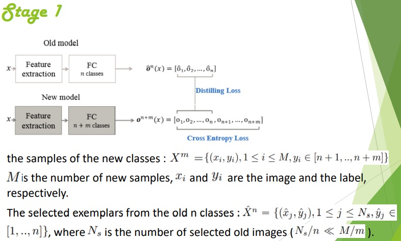

      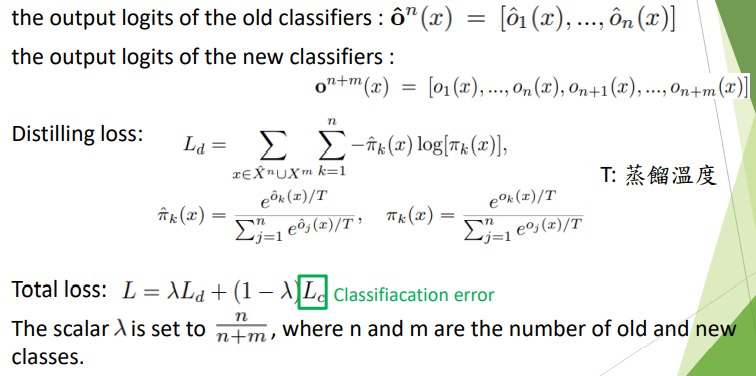

      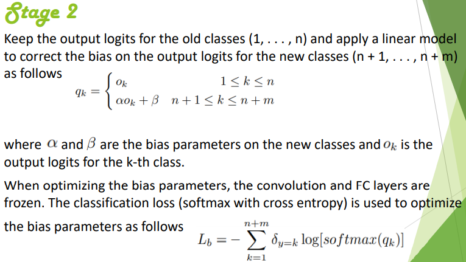

      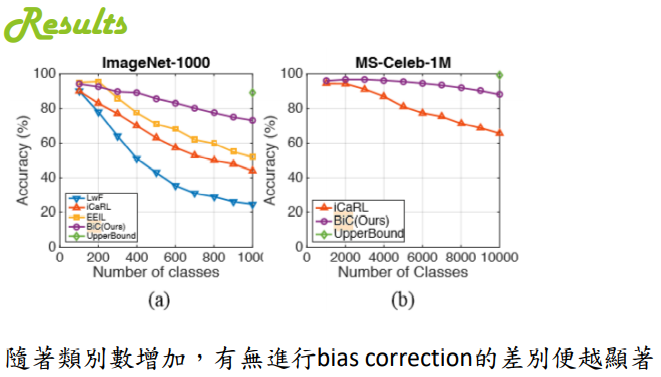

    * Few-Shot Class-Incremental Learning (FSCIL)

      * 此方法也是为了解决 new/old class imbalance 的问题，而其作用在小样本上，因此不平衡的情况会很严重（倾向于样本多的数据）
      * 以Neural gas（NG）取代 knowledge distillation，认为后者最主要的问题在于 new/old task 的不平衡，且 distilling loss 和 classification loss 会彼此影响

  * LLL Nowadays & Future

    * 目前 LLL 相关研究普遍还是以学术为主，商业方面近乎没有
    * 也许未来会因为对调节大规模信息量的model有所需求而
      使这项技术被业界所关注等等也不一定

