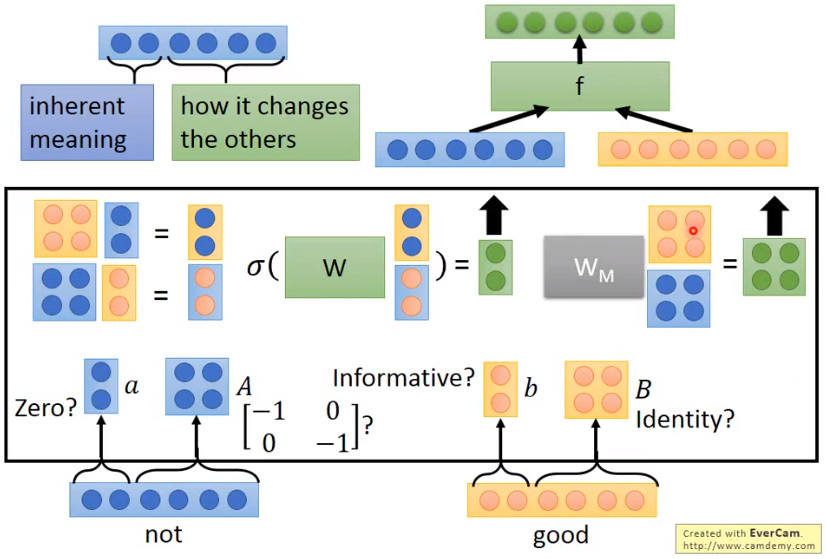

#### 5.递归神经网络（Recursive Neural Network, RNN）

* ##### 5.1 Recursive Structure

  * Application : 情绪分析 Sentiment Analysis

    

  * Recursive Model

    

    

  * 递归神经张量网络 Recursive Neural Tensor Network

    

  * 矩阵向量递归网络 Matrix-Vector Recursive Network 

    * Performance 较差

      

  * Tree LSTM

    

