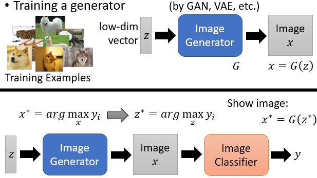

#### 9.可解释机器学习与可解释人工智能（Explainable Machine Learning and Explainable Artficial Intelligence, Explainable ML and Explainable AI）

* ##### 9.1 Explainable/Interpretable ML

  * 概述

    * Local Explanation

    * Global Explanation

      

    * 用机器来协助判断履历

    * 用机器协助判断罪犯是否可以假释

    * 金融相关的决策常常依法需要提供理由

    * 模型诊断：到底机器学到了什么

  * Interpretable v.s. Powerful

    * 有些模型本质上是可解释的，例如：线性模型（体重、其他特点）
    * 深度网络是很难去解释的，因为它是一个黑盒，我们不使用它，但是它比线性模型更有用，所以我们应该让深度网络变成可解释的
    * Decision tree ：可解释、功能更强大

  * Local Explanation : Explain the Decision

    * 定义
      * Object x 	~	 Components : {x_1, ..., x_n, ..., x_N}
      * 我们想知道做决定时每个因素的重要性
      * Idea : 删除或修改影响因素的值，观察决定的变化
      * 大的决定变化    ~    重要的影响因素
    * 梯度限制的基本方法
      * 梯度饱和
      * 集成梯度
    * 对抗性解释

  * Global Explanation : Explain the whole Model

    * 激活最大化 (Activation Maximization)

      Input ~ Convalution ~ Max Pooling ~ Convalution ~ Max Pooling ~ Flatten ~ y_i (Digit)

      $\large x^* = arg\ max_x\ y_i$

      

  * “Regularization” from Generator

    

  * Using a model to explain another

    * 一些模型很容易被解释

    * 使用可解释的模型模仿不可解释的模型

    * 线性模型无法模仿神经网络，然而它能模仿一个 local region

      

    * Local Interpretable Model - Agnostic Explanations (LIME)

      

    * LIME - Image

      

      

      

    * Decision Tree - Tree regularization

      

---

* **9.2 Explainable AI**
  
  * 解释一个训练模型：共同的工具和应用
    * 属性 Attribution
      * Local v.s. Global attribution
        * Local attribution
        * Global attribution
          * 属性汇总输出
          * 实现：层间相关性传播 (Layer-wise relevance propagation, LRP)
            * 定位直接父节点
            * 计算贡献
            * 重新分配的输出
            * 向后传播直到到达输入
        
      * 完整性 Completeness
  
        * Flexible baseline - Integrated gradient
  
          * 似乎是复杂的，事实上实现比 DeepLIFT 更容易
  
          * 但是更慢
            $$
            \large (x_i - \widehat{x_i}) · \int ^1_{\alpha} \frac{\part S_c(\widehat{x})}{\part(\widehat{x_i})}|_{\widehat{x}=\widehat{x}+\alpha(x-\widehat{x})} {\rm d}\alpha
            $$
  
        * Fixed-0 baseline - LRP when no bias
  
        * Attributions sum up to current output - baseline output
  
        * Sensitivity-n 
  
      * 评价 Evaluation
  
        * 重心
        * 累积分数
  
    * 探索 Probing
  
      * Background
        * BERT architecture
        * BERT training
          * 标记语言模型
          * 预测下个句子
      * BERT 
        * learn
          * Probing tasks
          * Classifier - Edge probing technique
        * not learn
          * 探测任务 : 无监督选区解析
      * Good prob
        * 线性分类器：不是所有的信息都是线性可分
        * 多层感知器：也许这只是学习下游任务的探索模式
      * Bad prob
        * 太大的容量
      * Selectivity (higher is better)
  
    * 热图 Heatmap
  
      * Activation map : CNN dissection
        * 概念 : 对象，部件，场景，纹理，材料和颜色
        * 数据集 : Broden(发布)
          * 像素级概念标签
          * CNN 训练在大型分类数据集 (例如: ImageNet)
          * 使用 Broden 数据集进行评估
      * Attention map
        * 方法 : 计算注意与归因之间的相关性
        * 获取的信息
          * When encoder is DNN → Attention is explanation
          * When encoder is contextualized → Unclear
            * 首先可以通过Guided-DNN框架验证注意的有效性
            * 与统一 Attention 相比
          * Relation with classic attribution methods → Unclear
          * Further reading:
            * 关于 Transformers 的可识别性
            * TLDR : 尽管情境化的 self-attention，来自原始输入的身份仍然存在
          * Implying attention is explanation for transformer
  
  * 创建一个可解释模型：重点在 CNN
  
    * 解释 CNN 有些困难
      * Activation map 在最后几层是复杂的
      * 有意义地可视化一个类别并不容易
    * 限制激活地图 Constraining activation maps
      * 在最后一层，将激活映射规则化为一些模板
      * 以复杂信息理论为基础，设计复杂信息的损失模型
      * 直观
    * 编码优先 Encoding prior
      * 判别模型 : 典型CNN
      * 生成模型
      * 生成 CNN
        * 现在 logit 直接包含先前的信息
        * Forward: Classifier
        * Backward: Image generator
      * 对抗训练 (Adversarial training)，编码优先
        * 利用攻击技术进行数据扩充
        * 没有理论，只有成功的经验

