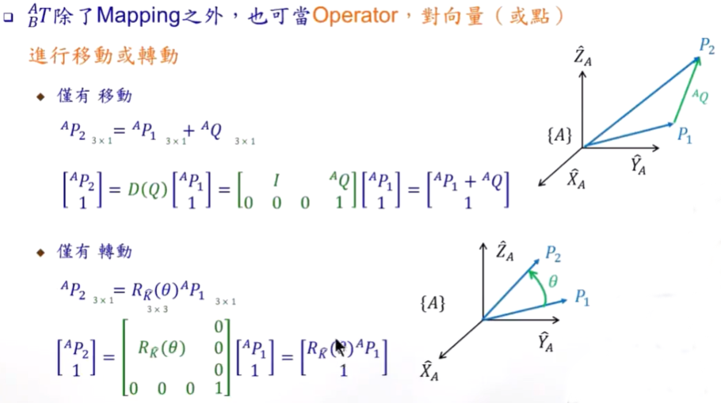
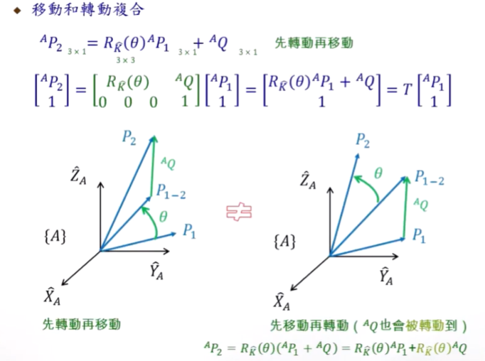
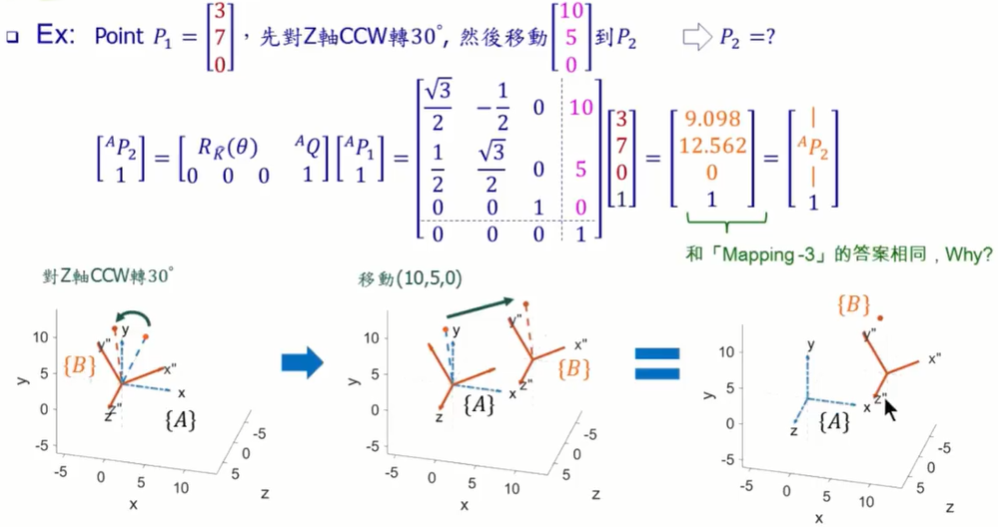
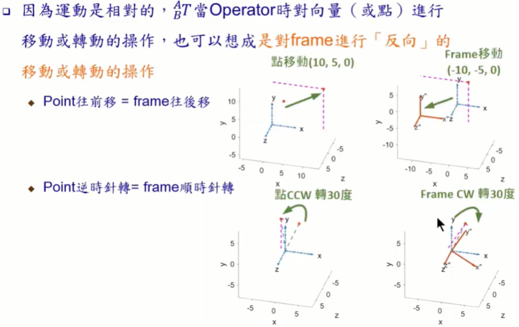
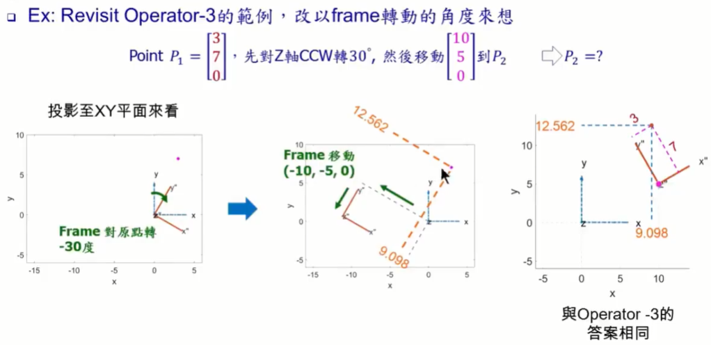
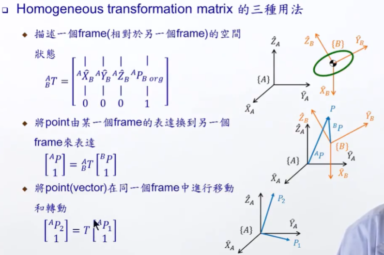
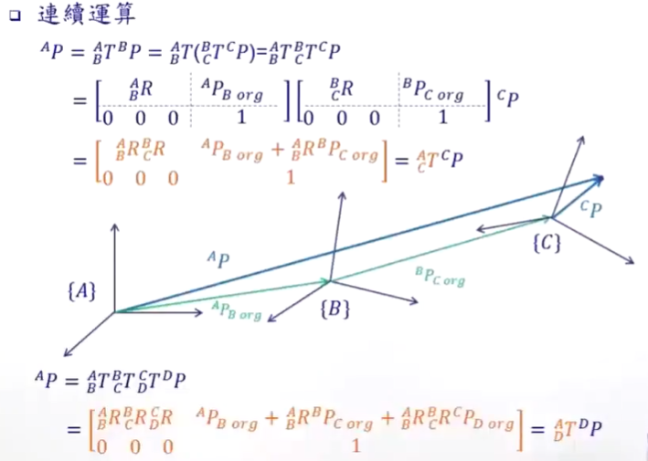
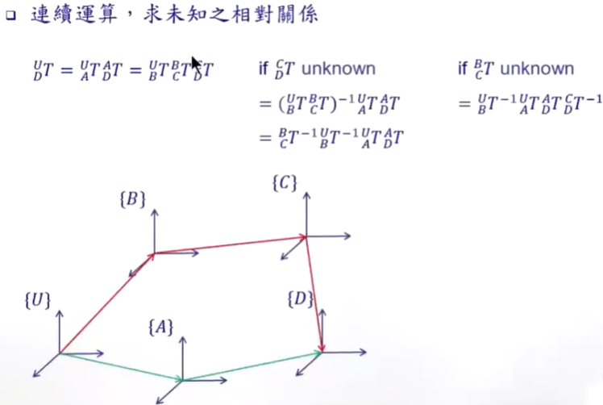
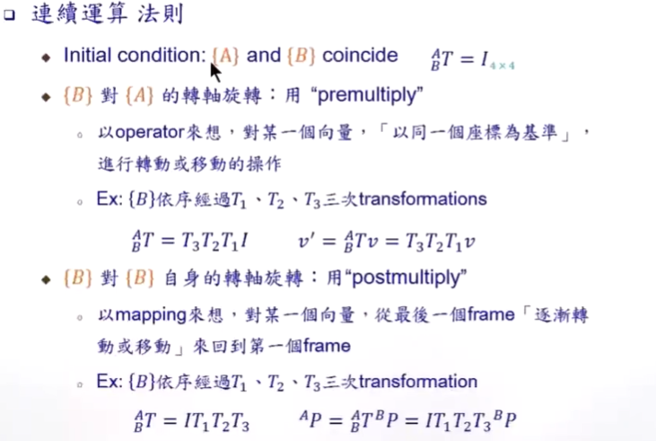

#### 3.变换矩阵（Transformation Matrix）

* ##### 3.1 概述

  * 操作 Operators

    * 整合

      
  
      
  
      
  
    * 图解
  
      
  
      
  
    * 小结

      

  * 运算

    * 反矩阵

      
    
    * 连续运算
    
      
    
      
    
      
    
      

