#### 5.机械手臂-逆向运动学（Manipulator Inverse Kinematics）

* ##### 5.1 概述

  * 比较

    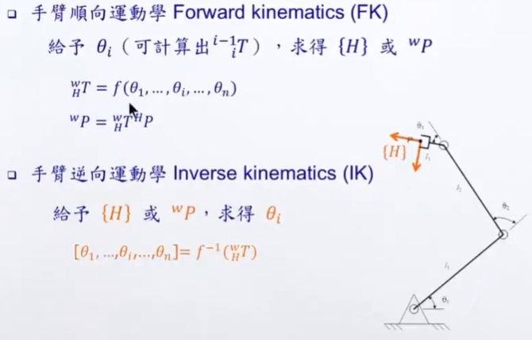

  * 求解概念

    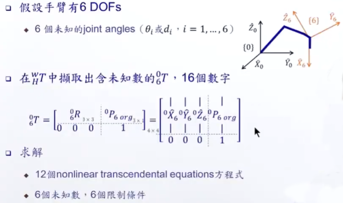

    

    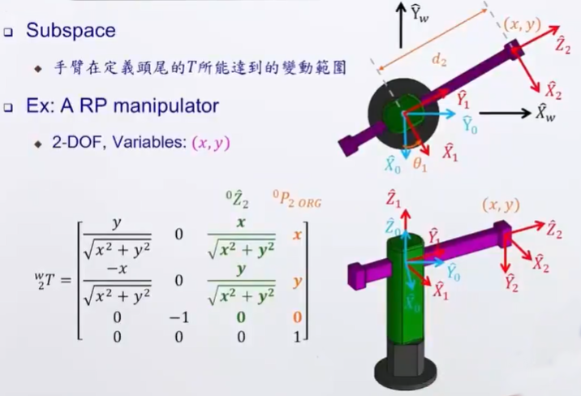

  * 多重解

    * 解的数目

      

    * 举例：PUMA (6 ratational joints)

      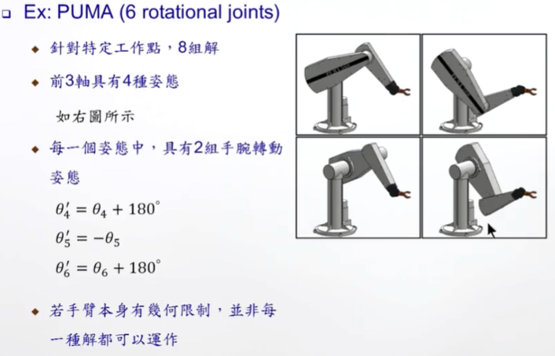

    * 若具有多重解，解的选择方式
      * 离目前状态最近的解
        * 最快
        * 最省能
      * 避开障碍物

  * 求解方法（Closed-form solutions）

    * 解析法（Closed-form solutions）
      * 用代数 algebraic 或几何 geometric 方法
    * 数值法（Numerical solutions）
    * 目前大多数机械手臂设计成具有解析解
      * Pieper's solution：相邻三轴相交的一点
      
    * 举例：A RRR Manipulator

      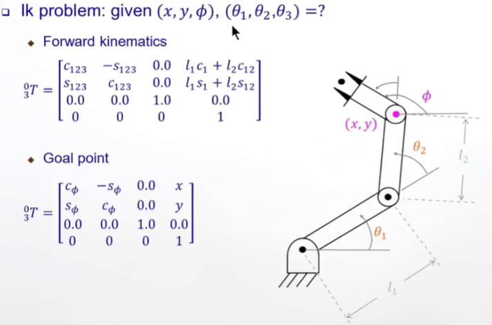

      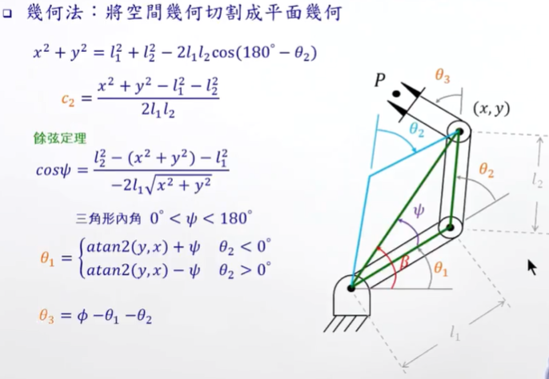

      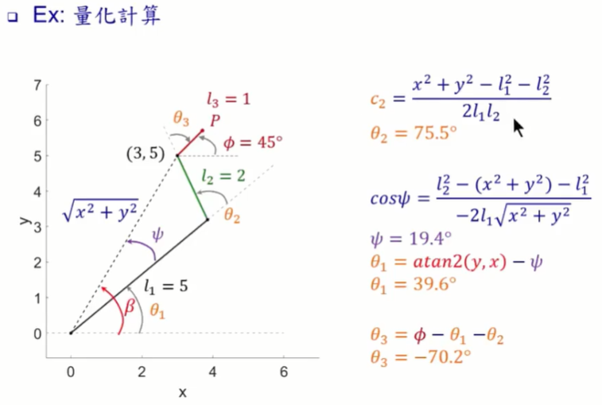

      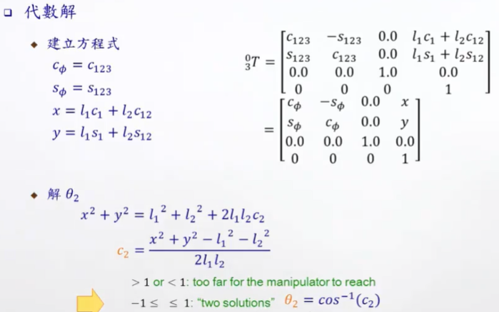

      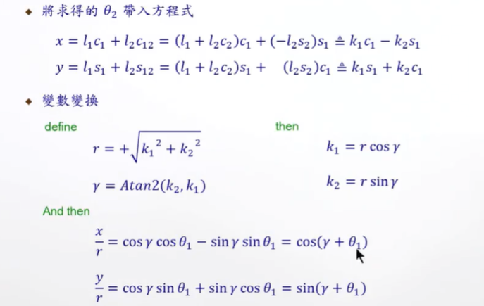

      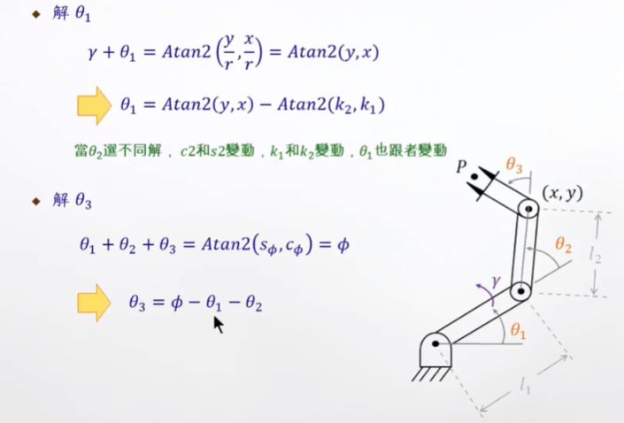

  * 三角方程式求解（万能法）

    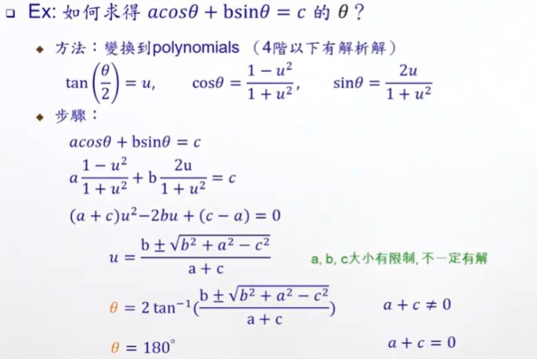

---

* **5.2 应用**

  * Pieper's Solution

    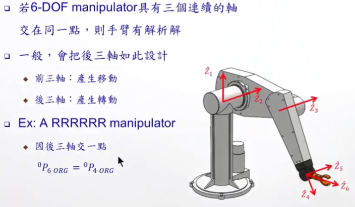

    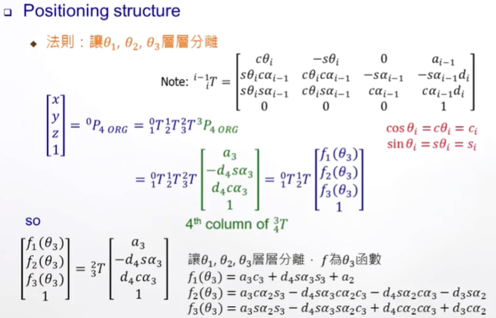

    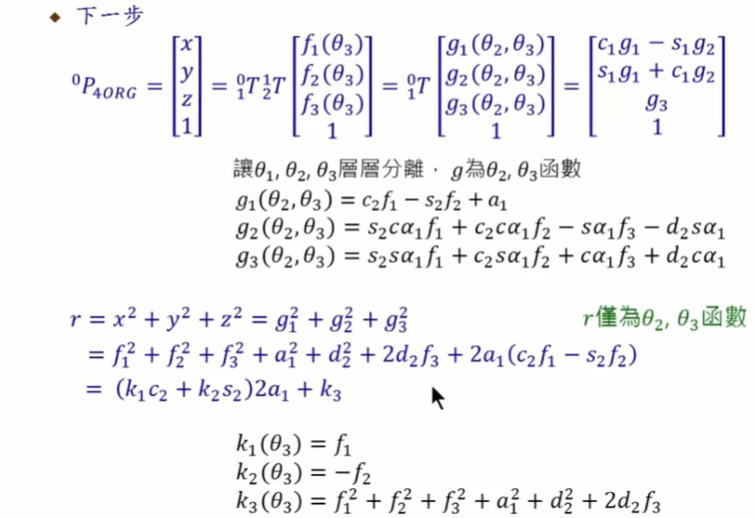

    

    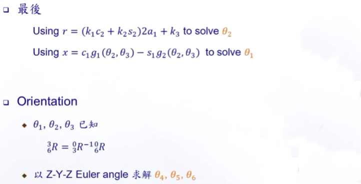

  * 坐标

    * Base, wrist, tool, station, and goal frames

    * 物件取放任务

      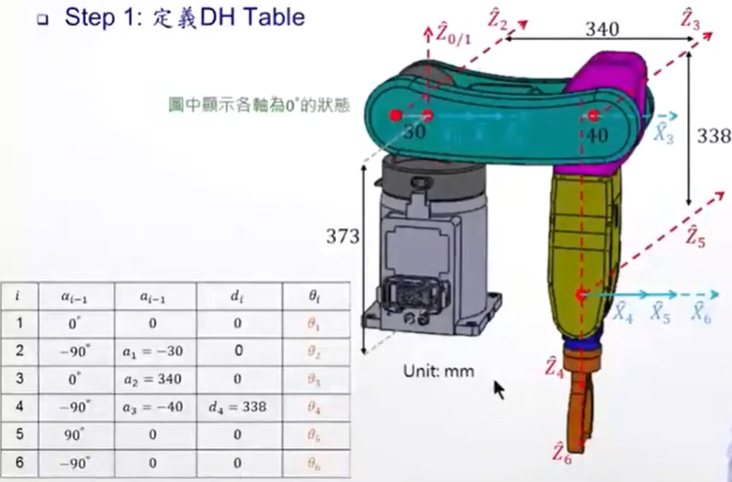

      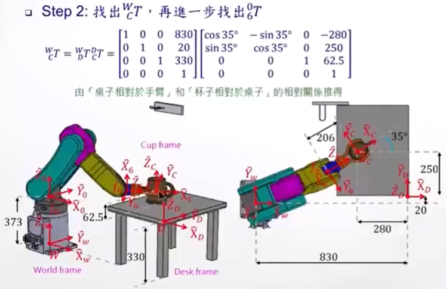

      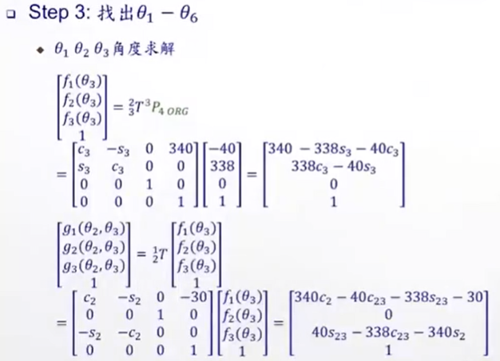

      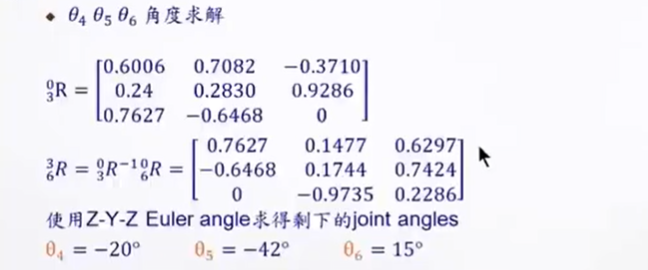

