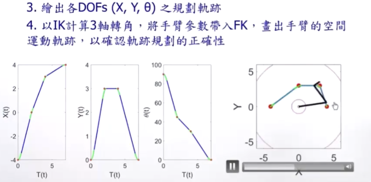

#### 6.机械手臂-轨迹规划（Manipulator Trajectory Planning）

* ##### 6.1 引言

  * 轨迹

    

    
  
  * 轨迹规划
  
    * Joint-space 下的轨迹规划
  
      
  
    * Cartesian-space 下的轨迹规划
  
      

---

* 6.2 轨迹规划架构

  * Cubic Polynomials

    * Cubic Polynomials 说明

      

      

      

      

    * 多段 Cubic Polynomials

      

      

      

      

      

    * General Cubic Polynomials

      

      

      

    * 举例：A RRR Manipulator

      

      

      

    * High-order Polynomials

      

  * Linear Function with Parabolic Belends

    * Linear Function with Parabolic Belends 说明

      

      

      

      

      

    * 多段 Linear Function with Parabolic Belends

      
      
      
      
      
      
      
    
    * Linear Function with Parabolic Blends 注解
    
      * 真实系统中可达到的加速度 $\theta$ 取决于许多因素
    
        * 马达规格
        * 手臂姿态：手臂在不同姿态下，各轴所需承载（如重力）的扭力不同
        * 手臂动态状态：手臂在不同动态下，各轴需承载惯性力不同
    
        
    
      * 规划后轨迹并未通过 via points
    
        * 仅加速度 -> ∞ 的轨迹有通过 via points
        * 如果通过 via points 为必须 -> 建立 pseudo via points，让原本 via points 落在 linear 段上，就会通过
    
        
    
      * 若有 Cartesian space 下直线轨迹的需求，轨迹规划需在 Cartesian space 下进行
    
      * Programming 里，仔细定义好某时间 t 所属的线段或曲线段
    
        
    
  * Cartesian Space 下轨迹几何限制
  
    
  
  * 举例：Revisit the RRR Manipulator
  
    
  
    
  
    
  
    

