#### 7.机械手臂-轨迹规划实例（Manipulator Trajectory-Planning Example）

* ##### 7.1 实例

  * 任务概述

    * Revisit 物件取放任务之情景：机械手臂夹住放在桌子上的杯子，移动手臂将杯子挂到墙上的杯架

    * 在IK 的课程中，练习以 IK 计算 RRRRRR 手臂在任务起点 C 的 6 个转角（joint angles），让手臂能顺利夹住杯子
    * 任务：规划手臂 将杯子从桌面拿起到放上杯架 间的整段轨迹
    * 辅助条件：加上两个 via points
      * 垂直拿起杯子一小段距离
      * 到达杯架前，调整到适当姿态，让杯子能顺利放上杯架

  * 条件设定

    * 设定 1：清楚定义杯子 cup 在各点（P_{0-f}）的时间、坐标位置及姿态

      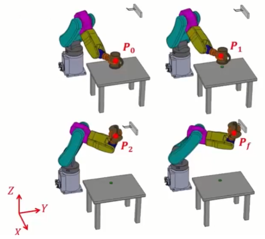

    * 设定 2：整理成总表以利后续轨迹规划

      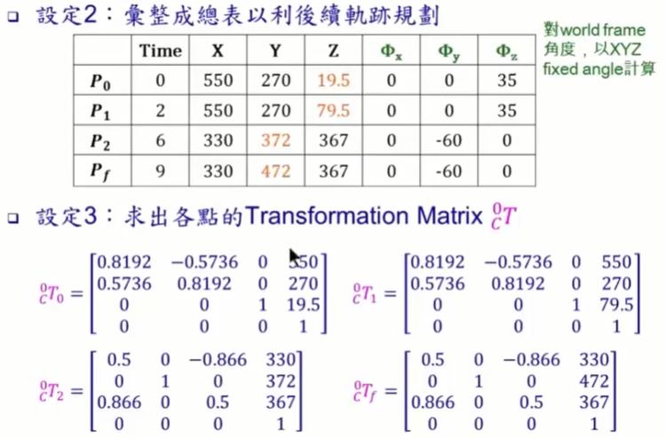

    * 设定 3：求出各点的 Transformation Matrix $^0_CT$​

      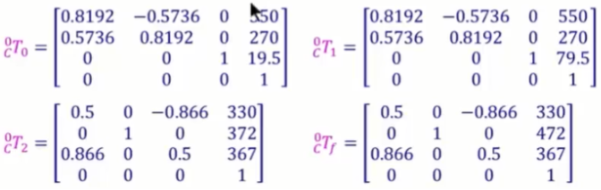

    * 设定 4：求出各点的 Transformation Matrix $^0_6T$​

      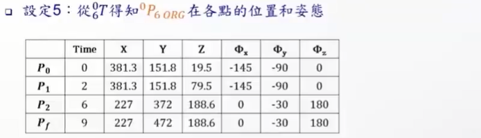

    * 设定 5：从 $^0_6T得知^0P_{6\ ORG}$​ 在各点的位置和姿态

      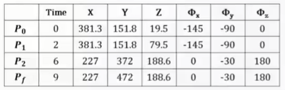

  * 解决方案

      * 方法一：以 Linear function with parabolic blends 在 Cartesian-space 下规划轨迹

        * 步骤 1：$求出 ^0P_{6 ORG}在各DOF(X, Y, Z, \Phi_x, \Phi_y, \Phi_z)每段的速度及加速度$ 

          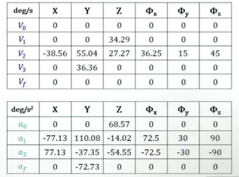

        * 步骤 2：建立并画出各 DOF 在每个时间区段轨迹

          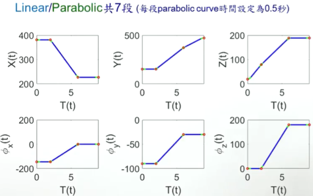

        * 步骤 3：以 IK 解出轨迹上所有设定点 & 轨迹内插点的 6 轴转角 $^0P_{6ORG}$​​ 在各设定点的位置和姿态

          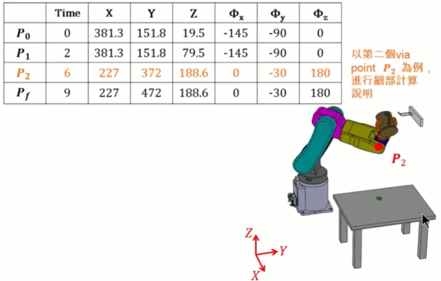

          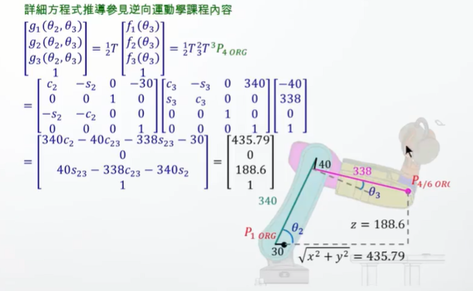

          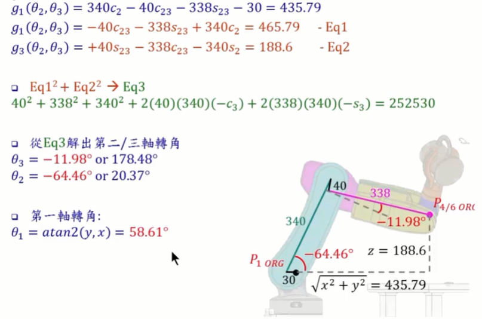

          

          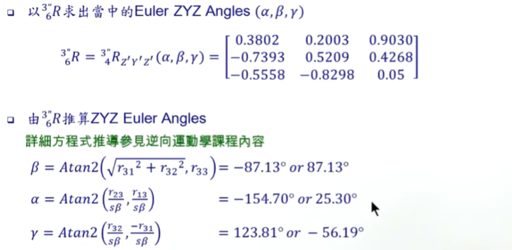

          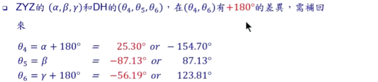

        * 步骤 4：将解出设定点 & 轨迹内插点的 6 轴转角各自对时间化成轨迹图（附注：在 joint space 下的轨迹不再是直线，但依然 smooth）

          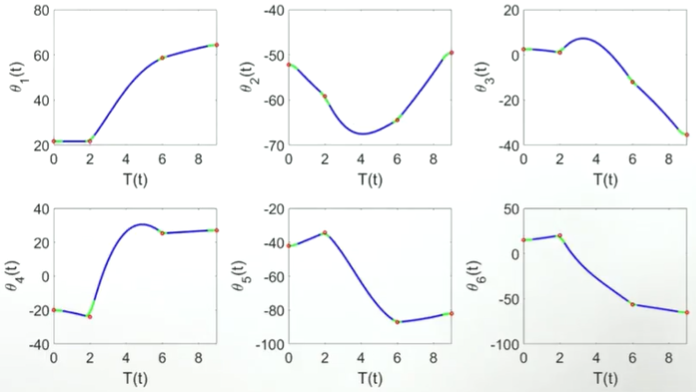

        * 步骤 5：将转角带入 FK，绘出杯子 $^0P_{C\ ORG}$ 的坐标及姿态，以确认轨迹规划正确性（同样以第二个 via point P_2 为例，进行细部计算说明）​​​

          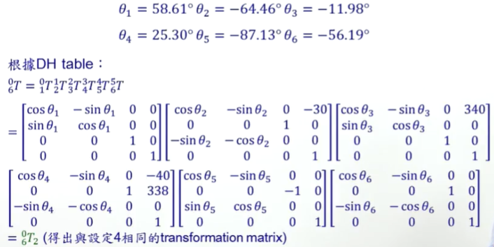

        * 步骤 6：轨迹模拟

          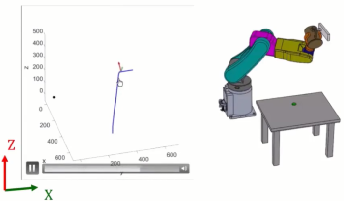

      * 方法二：以 linear function with parabolic blends 在 joint-space 下轨迹规划

        * 步骤 1：以 IK 先计算个点的 6 轴转角

          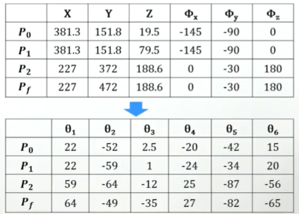

        * 步骤 2：求出各轴 $\Theta_1-\Theta_6$ 在每个时段的速度及加速度

          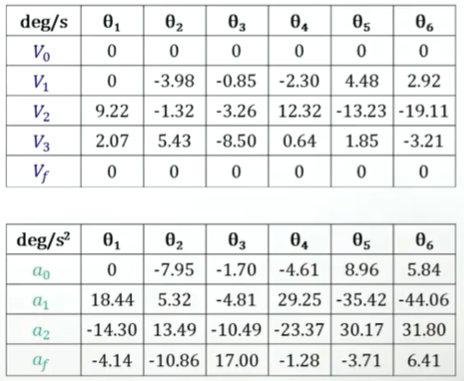

        * 步骤 3：建立各轴在每个时段的 equation（Linear/Parabolic 共 7 段），绘出平滑的轨迹（每段 parabolic curve 时间为 0.5 秒）

          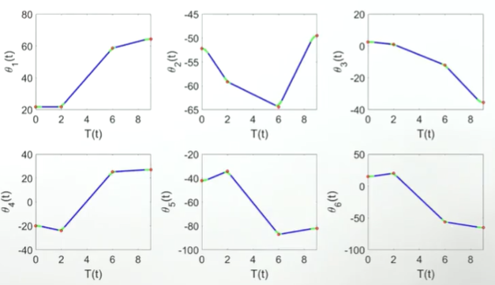
        
        * 步骤 4：以 FK 绘出 $^0P_{C\ ORG}$ 对时间轨迹，确认轨迹有通过设定点
        
          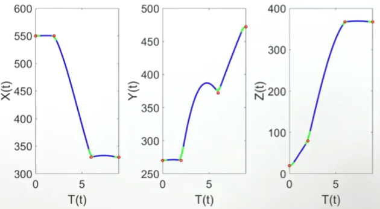
        
        * 步骤 5：绘出杯子的运动轨迹（$^0P_{C\ ORG}$​ 及旋转姿态），以验证答案
        
          在 Cartesian-space 下和在 joint-space 下轨迹比较
        
          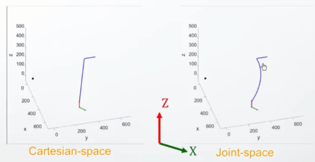

  * 总结

    * 本例题实为本课程的总结例题（Capstone example），在解题过程中运用了本课程所讲授的每个主题，和其内含的多个知识点
        * 刚体运动状态的描述
        * 顺向运动学
        * 逆向运动学
        * 轨迹规划

    * 轨迹规划一般为任务导向，设定手臂末端点和物件（工件）之间的关系，独立于手臂的类型（或自由度配置）

      * Cubic polynomials
      * Linear function with parabolic blends

    * 本课程所讲授两种轨迹规划方式为基础方法，可使用。若实际应用时仍不满足所需，可以照课程讲授法则适度延申（如规划位置速度和加速度都连续的轨迹等）

    * 顺向运动学和逆向运动学则和手臂的自由度配置相关，不同的配置方式，有不同的计算方式，尤以逆向运动学影响甚大，本课程主要是讲授开链（open-chain）手臂的 IK，移动方面

      * 平面 RRR 自由度手臂的 IK（SCARA 和晶圆机器人可视为此类型的延申）

        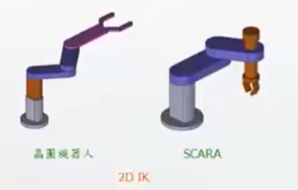

      * 空间 RRRRRR 自由度手臂的 IK（多关节机器人，articulated manipulator）

        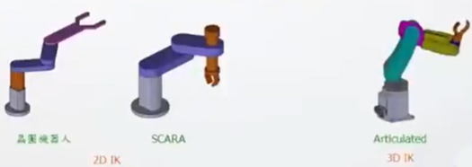

      * 坐标型 机器人则不需要 FK 和 IK（转动方面可以和 Euler Angles 方式求解）

        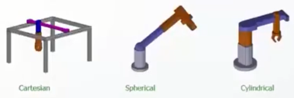

    * 闭链（closed-chain）手臂的 FK 和 IK 有不同的计算方式

      * DELTA 机器人
      * Steward platform 等

    * 若手臂具有冗自由度（redundant DOF），轨迹规划和 IK 一般具有无限多解，需导入最佳化方法（可避障、时间更快、最省能等）

