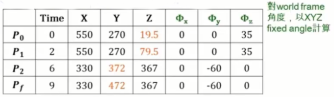
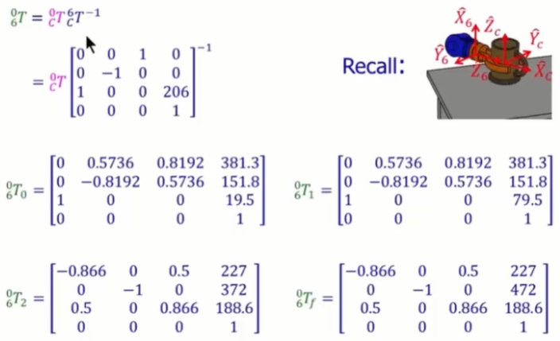

#### 7.机械手臂-轨迹规划实例（Manipulator Trajectory-Planning Example）

* ##### 7.1 实例

  * ##### 任务

    * Revisit 物件取放任务之情景：机械手臂夹住放在桌子上的杯子，移动手臂将杯子挂到墙上的杯架

    * 在IK 的课程中，练习以 IK 计算 RRRRRR 手臂在任务起点 C 的 6 个转角（joint angles），让手臂能顺利夹住杯子
  
  * 任务：规划手臂 将杯子从桌面拿起到放上杯架 间的整段轨迹
  
  * 辅助条件：加上两个 via points
  
    * 垂直拿起杯子一小段距离
      * 到达杯架前，调整到适当姿态，让杯子能顺利放上杯架

    * 条件设定
  
      
  
    
  
    
  
    
    
  * 解决方案
    
      * 方法一：以 Linear function with parabolic blends 在 Cartesian-space 下规划轨迹
      
        * 步骤 1：$求出 ^0P_{6 ORG}在各DOF(X, Y, Z, \Phi_x, \Phi_y, \Phi_z)每段的速度及加速度$ 
      
          
      
        * 步骤 2：建立并画出各 DOF 在每个时间区段轨迹
      
          
      
        * 步骤 3：以 IK 解出轨迹上所有设定点 & 轨迹内插点的 6 轴转角 $^0P_{6ORG}$​​ 在各设定点的位置和姿态
      
          
      
          
      
          
      
          
      
          
      
          
      
        * 步骤 4：将解出设定点 & 轨迹内插点的 6 轴转角各自对时间化成轨迹图（附注：在 joint space 下的轨迹不再是直线，但依然 smooth）
      
          
      
        * 步骤 5：将转角带入 FK，绘出杯子 $^0P_{C\ ORG}$ 的坐标及姿态，以确认轨迹规划正确性（同样以第二个 via point P_2 为例，进行细部计算说明）​​​
      
          
      
        * 步骤 6：轨迹模拟
      
          
      
      * 方法二：以 linear function with parabolic blends 在 joint-space 下轨迹规划
      
        * 步骤 1：以 IK 先计算个点的 6 轴转角
      
          
      
        * 步骤 2：求出各轴 $\Theta_1-\Theta_6$ 在每个时段的速度及加速度
      
          
      
        * 步骤 3：建立各轴在每个时段的 equation（Linear/Parabolic 共 7 段），绘出平滑的轨迹（每段 parabolic curve 时间为 0.5 秒）
      
          
      
      

  

