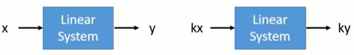
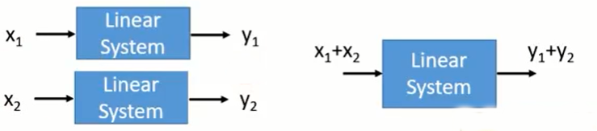
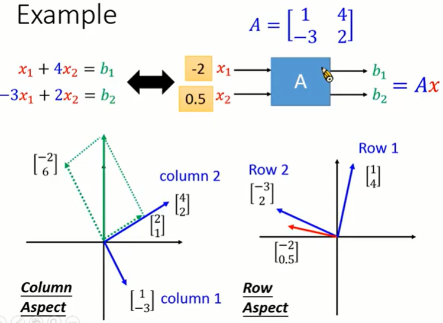

#### 1.概述（Summary）

* ##### 1.1 系统（System）

  * A system has input and output (function, transformation, operator)

  * 举例

    * Speech Recognition System
    * Dialogue System
    * Communication System

  * Linear System

    * Linear System = System of Linear Equations

      * 函数
        * 定义域
        * 值域
      * one-to-one (一对一)
      * Onto (映射)

    * 大多数系统都被假定为线性

    * 特点

      * Persevering Multiplication

        

      * Persevering Addition

        

    * 应用
      * 电路
      * 信号与系统
      * 计算机图形学

---

* **1.2 向量（Vector）**
  * A vector v is a set of numbers
    * $\vec{v} = \left \{ \begin{matrix} 1 \\ 2 \\ 3 \end{matrix} \right \}$​
    * components : the entries of a vector
      * The i-th component of vector v refers to v_i
      * v_1 = 1, v_2 = 2, v_3 = 3
  * 运算
    * Scalar Multiplication
      * $c\vec{v}$
    * Vector Addition
      * $\vec{a}+\vec{b} = \{a_1+b_1, a_2+b_2\}$
    * Vector Set
      * $\{\vec{a},\ \vec{b},\ \vec{c},\ \vec{d}\}$​
      * $R^n$ : We denote the set of all vectors with n entries
  * 特性
    * For any vector u, v and w in R^n, and any scalars a and b
    * u + v = v + u
    * (u + v ) + w = u + (v + w)
    * There is an element 0 in R^n such that 0 + u = u
    * There is an element u' in R^n such that u' + u = 0
      * 0 = {0 ... 0} zero vector
      * u' is the additive inverse of u
    * 1u = u
    * (ab)u = a(bu)
    * a(u + v) = au + av
    * (a + b)u = au + bu

---

* **1.3 矩阵（Matrix）**

  * A matrix is a set of vectors

    * $\{\vec{a},\ \vec{b},\ \vec{c},\ \vec{d}\}$

    * If the matrix has m rows and n columns, we say the size of the matrix is m by n, written m x n

      * The matrix is called square if m = n
      * we use M_{mxn} to denote the set that contains all matrices whose size is m x n

    * Index of component : the scalar in the i-th row and j-th column is called (i, j)-entry of the matrix (先 row 后 column)
      $$
      A = 
      \left \{ \begin{matrix}
      2 & 3 & 5  \\
      3 & 1 & -1 \\
      -2 & 1 & 1 \\
      \end{matrix} \right \}
      $$

  * 运算

    * Two matrices with the same size can add or subtract
    * Matrix can multiply by a scalar

  * Zero Matrix

    * A + O = A
    * OA = O
    * A - A = 0

  * 特性

    * A, B, C are m x n matrices, and s and t are scalars
      * A + B = B + A
      * (A + B) + C = A + (B + C)
      * (st)A = S(sA)
      * s(A + B) = sA + sB
      * (s + t)A = sA + tA

  * Transpose

    * If A is an m x n matrix
    * A^T (transpose of A) is an m x n matrix whose (i, j)-entry is the (j-i)-entry of A
    * 特性
      * A and B are m x n matrices, and s is a scalar
        * $(A^T)^T = A$​
        * $(sA)^T = sA^T$
        * $(A + B)^T = A^T + B^T$
    
  * 矩阵向量乘积

    * The size of matrix and vector should be matched

    * 举例
      $$
      \large
      A_{mxn} =
      \left [ \begin{matrix}
      a_{11} & a_{12} & ... & a_{1n} \\
      a_{21} & a_{22} & ... & a_{2n} \\
      ... & ... & ... & ... \\
      a_{m1} & a_{m2} & ... & a_{mn} \\
      \end{matrix} \right ]
      \quad
      x = 
      \left [ \begin{matrix}
      x_1 \\
      x_2 \\
      ... \\
      x_n
      \end{matrix} \right ]
      \\
      \\
      \large
      Ax = 
      \left [ \begin{matrix}
      a_{11}x_1 & a_{12}x_2 & ... & a_{1n}x_n \\
      a_{21}x_1 & a_{22}x_2 & ... & a_{2n}x_n \\
      ... & ... & ... & ...\\
      a_{m1}x_1 & a_{m2}x_2 & ... & a_{mn}x_n \\
      \end{matrix} \right ]
      \\
      \large
      = x_1
      \left [ \begin{matrix}
      a_{11} \\ a_{21} \\ ... \\ a_{m1} \\
      \end{matrix} \right ]
      +\ ...\
      + x_2
      \left [ \begin{matrix}
      a_{1n} \\ a_{2n} \\ ... \\ a_{mn} \\
      \end{matrix} \right ]
      $$

    * Ax = b

      
    
    * 特性
      * A and B are m x n matrices, u and v are vectors in R^n, and c is a scalar
        * A(u + v) = Au + Av
        * A(cu) = c(Au) = (cA)u
        * (A + B)u = Au + Bu
        * AO is the m x 1 zero vector
        * Ov is also the m x 1 zero vector
        * $I_n v = v$
        * If Aw = Bw for all w in R^n, it is true that A = B

