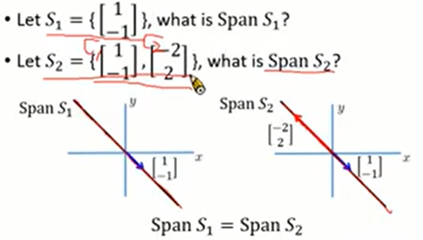
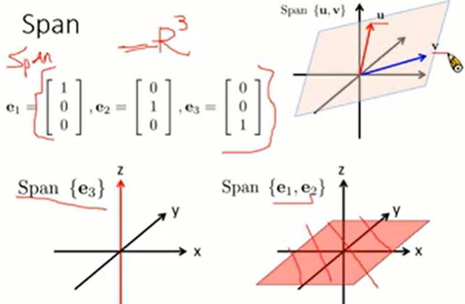
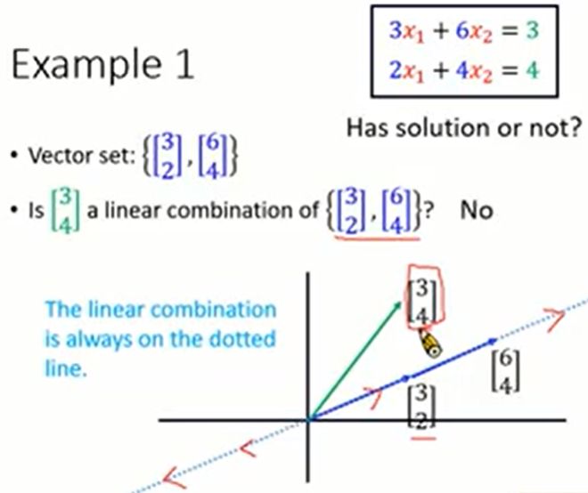
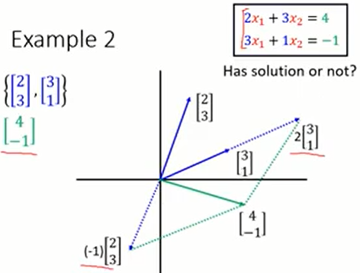
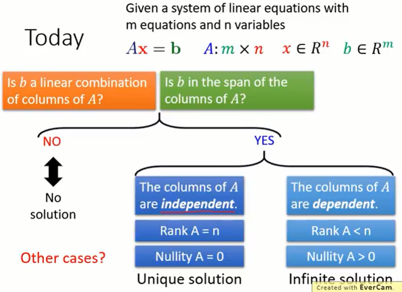

#### 2.线性系统方程（System of Linear Equations）

* ##### 2.1 方程的解

  * 关系

    * 线性系统方程
    $$
      \large a_{11}x_1 + a_{12}x_2 + ... + a_{1n}x_n = b_1 \\
    \large a_{21}x_1 + a_{22}x_2 + ... + a_{2n}x_n = b_2 \\
      \large ... \\
      \large a_{m1}x_1 + a_{m2}x_2 + ... + a_{mn}x_n = b_m
    $$

    * 矩阵向量乘积
    $$
      \large Ax = b
    $$
    
    * 联立
      $$
      \large Ax = a_1x_1 + a_2x_2 + ... + a_nx_n
      $$

  * 线性组合

    * Given a vector set $\{u_1, u_2, ..., u_k\}$
    * The linear combination of the vectors in the set
      * $v = c_1u_1 + c_2u_2 + ... + c_ku_k$
      * $c_1, c_2, ..., c_k$ are scalars (Coefficients of linear combination)

  * Span

    * A vector set $S = \{u_1, u_2, ..., u_k\}$

    * Span S is the vector set of all linear combinations of $u_1, u_2, ..., u_k$

      * Span $S = \{c_1 + c_2u_2 + ... + c_ku_k\ |\ for\ all\ c_1, c_2, c_k\}$

    * Vector set $V = Span S$

      * ^nS is a generating set for V^n or V^n or ^nS generates V^n
      * One way to describe a vector set (with infinite elements)

    * 举例

      

      

  * 解

    * 无解

      

    * 有解

      

    * 解的情况

      

  * Dependent and Independent
    * 定义
      * A set of n vector $\{a_1, a_2, ..., a_n\}$ is linear dependent
        * If there exist scalars $x_1, x_2, ..., x_n$, not all zero, such that
        * $x_1a_1 + x_2a_2 + ... +x_na_n$ = 0
      * A set of n vectors $\{a_1, a_2, ..., a_n\}$ is linear independent
        * $x_1a_1 + x_2a_2 + ... + x_na_n = 0$
        * Only if $x_1 = x_2 = ... = x_k = 0$
    * Linear Dependent
      * Given a vector set, $\{a_1, a_2, ..., a_n\}$, if there exists any a_i, that is a linear combination of other vectors
      * Given a vector set, $\{a_1, a_2, ..., a_n\}$, there exists scalars $x_1, x_2, ..., x_n$, that are not all zero, such that $x_1a_1 + x_2a_2 + ... + x_na_n = 0$
    * Rank and Nullity
      * The rank of a matrix is defined as the maximum number of linearly independent columns in the matrix
      * Nullity = Number of columns - rank
      * Rank A + Nullity A = n
    * 特征
      * Columns of A are dependent -> If Ax=b have solution, it will have Infinite Solutions
      * If Ax=b have Infinite solutions -> Columns of A are dependent

---

* **2.1 解线性方程组（Solving System of Linear Equations）**
  * Equivalent
    * Two systems of linear equations are equivalent if they have exactly the same solution set
    * Applying the following three operations on a system of linear equations will produce an equivalent one
      * Interchange
      * Scaling
      * Row Addition
  * Reduced Row Echelon Form
    * A system of linear equations is easily solvable if its augmented matrix is in reduced row echelon form 
    * Row Echelon Form
      * Each nonzero row lines above every zero row
      * The leading entries are in echelon form
    * A matrix can be transformed into multiple REF by row operation, but only one RREF
    * Gaussion elimination : an algorithm for finding the reduced row echelon form of a matrix
    * 举例
      * Unique Solution
      * Infinite Solution
        * Free variables
        * Basic variables
      * No Solution

