#### 4.子空间（Subspace）

* ##### 4.1 概述

  * 概念

    * 如果一组矢量 V 有以下三个特性，则被称为子空间

      * 这个零矢量 0 属于 V
      * 如果 u 和 w 属于 V， 则 u+w 也属于 V （与向量加法密切相关）
      * 如果 u 属于 V，并且 c 是一个常量，则 cu 也属于 V （与参数乘法相关）

    * 举例

      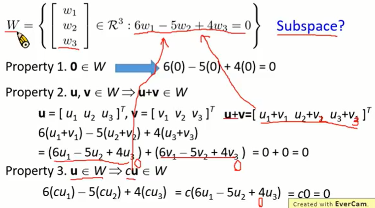

      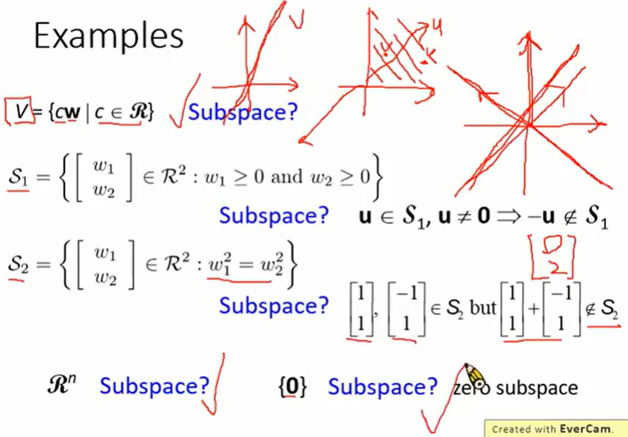

  * Subspace v.s. Span

    * The space of a vector set is a subspace

      Let S = {w_1, w_2, ..., w_k}        V = span S

      property 1 : 0 ∈ V

      property 2 : u, v ∈ V， u+ v ∈ V

      property 3 : u ∈ V， cu ∈ V

  * 其他的 space

    * Null space

      * 矩阵 A 的零空间是 Ax = 0 的解集，它被表示为 Null A
      * Null A 是子空间

    * Column Space and Row Space

      * 矩阵 A 的列空间是它的列的 span，它表示为 Col A
      * 矩阵 A 的行空间就是它的行的 span，它表示为 Row A

    * Column Space = Range

      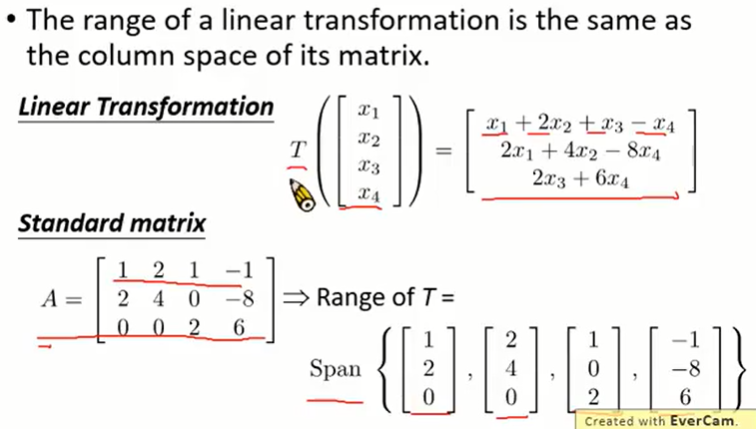

  * RREF

    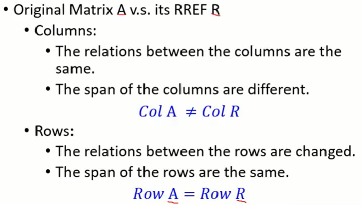

  * Consistent
    * Ax = b 有解 (一致性)
    * b 是 A 列向量的线性组合
    * b 在 A 的列的 span 中
    * b ∈ Col A 
  * 结论
    * 子空间与加法和乘法更密切

---

* **4.2 Basis**
  * 概念

    * Let V be a nonzero subspace of R^n. A basis B for V is a linearly independent generation set of V
      * $\{e_1, e_2, ..., e_n\}$  is a basis for R^n
      * property 1 : $\{e_1, e_2, ..., e_n\}$ is independent
      * property 2 : $\{e_1, e_2, ..., e_n\}$ generates R^n
    * The pivot columns of a matrix form a basis for its columns space
    * Property
      * S is contained in Span S
      * If a finite set S' is contained in Span S, then Span S' is also contained in Span S, becase Span S is a subspace
      * For any vector z, Span S = Span SU{z} if and only z belongs to then Span S

  * Theorem

    * A basis the smallest generation set

    * A basis is the largest independent vector set in the subspace

    * Any two bases for a subspace V contain the same number of vectors

      * The number of vector in a basis for a nonzero subspace V is called dimension of V (dim V)

      * The dimension of zero subspace is 0

      * 证明

        Suppose $\{u_1, u_2, ..., u_k\}\ and\ \{w_1, w_2, ..., w_p\}$ are two bases of V

        Let $A = \{u_1, u_2, ..., u_k\}\ and\  B = \{w_1, w_2, ..., w_p\}$

        Since $\{u_1, u_2, ..., u_k\}\ span \ V, \exist c_i \in R^k s.t. Ac_i = w_i\ for\ all\ i$

        $\Rightarrow A\{c_1c_2...c_p\} = \{w_1w_2...wp\} \Rightarrow AC = B$

        Now Cx = 0 for some $x \in R^p \Rightarrow ACx = Bx = 0$

        B is indepdendent vector set $\Rightarrow x = 0 \Rightarrow c_1c_2c_p$ are independent

        $C_i \in R^k \Rightarrow p \leq k$

        Reversing the roles of the two bases one has $k \leq p \Rightarrow p = k$

    * 举例

      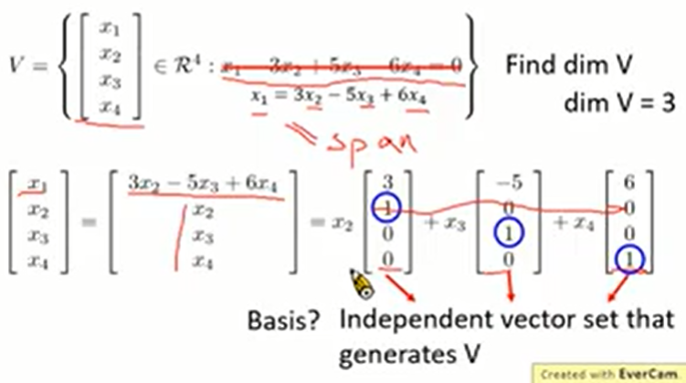

  * Confirming that a set is a Basis
    * intuitive way
      * Definition : A basis B for V is an independent generation set of V
    * Another way
      * Given a subspace V, assume that we already know that dom V = k. Suppose S is subset of V with k vectors
        * If S is indepdendent  $\Rightarrow$  S is basis
        * If S is a generation set  $\Rightarrow$  S is basis 

---

* **4.3 与矩阵相关的子空间**
  * Three Associated Subsapce
    * Col A
      * Basis : The pivot columns of A form a basis for Col A
      * Dimension : Dim (Col A) = number of pivot columns = rank A
    * Row A 
      * Basis : Nonzero rows of RREF(A)
      * Dimension : Dim (Row A) = Number of Nonzero rows = Rank A
    * Null A
      * Basis 
        * Solving Ax = 0
        * Each free variable in the parametric representation of the general solution is multiplied by a vector
        * The vectors form the basis
      * Dimension
        * Dim (Null A) = number of free variables = Nullity A = n - Rank A
    
  * Rank A = Rank A^T
  
    * Maximum number of independent Columns
    * Number of Pivot Columns
    * Number of Non-zero rows
    * Number of Basis Variables
    * Dim (Col A) : dimension of column space = Dim (Row A)
    * Dimension of the range of A = Dim (Col A^T)
  
  * Dim of Range + Dim of Null = Dim of Domain
  
    * Dim of Range = Dim (Col A) = Rank A
    * Dim of Null = Dim (Null A) = n - Rank A
    * Dim of Domain = if A is m x n, Dim (R^n) = n
  
  * Summary 
  
    * A is an m x n matrix
  
      |        |       Dimension        |                            Basis                             |
      | :----: | :--------------------: | :----------------------------------------------------------: |
      | Col A  |         Rank A         |                    The pivot columns of A                    |
      | Null A | Nullity A = n - Rank A | The vectors in the parametric representation of the solution of Ax = 0 |
      | Row A  |         Rank A         |              The nonzero rows of the RREF of A               |

---

* **4.4 坐标系（Coordinate System）**
  * 概念
    * 每个坐标系都是矢量表示的 “viewpoint”

      * 同一矢量在不同的坐标系中表示不同
      * 不同的向量可以在不同的坐标系中具有相同的表示

    * 矢量

      * 一组矢量 B 能被认为是坐标系，如果对于 R^n 满足（B 是 R^n 的一组 basis）：
      * 这组矢量 B 的 span 是 R^n（每个矢量都应该有表示）
      * 这组矢量 B 是非自由的（唯一表示） 

    * 特性

      * Let vector set $B = \{u_1, u_2, ..., u_n\}$ be a basis for a subdpace R^n (B is a coordinate system)

      * For any v in R^n, there are unique scalars $c_1, c_2, ..., c_n$ such that 
        $$
        B = \{b_1, b_2, ..., b_n\} \\
        v = c_1u_1 + c_2v_2 + ... + c_nv_n
        $$
        B-coordinate vector of v :
        $$
        [v]_B = 
        \left [ \begin{matrix}
        c_1 \\ c_2 \\ ... \\ c_n
        \end{matrix} \right ]
        \in R^n
        $$

      * $[v]_B = B^{-1}v$
      * $v = B[v]_B$

  * 坐标转换

    * 椭圆方程：图形逆时针旋转 45° 求直角坐标系方程

    * 双曲线方程：图形逆时针旋转 30° 求直角坐标系方程

      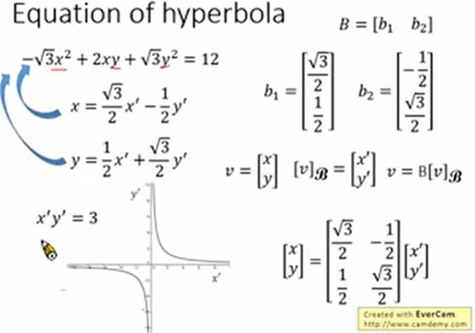

  * 坐标系中的线性方程

    * Basic Idea (复杂函数简单表示)

      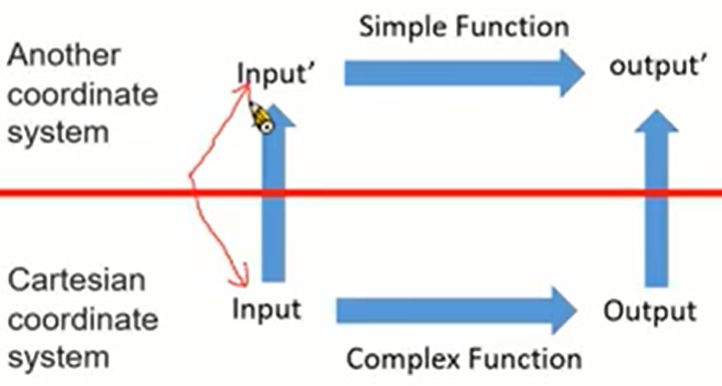

    * 推导

      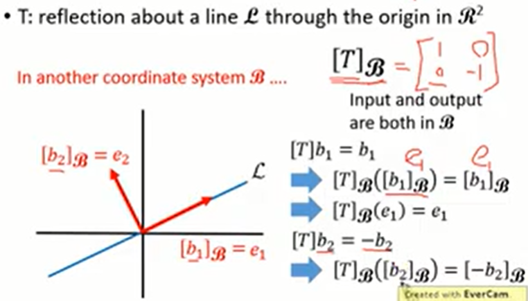

      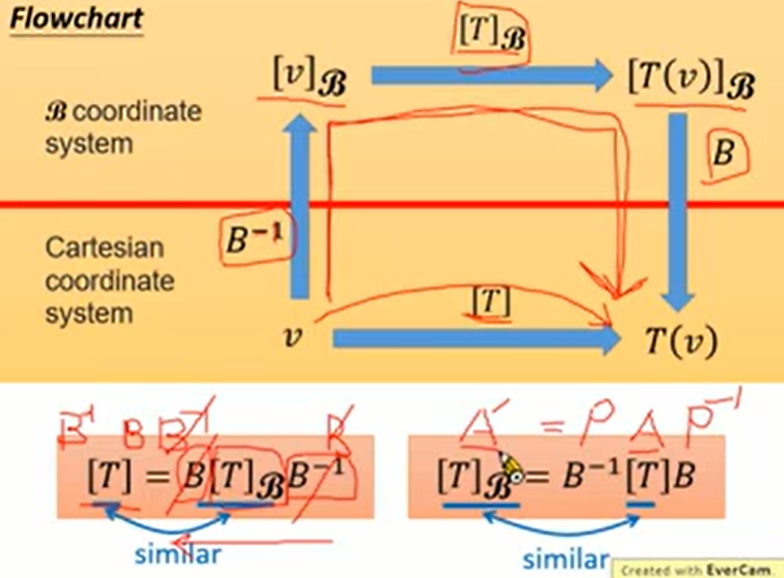

    * Example

      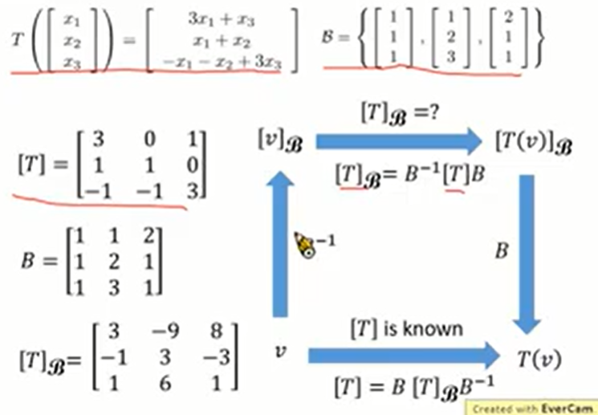

    * Conclusion

      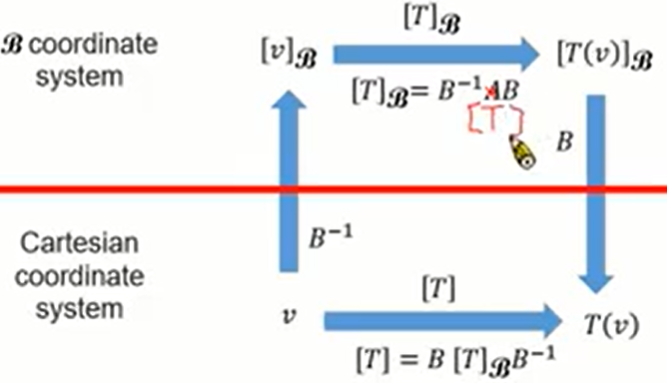

---

* **4.5 行列式（Determinant）**
  * Review

