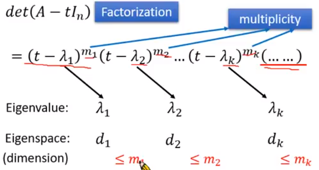
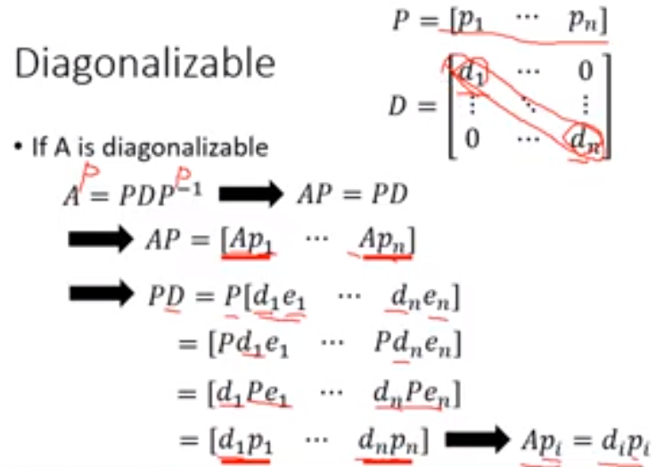
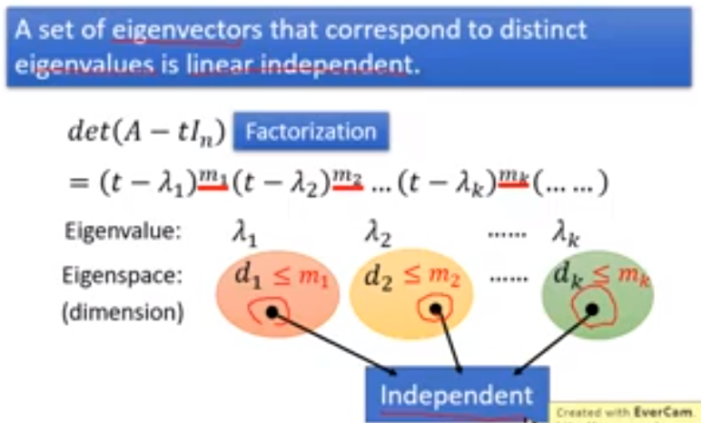
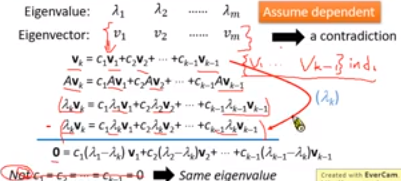
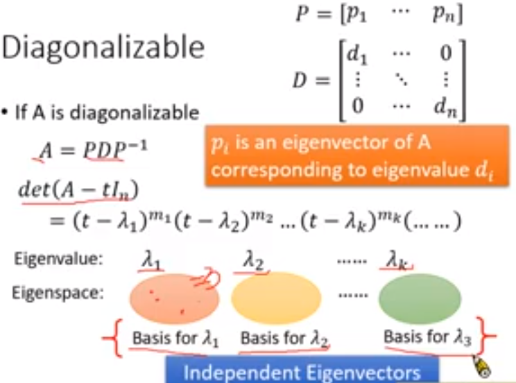
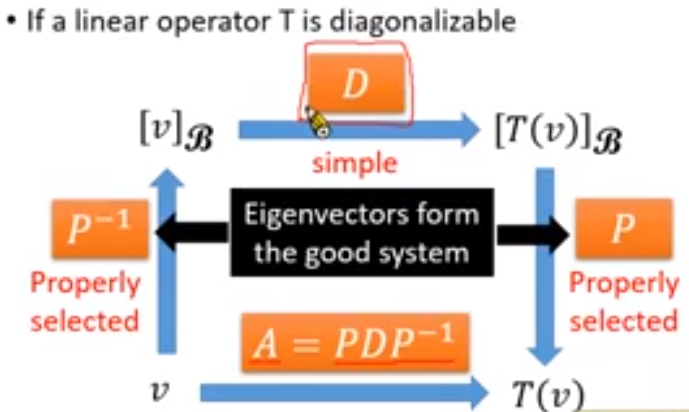

#### 5.特征值和特征向量（Eigenvalues and Eigenvectors）

* ##### 5.1  概述

  * 定义

    * If Av = λv (v is a vector, λ is a scalar)
      * v is an eigenvector of A
      * λ is an eigenvalue of A that corresponds to v
    * T is a linear operator. If T(v) = λv (v is a vector, λ is a scalar)
      * v is an eigenvector of T
      * λ is an eigenvalue of T that corresponds to v

  * 特性

    * A 的特征向量对应于一个唯一的特征值
    * A 的一个特征值有无穷多个特征向量

  * 特征空间（Eigenspace）

    * 假设 λ 是矩阵 A 的特征值

    * λ 对应的特征向量
      $$
      Av &=& \lambda v \\
      Av - \lambda v &=& 0 \\
      Av - \lambda I_n v &=& 0 \\
      (A - \lambda I_n)v &=& 0
      $$

    * $\lambda = Null(A - \lambda I_n) - {0}$

    * λ 的特征空间：λ +{0} 对应的特征向量

  * Check Eigenvalues

    * Check the dimension of eigenspace of λ
    * If the dimension is 0
      * Eigenspace only contains {0}
      * No eigenvector
      * λ is not eigenvalue

  * Looking for Eigenvalues

    * A scalar t is an eigenvalue of A
      * Existing v ≠ 0 such that $Av = tv$
      * Existing v ≠ 0 such that $Av - tv = 0$
      * Existing v ≠ 0 such that $(A - tI_n) v = 0$
      * $(A - tI_n) v = 0$ has multiple solution
      * The columns of $(A - tI_n)$ are dependent
      * $(A - tI_n)$  is not invertible
      * $det(A - tI_n) = 0$
    * A scalar t is an eigenvalue of A $\Leftarrow \Rightarrow det(A - tI_n) = 0$
      * $det(A - tI_n)$ : 线性算子 T 的特征多项式
      * $det(A - tI_n) = 0$ : A 的特征方程

  * 特征多项式（Characteristic polynomial）

    * 一般来说，矩阵 A 和矩阵 A 的 RREF 有不同的特征多项式 $\Leftarrow \Rightarrow$ 不同的特征值

    * 相似矩阵具有相同的特征多项式 $\Leftarrow \Rightarrow$ 相同的特征值
      $$
      B = P^{-1}AP \\
      det(B - tI) &=& det(P^{-1}AP - P^{-1}(tI)P) \\
      &=& det(P^{-1}(A-tI)P) \\
      &=& det(P^{-1})det(A-tI)det(P) \\
      &=& (\frac{1}{det(P)})det(A-tI)det(P) \\
      &=& det(A-tI)
      $$

    * 求解特征值

      

---

* **对角化（Diagonalization）**

  * 概述

    * 如果 $A = PDP^{-1}$，则 n x n 矩阵 A 可对角化。

      * D : n x n 对角矩阵
      * P : n x n 可逆矩阵

    * 一个矩阵是可对角化的，求出 D 和 P

    * 不是所有的矩阵都可对角化

    * 证明

      

      ​			p_i 是 A 的特征向量，对应于特征值 d_i

  * 特性

    * 如果 A 可对角化
      * $A = PDP^{-1}$
      * 有 n 个特征向量构成可逆矩阵
      * 有 n 个独立的特征向量
      * A 的特征向量可以构成 R^n 的一组基
    * 如果 A 可对角化，$A = PDP^{-1} \Rightarrow A^m = PD^mP^{-1}$

  * 步骤

    * Step 1 : 找到 n 个 L.I. 特征向量，如果可能的话，并形成一个可逆的 P

    * Step 2 : 特征值对应于特征向量 P 的形式对角矩阵 D

      

      

      

  * 总结

    

