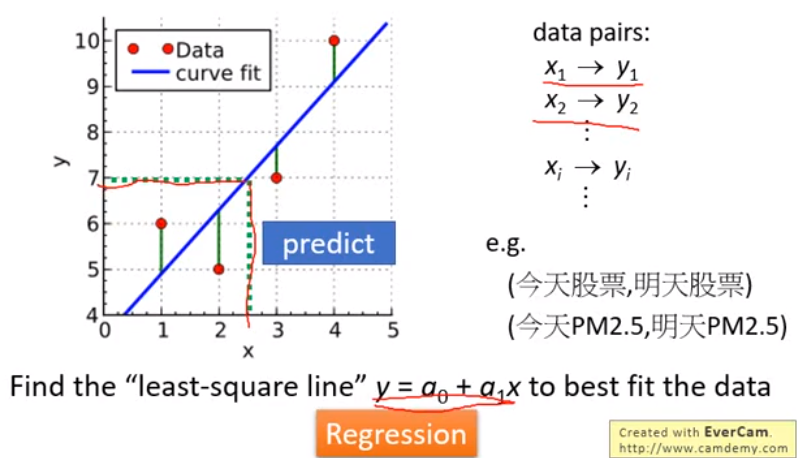

#### 6.正交性（Orthogonality）

* ##### 6.1 概述 

  * Norm & Distance

    

  * Dot Product & Orthogonal

    * Dot Product : dot product of u and v is
      $$
      u · v &=& u_1v_1 + u_2v_2 + ... + u_nv_n \\
      &=&
      \left [ \begin{matrix}
      u_1 & u_2 & ... & u_n
      \end{matrix} \right ]
      \left [ \begin{matrix}
      v_1 \\ v_2 \\ ... \\ v_n
      \end{matrix} \right ] \\
      &=& u^Tv
      $$

      * Let u and v be vectors, A be a matrix, and c be a scalar
      * $u · u = ||u||^2$
      * u · u = 0 if and only if u = 0
      * u · v = v · u
      * u · (v + w) = u · v + u · w
      * (v + w) · u = u · v + u · w
      * (cu) · v = c(u · v) = u · (cv)
      * $||cu|| = |c|||u||$
      * $Au · v = (Au)^Tv = u^T(A^Tv) = u·A^Tv$

    * Othogonal : u and v are orthogonal if u · v = 0

      * 正交实际上是“垂直的”
      * 零向量正交于每一个向量

  * 勾股定理（Pythagorean Theorem）

    * u and v are orthogonal $\Leftarrow \Rightarrow ||u+v||^2 = ||u||^2 + ||v||^2$
      $$
      ||u+v||^2 &=& ||u||^2 + 2u·v + ||v||^2 \\
      &=& ||u||^2 + ||v||^2
      $$

    * 平行四边形的对角线是正交的 $\Leftarrow \Rightarrow$ 平行四边形是菱形
      $$
      &\because& (u + v)·(u - v) = ||u||^2 - ||v||^2 = 0 \\
      &\therefore& ||u|| = ||v||
      $$

    * Triangle Inequality : for any vector u and v, $||u + v|| \le ||u|| + ||v||$
      $$
      &\because& ||u + v||^2 &=& ||u||^2 + 2u·v + ||v||^2 \\
      && &\le& ||u||^2 + 2|u·v| + ||v||^2 \\
      && &\le& ||u||^2 + 2||u||·||v|| + ||v||^2 \\
      && &\le& (||u|| + ||v||)^2 \\
      &\therefore& ||u + v|| &\le& ||u|| + ||v||
      $$

---

* **6.2 正交投影（Orthogonality Projection）**
  * 正交补（Orthogonal Complement）

    * 非空向量集 S 的正交补记为 $S^{\bot}$  (S perp)

    * $S^{\bot}$ 是与 S 中的每个向量正交的向量集合
      $$
      S^{\bot} = \{v:v·u = 0, \forall u \in S \} \\
      S = R^n \Rightarrow S^{\bot} = {0} \\
      S = {0} \Rightarrow S^{\bot} = R^n
      $$

    * 特性

      * For any nonempty vector set S, (Span S)$^{\bot} = S^{\bot}$
      * Let W be a subspace, and B be a basis of W $\Rightarrow B^{\bot} = W^{\bot}$
      * $S \bigcup S^{\bot}$ is zero vector

    * 举例

      * For W = Span{u_1, u_2}, where u_1 = [1 1 -1 4]^T and u_2 = [1 -1 1 2]^T, v ∈ $W^{\bot}$ if and only if u_1 · v = u_2 · v = 0

      * For any matrix A $(Row\ A)^{\bot} = Null\ A$

        $v \in (Row\ A)^{\bot} &\Leftarrow \Rightarrow& w \in Span\{rows\ of\ A\}, w·v = 0 \\ &\Leftarrow \Rightarrow& Av = 0$

        $(Col\ A)^{\bot} = (Row\ A^T)^{\bot} = Null\ A^T$

        

  * 正交投影（Orthogonal Projection）

    * 定义

      

    * 特性

      * Closest Vector Property

        

      * Orthogonal Projection Matrix

        

  * How to do Prthogonal Projection

    * 步骤

      

    * 举例

      

    * Orthogonal Projection Matrix

      * Let C be an n x k matrix whose columns form a basis for a subspace W

        $P_W = C(C^TC)^{-1}C^T$
        $$
        Let\ u \in R^n\ and\ w = U_w(u) \\
        Since\ W = Col\ C, w = Cb\ for\ some\ b \in R^k\ and u - w \in W^{\bot} \\
        \Rightarrow 0 = C^T(u - w) = C^Tu - C^Tw = C^Tu - C^TCb \\
        \Rightarrow C^Tu = C^TCb \\
        \Rightarrow b = (C^TC)^{-1}C^Tu\ and\ w = C(C^TC)^{-1}C^Tu\ as\ C^TC\ is\ invertible
        $$
        

      * 举例

        

  * Application of Orthogonal Projection

    * Solution of Inconsistent System of Linear Equations

      

    * Least Square Approximation

      

      

      

      

---

* **6.3 正交基（Orthogonal Basis）**

  * Orthogonal/Orthonormal Basis

    * Orthogonal Set

      * 如果一个向量集中的每一对不同的向量是正交的，那么这个向量集就叫做正交集
      * 任何非零向量的正交集都是线性无关的
      * 如果一个向量集是正交集，并且所有向量的范数都是 1，那么这个向量集就叫做标准正交集（范数为 1 的向量称为单位向量）

    * Orthogonal Basis

      * 一个正交（orthogonal/orthogormal）集的基称为正交（标准正交）基

      * Let S = {v_1, v_2, ..., v_k} be an orthogonal basis for a subspace W, and let u be a vector in W

      * 设 $S = \{v_1, v_2，…， v_k\}$ 是子空间 W 的正交基，设 u 是 W 中的向量
        $$
        u &=& c_1v_1 + c_2v_2 + ... + c_kv_k \\
        c_1 &=& \frac{u·v_1}{||v_1||^2} \\
        c_2 &=& \frac{u·v_2}{||v_2||^2} \\
        .... \\
        c_k &=& \frac{u·v_k}{||v_k||^2}
        $$

      * 设 u 是任意向量，w 是 u 在 w 上的正交投影
        $$
        w &=& c_1v_1 + c_2v_2 + ... + c_kv_k \\
        c_1 &=& \frac{u·v_1}{||v_1||^2} \\
        c_2 &=& \frac{u·v_2}{||v_2||^2} \\
        .... \\
        c_k &=& \frac{u·v_k}{||v_k||^2}
        $$

  * 正交分解理论（Orthogonal Decomposition Theory）

    * Orthogonal Projection
      $$
      P_W &=& C(C^TC)^{-1}C^T \\
      &=& CD^{-1}C^T \\
      $$

      $$
      C^T = 
      \left [ \begin{matrix}
      v_1^T \\ v_2^T \\ ... \\ v_n^T
      \end{matrix} \right ]
      \quad
      C = [v_1\ v_2\ ...\ v_n]
      $$

      Projected：
      $$
      w = CD^{-1}C^Tu
      $$

  * How to find Orthonormal Basis

    * 设 {u_1, u_2, ..., u_k} 是子空间 W 的一组基。如何将 {u_1, u_2, ..., u_k} 转换成正交基 {v_1, v_2，…, v_k} ?
      $$
      v_1 &=& u_1 \\
      v_2 &=& u_2 - \frac{u_2·v_1}{||v_1||^2}v_1 \\
      v_3 &=& u_3 - \frac{u_3·v_1}{||v_1||^2}v_1 - \frac{u_3·v_2}{||v_2||^2}v_2 \\
      ... \\
      v_k &=& u_k - \frac{u_k·v_1}{||v_1||^2}v_1 - \frac{u_3·v_2}{||v_2||^2}v_2 - ... - \frac{u_k·v_{k-1}}{||v_{k-1}||^2}v_{k-1}
      $$
      Then {v_1, v_2, ..., v_k} is an orthogonal basis for W
      $$
      Span\ \{v_1, v_2, ..., v_i\} = Span\ \{u_1, u_2, ..., u_i\}
      $$

    * 

    * 举例

      

---

* **6.4 正交矩阵与对称矩阵（Orthogonal Matrices & Symmetric Matrices）**
  * 正交矩阵（Orthogonal Matrices）
  * 对称矩阵（Symmetric Matrices）

