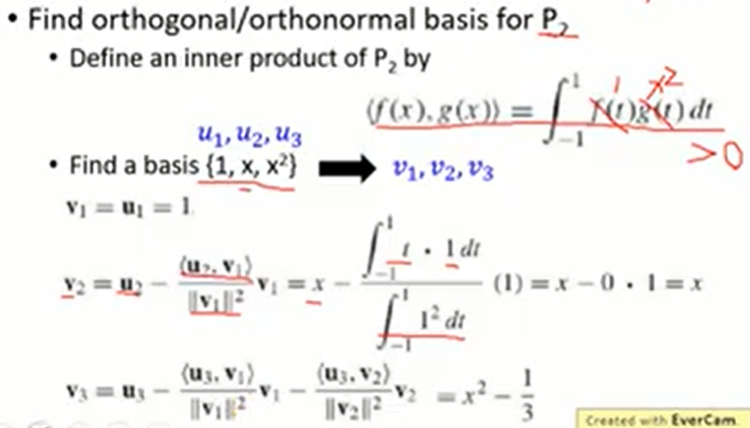
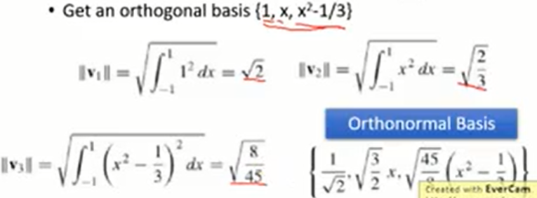
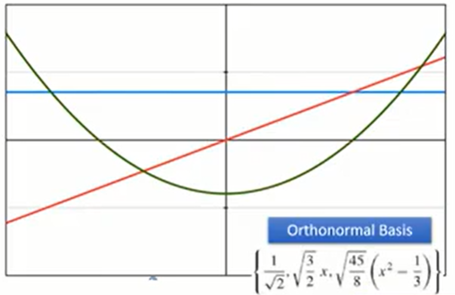

#### 7.广义向量（Beyond Vectors）

* ##### 7.1 概述

  * 定义
    * 如果物体 V 是一个向量空间，那么这些物体就是"向量"
    * 向量空间
      * 有一些运算叫做“加法”和“标量乘法”
      * u, v and w are in V, and a and b are scalars, u + v and au are unique elements of V
      * u，v 和 w 在 V 中，a 和 b 是标量，u + v 和 au 是 V 中唯一的元素
    * 特性
      * u + v = v + u, (u + v) + w = u + (v + w)
      * There is a "zero vector" 0 in V such that u + 0 = u
      * There is -u in V such that u + (-u) = 0
      * 1u = u, (ab)u = a(bu), a(u + v) = au + av, (a + b)u = au + bu
  * Review
    * Polynomials
    
    * Subspace
    
    * Linear Combination and Span
    
    * Linear transformation
      * 微分（Derivative）
      * 积分（Integral）
      
    * Null Space and Range
    
    * One-to-one and Onto
    
    * 同构（Isomorphism）
      * Let V and W be vector space
      * A linear transformation T : V  -->  W is called an isomorphism if it is one-to-one and onto
        * Invertible linear transform
        * W and V are isomorphic
      
    * Basis
      * Independent
      
    * Matrix Representation of Linear Operator（Matrix Representation of Linear Operator)
    
      * 微分（Derivative）
      * 积分（Integral）
    
    * 特征值和特征向量
    
      * 微分（Derivative）
      * 转置（Transpose）
    
    * 内积（Inner Product）
    
      * Dot Product
      * Inner Product of Matrix
    
    * 正交基（Orthogonal/Orthonormal Basis）
    
      
    
      
    
      

---

* **7.2 奇异值分解（Singular Value Decomposition）**

  * 比较

    * 对角化只能应用于某些方阵
    * 奇异值分解(SVD)可以应用于任何矩阵

  * SVD

    * Any m x n matrix A
      $$
      A &=& U · \sum · V^T \\
      m \times n &=& m \times m · m \times n · n \times n \\
      &=& Independent · Diagonal · Independent \\
      \\
      A &=& U_1 · \sum' · V_1^T \\
      m \times n &=& m \times k · k \times k · k \times n \\
      \\
      A' &=& U_1 · \sum' · V_1^T \\
      m \times n &=& m \times (k-1) · (k-1) \times (k-1) · (k-1) \times n
      $$

    * 秩的特性

      * If A is a m x n matrix, and B is a n x k matrix, then Rank(AB) <= min{Rank(A), Rank(B)}
      * If B is a matrix of rank n, then Rank(AB) = Rank(A)
      * If A is a matrix of rank n, then Rank(AB) = Rank(B)

  * 应用

    * 利用奇异值分解的低秩近似

