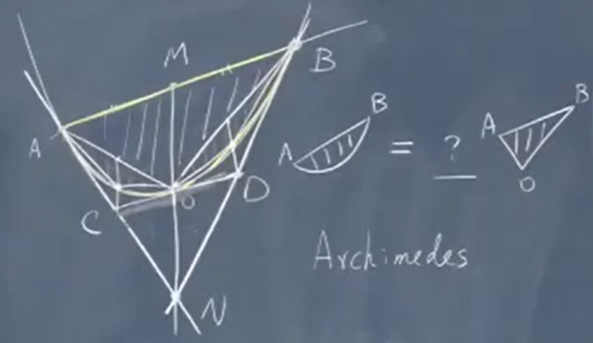

#### 1.概述（Summary）

* ##### 1.1 简述

  * Calculus
    * differentiation
    * integration
  * Number
    * length
    * Pythagorean theorem : $a^2 + b^2 = c^2$
    * Area
      * Square: $S = a^2$
      * Rectangle : $S = ab$
      * Rriangle : $S = \frac{1}{2}ah$
      * Rircular : $S = \pi r^2$
    * Parabola
      * 圆弧使用多边形无限逼近

        

        证明：

        (1) $\bar{MD} = \bar{ON} \\$

        (2) $\bar{CD} // \bar{AB}$  in terms of coordinates

      * 切线

        斜率：$\Large k = \frac{f(x)-f(a)}{x-a}$

        极限：$\Large \lim_{x \rightarrow a} \frac{f(x)-f(a)}{x-a}$

        极限存在，即有斜率

---

* **1.2 极限**

  * 函数的连续性（Continuity）

    * 设函数 f(x) 在某 U(x0) 内有定义，若 $\lim f(x)_{x→x0} = f(x_0)$， 则称 f(x) 在点 x0 连续

    * 若函数 f(x) 在区间 I 的每一点都连续,则称 f(x) 在区间 I 上连续

    * 函数连续必须同时满足三个条件：

      * 函数在 x0 处有定义

      * x-> x0 时，limf(x) 存在

      * x-> x0 时，limf(x) = f(x0)

        则初等函数在其定义域内是连续的
  
  * 函数的有界性
    * 设函数 f(x) 的定义域为 D，f(x) 集合 D 上有定义
    * 如果存在数 K1，使得 f(x) ≤ K1 对任意 x∈D 都成立，则称函数 f(x) 在 D 上有上界；反之，如果存在数字 K2，使得 f(x) ≥ K2 对任意 x∈D 都成立，则称函数 f(x) 在 D 上有下界，而 K2 称为函数 f(x) 在 D 上的一个下界
    * 如果存在正数 M，使得 |f(x)|≤ M 对任意 x∈D 都成立，则称函数在 X 上有界；如果这样的 M 不存在，就称函数 f(x) 在 X 上无界，等价于，无论对于任何正数 M，总存在 x1∈X，使得|f(x1)| > M，那么函数 f(x) 在 X 上无界
    * 此外，函数 f(x) 在 X 上有界的充分必要条件是它在 X 上既有上界也有下界
  * 极限定义
    * 数列极限
      * 对数列 {xn}，若存在常数 a，对于任意 ε > 0，总存在正整数 N，使得当 n > N 时，|xn-a| < ε 成立，那么称 a 是数列 {xn} 的极限
      * 性质
        * 数列极限的唯一性：若数列存在极限，则该极限唯一
        * 数列极限的有界性：若数列存在极限，则该数列一定有界
        * 数列极限的保号性：若数列存在极限，且极限大于零(或小于零)，则存在正整数 N，当 n > N时，数列项 an 大于零（或小于零）
          * 推论1：若数列的每一项非负且数列收敛，则其极限也非负。（可根据保号性定理，用反证法证明）
          * 推论2：若数列的每一项小于等于零且数列收敛，则其极限也小于等于零
        * 单调有界准则：单调有界的数列（函数）必有极限
        * 夹逼定理
    * 函数极限
      * 设函数 f(x)，|x| 大于某一正数时有定义，若存在常数 A，对于任意 ε > 0，总存在正整数 X，使得当 x>X 时，|f(x)-A| < ε 成立，那么称 A 是函数 f(x) 在无穷大处的极限；反之亦成立
      * 设函数 f(x) 在 x0 处的某一去心邻域内有定义，若存在常数 A，对于任意 ε > 0，总存在正数 δ，使得当 |x-xo| < δ 时，|f(x)-A| < ε 成立，那么称 A 是函数 f(x) 在 x0 处的极限

