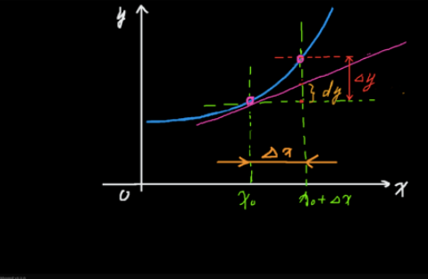

#### 2.微分（Differentiation）

* ##### 2.1 概述

  * 定义
  
    * 由函数 B=f(A)，得到 A、B 两个数集，在 A 中当 dx 靠近自己时，函数在 dx 处的极限叫作函数在 dx 处的微分
  
    * 微分的中心思想是无穷分割
  
    * 微分是函数改变量的线性主要部分，微积分的基本概念之一
  
      
  
  * 公式推导
    * 设函数 y = f(x) 在某区间内有定义，x0 及 x0+△x 在这区间内，若函数的增量 Δy = f(x0 + Δx) − f(x0) 可表示为 Δy = AΔx + o(Δx)，其中 A 是不依赖于 △x 的常数，o(Δx) 是 △x 的高阶无穷小，则称函数 y = f(x) 在点 x0 是可微的
    *  AΔx 叫做函数在点 x0 相应于自变量增量 △x 的微分，记作 dy，即：dy = AΔx
    * 微分 dy 是自变量改变量 △x 的线性函数，dy 与 △y 的差是关于 △x 的高阶无穷小量，我们把 dy 称作 △y 的线性主部，得出：当 △x→0 时，△y ≈ dy
