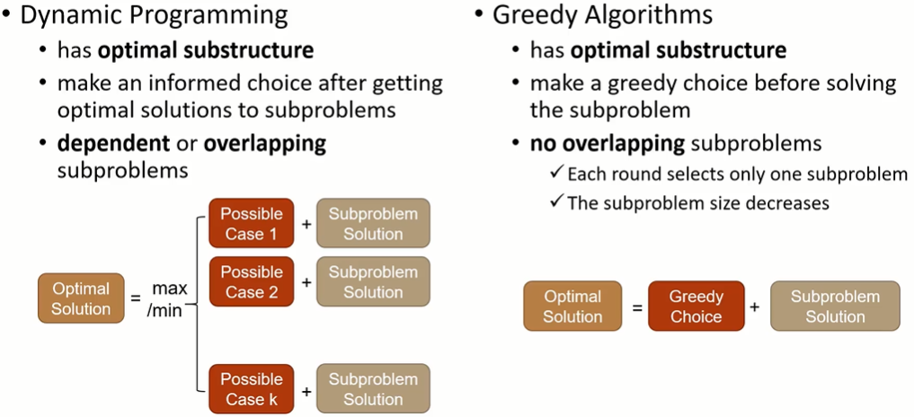
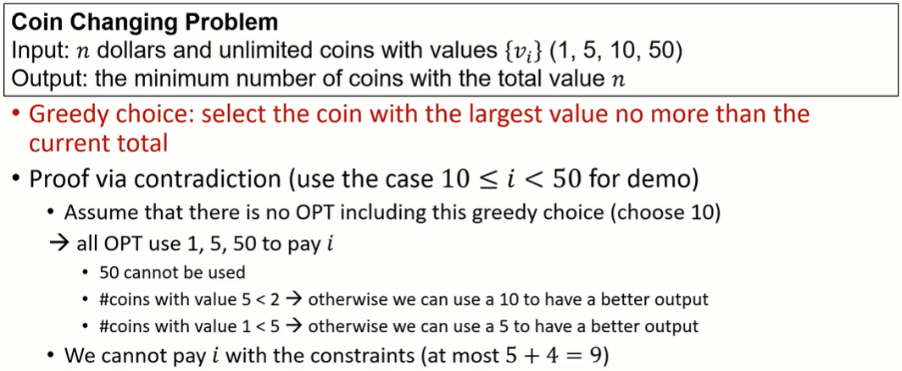
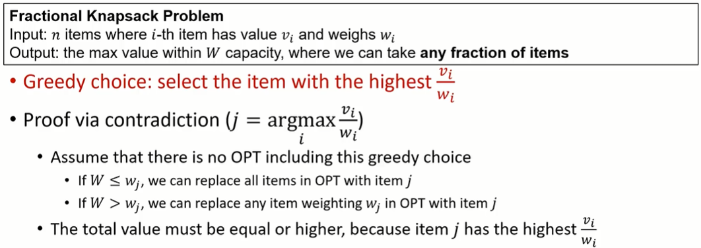
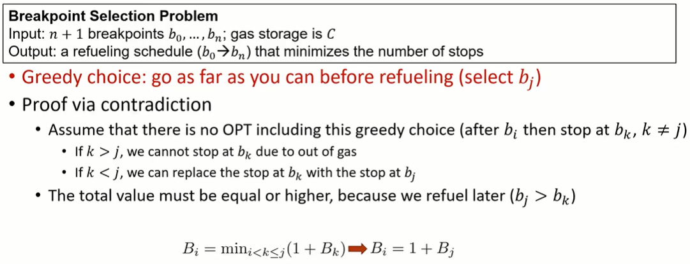
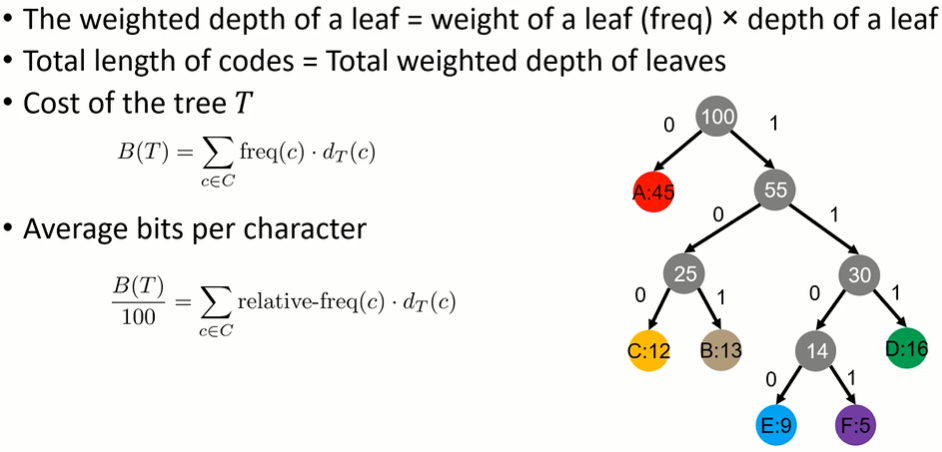
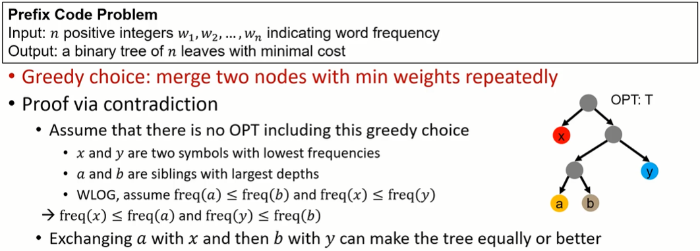
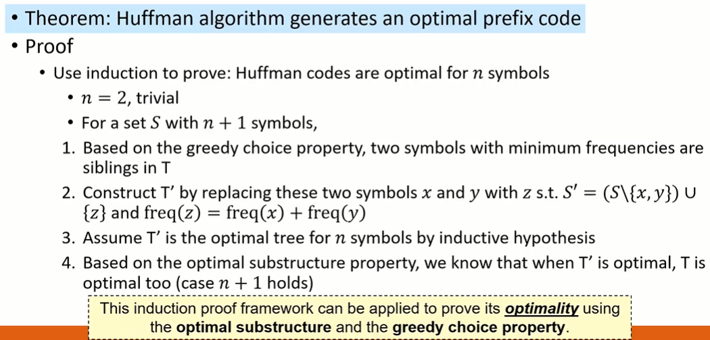
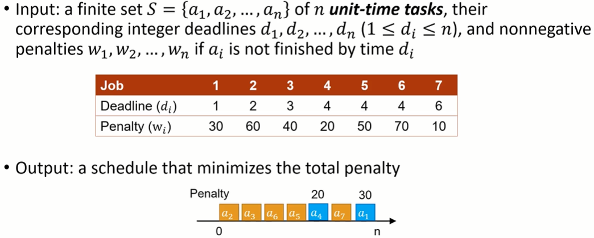
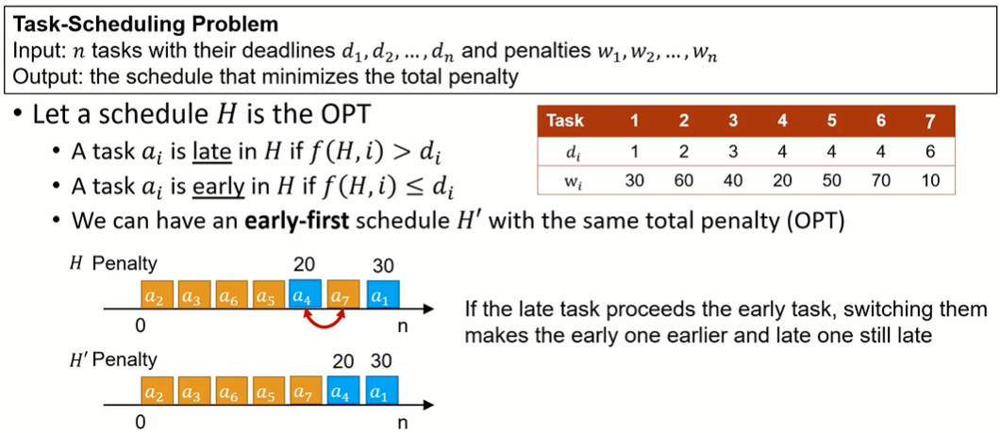
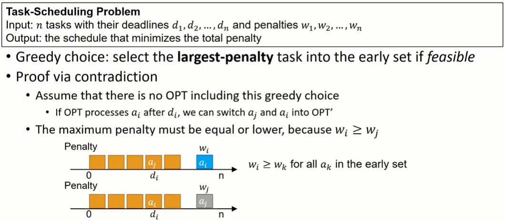

#### 4.贪婪算法（Greedy Algorithm）

* ##### 4.1 概述

  * 概念

    * 总是做出当下看起来最好的选择

    * 做一个局部最优选择，希望这个选择将导致一个全局最优解

      * 并不总是得到最优解

      * 最终可能会达到局部最优

        

      * Optimal Substructure : 问题的最优解包含子问题的最优解

      * Greedy-Choice Property : 局部最优(贪婪)选择会导致全局最优解

  * 步骤

    * 将优化问题抛为这样一个问题，即我们做出选择并保留一个子问题来求解
    * 给出了最优子结构
    * 通过贪心结合子问题的最优解可以得到原选择的最优解

  * 情景使用

    * Whether the problem has optimal substructure
    * Whether we can make a greedy choice and remain only one subproblem
    * Common for optimization problem
  
  * 比较
  
    

---

* **4.2 应用**

  * Activity-Selection / Interval Scheduling

    * 定义

      * Input : n activities with start times s_i and finish times f_i (the activities are sorted in monotonically increasing order of finish time $\large f_i \le f_2 \le ... \le f_n$​)
      * Output : the maximum number of compatible activities
      * Without loss of generality : $\large s_1 < s_2 < ... < s_n\ and\ f_1 < f_2 < ... < f_n$​

    * 分析

      

    * 伪码

      ```pseudocode
      Act-Select (n, s, f, v, p)
      {
      	M[0] = 0
      	for i = 1 to n
      		M[i] = 1 + M[p[i]]
      	return M[n]
      }
      
      Find-Solution (M, n)
      {
      	if n = 0
      		return { }
      	return {n} U Find-Solution(p[n])
      }
      ```

  * Coin Changing

    * 定义

      * Input : n dollars and unlimited coins with values {v_i} (1, 5, 10, 50)
      * Output : the minimum number of coins with total value n
      * Cashier's algorithm : at each iteration, add the coin with the largest value no more than the current total

    * 分析

      

  * Fractional Knapsack Problem

    * 定义

      * Input : n items where i-th item has value v_i and weights w_i (v_i and w_i are positive integers)
      * Output : the maximum value for the knapsack with capacity of W, where we can take any fraction of items
      * Greedy algorithm : at each iteration, choose the item with the highest $\Large \frac{v_i}{w_i}$​​ and continue when W - w_i > 0

    * 分析

      

  * Breakpoint Selection Problem

    * 定义

      * Input : a planned route with n + 1 gas stations b_0, ..., b_n; the car can go at most C after refueling at a breakpoint
      * Output : a refueling schedule (b_0 -> b_n) that minimizes the number of stops
      * Greedy algorithm : go as far as you can before refueling

    * 分析

      

    * 伪码

      ```pseudocode
      BP-Select (C, b)
      {
      	Sort(b) s.t. b[0] < b[1] < ... < b[n]
      	p = 0
      	S = {0}
      	for i = 1 to n - 1
      		if b[i + 1] - b[p] > C
      		 if i == p
      		 	return "no solution"
      		 A = A U {i}
      		 p = i
      	return A
      }
      ```

  * Huffman Codes

    * 编码

      * 类型
        * Fixed-length
        * Variable-length

      * 方法
        * Prefix Code : 一种长度可变的代码，其中没有码字是其他码字的前缀
        * Letter Frequency Distribution

      * Total Length of Codes

        

    * 定义

      * Input : n positive integers w_1, w_2, ..., w_n indicating word frequecny

      * Output : a binary tree of b leaves, whose weights from w_1, w_2, ..., w_n s.t. the cost of the tree is minimized
        $$
        \large T^* = arg\ min_T B(T) = arg\ min_T \sum_{c \in C}freq(c)·d_T(c)
        $$

    * 分析

      

      

    * 伪码

      ```pseudocode
      Huffman (S)
      {
      	n = |S|
      	Q = Bulid-Priority-Queue(S)
      	for i = 1 to n - 1
      		allocate a new node z
      		z.left = x = Extract - Min(Q)
      		z.right = y = Extract - Min(Q)
      		freq(z) = freq(x) + freq(y)
      		Insert(Q, z)
      		Delete(Q, x)
      		Delete(Q, y)
      	return Extract-Min(Q) // return the prefix tree
      }
      ```

  * Task-Scheduling

    * 定义

      

    * 分析

      

      

    * 伪码

      ```pseudocode
      Task-Scheduling (n, d[], w[])
      {
      	sort tasks by lenalties s.t. w[1] >= w[2] >= ... >= w[n]
      	for i = 1 to n
      		find the latest available index j <= d[i]
      		if j > 0
      			A = A U {i}
      			mark index j unavailable
      	return A // the set of early tasks
      }

  * Scheduling to Minimize Lateness

