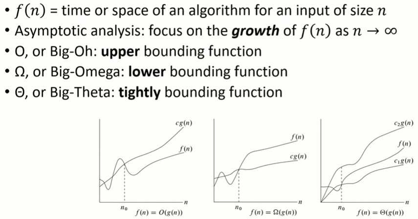
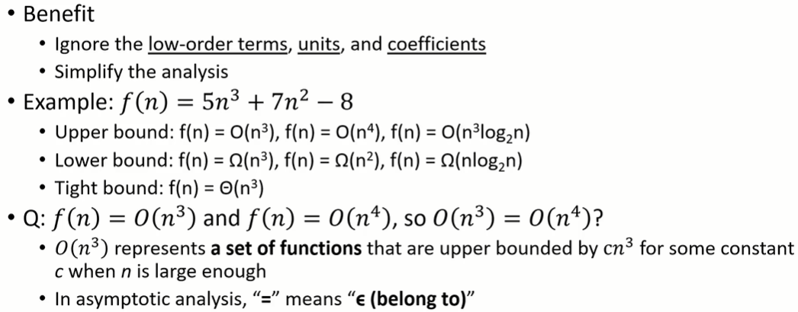

#### 1.概述（Summary）

* ##### 1.1 算法

  * Efficiency Measurement = Speed

  * 流程

    * 计算模型
    * 难易程度
    * 解决问题（演算法）

  * 步骤

    * 问题
    * 算法
    * 证明（反证法）
    * 分析时间/空间复杂度

  * 算法设计

    * 创建一个详细的解决问题的方法
    * 难度：使用上届和下届，重点关注最糟糕的复杂度

  * 复习渐进符号

    

    

  * 举例
    * 最大值：擂台法
    * 冒泡排序法
  * 复杂度
    * 时间复杂度
      * 平均复杂度
      * 比较：最糟糕情况、平均、最好情况
    * 问题复杂度
      * 最糟糕复杂度
      * 比较：难易程度

