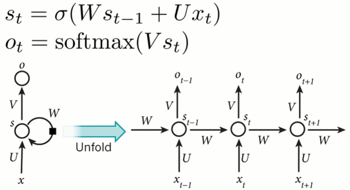
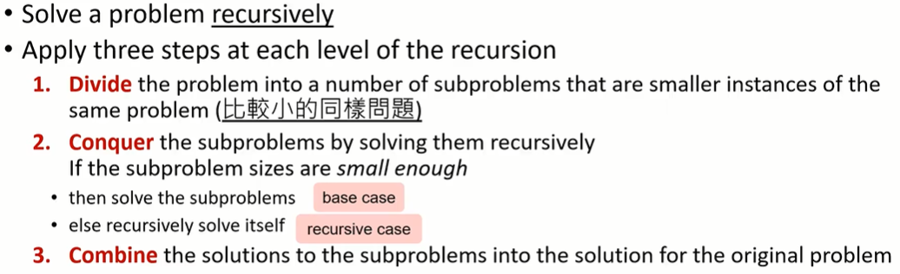

#### 2.分治法（Divide-and-Conquer）

* ##### 2.1 循环（Recurrence）

  * 概述
    * 递归式是一个方程或不等式，它用较小的输入值来描述一个函数
    * 举例：斐波那契数列（Fibonacci sequence）
      * Base case : F(0) = F(1) = 1
      * Recursive case : F(n) = F(n-1) + F(n-2)
  * 优势
    * 定义更容易、更清晰
      * 定义 base case 和 recursive case
      * 定义一个很长的序列
    * 
  * 循环神经网络（Recurrent Neural Network, RNN）
    * 

---

* **2.2 分治法（Divide-and-Conquer）**

  * 概述

    

  * 优势

    * 容易解决困难的问题
    * 容易找到高效率的算法
    * 稳定的平行运算（多核系统）
    * 更高效的内存接入

  * 举例

    * Tower of Hanoi (河内塔)

      * Problem : move n disks from A to C

      * Rules

        * Move one disk at a time
        * Cannot place a larger disk onto a smaller disk

      * 伪码

        ```
        Hanoi (n, src, dest, spare)
        {
        	if n == 1
        		Move disk from src to dest
        	else
        		Hanoi (n-1, src, spare, dest)
        		Move disk from src to dest
        		Hanoi (n-1, spare, dest, src)
        }
        ```

      * T(n) = moves with  n disks
        * Base case : T(1) = 1
        * Recursive case (n > 1) : T(n) = 2T(n-1) + 1  

    * Bitonic Champion Problem

      * Input : A bitonic sequence A[1], A[2], ..., A[n] of distinct positive integers

      * Output : the index i with 1 <= i <= n such that
        $$
        \large A[i] = max_{1 \le j \le n}A[j]
        $$

      * 伪码

        ```pseudocode
        Champion(i, j)
        {
        	if i == j
        		return i
        	else
        		k = floor((i + j) / 2)
        		l = Champion(i, k)
        		r = Champion(k+1, j)
        		if A[l] > A[r]
        			return l;
        		if A[l] < A[r]
        			return r
        }
        
        Champion-2(i, j)
        {
        	if i == j
        		return i
        	else
        		k = floor((i + j) / 2)
        		if A[k] > A[k+1]
        			return Champion(i, k)
        		if A[k] < A[k+1]
        			return Champion(k+1, j)
        }
        ```

        


