#### 3.动态规划（Dynamic Programming）

* ##### 3.1 概述

  * 功能

    * Overlapping subproblems 
    * Optional substructures

  * 方法

    

  * 步骤

    * 描述可选解决方案的结构
    * 递归地定义一个可选解决方案的值
    * 计算可选解决方案的值，通常采用自底向上的方式
    * 根据计算信息构造一个可选的解决方案

---

* **3.2 应用**

  * Fibonacci Sequence（斐波那契数列）

    * 定义

      * Base case : F(0) = F(1) = 1
      * Recursive case : F(n) = F(n-1) + F(n-2)

    * 伪码

      ```pseudocode
      Fibonacci (n)
      {
      	if n < 2
      		return 1
      	return Fibonacci(n-1) + Fibonacci(n-2)
      }
      
      // Top-Down with Memoization
      Memoized-Fibonacci (n)
      {
      	a[0] = 1
      	a[1] = 1
      	for i = 2 to n
      		a[i] = 0
      	return Memoized-Fibonacci-Aux(n, a)
      }
      
      Memoized-Fibonacci-Aux (n, a)
      {
      	if a[0] > 0
      		return a[n]
      	// save the result to avoid recomputation
      	a[n] Memoized-Fibonacci-Aux(n-1, a) + Memoized-Fibonacci-Aux(n-2, a)
      	return a[n]
      }
      
      // Bottom-Up Method
      Bottom-Up-Fibonacci (n)
      {
      	if n < 2
      		return 1
      	a[0] = 1
      	a[1] = 1
      	for i = 2 ... n
      		a[i] = a[i-1] + a[i-2]
      	return a[n]
      }
      ```

  * Shortest Path Problem

    * 定义
      * Input : a graph where the edges have positive costs
      * Output : a path from S to T with the smallest cost
      
    * 分析

      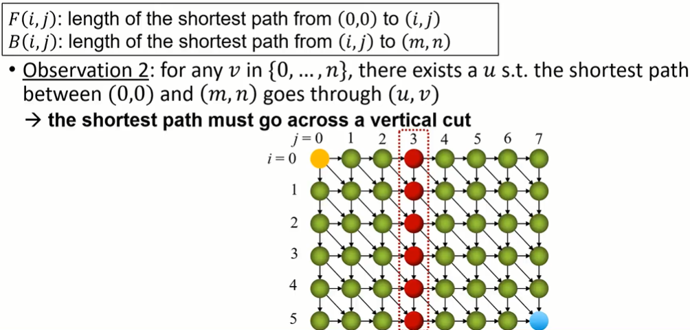

      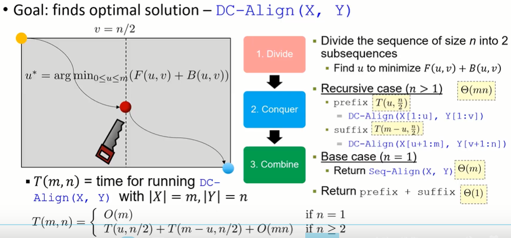

  * Rod Cutting Problem

    * 定义

      * Input : a rod of length n and a table of prices p_i for i = 1, ..., n

        | length i (m) |  1   |  2   |  3   |  4   |  5   |
        | :----------: | :--: | :--: | :--: | :--: | :--: |
        |  price p_i   |  1   |  5   |  8   |  9   |  10  |

      * Output : the maximum revenue r_n obtainable by cutting up the rod and selling the pieces

    * 分析

      

    * 伪码

      ```pseudocode
      Cut-Rod (p, n)
      {
      	// base case
      	if n == 0
      		return 0
      	// recursive case
      	a = -∞
      	for i = 1 to n
      		q = max(q, p[i] + Cut-Rod(p, n-i))
      	return q
      }
      
      // Top-Down with Memoization
      Memoized-Cut-Rod (p, n)
      {
      	// initialize memo (an array r[] to keep max revenue)
      	r[0] = 0
      	for i = 1 to n
      		r[i] = -∞ // r[i] = max revenue for rod with length = i
      	return Memorized-Cut-Rod-Aux(p, n, r)
      }
      
      Memoized-Cut-Rod-Aux (p, n, r)
      {
      	if r[n] >= 0
      		return r[n] // return the saved solution
      	q = -∞
      	for i = 1 to n
      		q = max(q, p[i] + Memoized-Cut-Rod-Aux(p, n-i, r))
      	r[n] = q // update memo
      	return q
      }
      
      // Bottom-Up with Tabulation
      Bottom-Up-Cut-Rod (p, n)
      {
      	r[0] = 0
      	for j = 1 to n // compute r[1], r[2], ..., in order
      		q = -∞
      		for i = 1 to j
      			q = max(q, p[i] + r[j - i])
      		r[j] = q
      	return r[n]
      }
      
      Extended-Bottom-Up-Cut-Rod (p, n)
      {
      	r[0] = 0
      	for j = 1 to n // compute r[1], r[2], ... in order
      	q = -∞
      	 for i = 1 to j
      	 	if q < p[i] + r[j - i]
      	 		q = p[i] + r[j - i]
      	 		cut[j] = i // the best first cut for len j rod
      	 	r[i] = q
      	 return r[n], cut
      }
      
      Print-Cut-Rod-Solution(p, n)
      {
      	(r, cut) = Extended-Bottom-Up-Cut-Rod (p, n)
      	while n > 0
      		print cut[n]
      		n = n - cut[n] // remove the first piece
      }
      ```

  * Sequence Alignment

    * Longest Common Subsequence (LCS)

      * 定义

        * Input : two sequence $X = (x_1, x_2, ..., x_m), Y = (y_1, y_2, ..., y_n)$​
        * Output : longest common subsequence of two sequences

      * 效率

        * 空间复杂度：O(mn)

      * 伪码

        ```pseudocode
        Seq-Align (X, Y, C_DEL, C_INS, C_{p,q})
        {
        	for j = 0 to n
        		M[0][j] = j * C_INS // |X|=0, const=|Y|*penalty
        	for i = 1 to m
        		M[i][0] = i * C_DEL // |Y|=0, const=|X|*penalty
        	for i = 1 to m
        		for j = 1 to n
        			M[i][j] = min(M[i-1][j-1]+C+{xi,yi}, M[i-1][j]+C_DEL, M[i][j-1]+C_INS)
        	
        	return M[m][n]
        }
        
        Find-Solution (M)
        {
        	if m = 0 or n = 0
        		return { }
        	v = min(M[m-1][n-1]) + C_{xm,yn}, M[m-1][n]+C_DEL, M[m][n-1]+C_INS)
        	if v = M[m-1][n] + C_DEL // deletion
        		return Find-Solution(m-1, n)
        	if v = M[m][n-1] + C_INS // insertion
        		return Find-Solution(m, n-1)
        	return {(m, n)} U Find-Solution(m-1, n-1) // match/substitution
        }
        ```

    * Viterbi Algorithm
    
    * Space Efficient Algorithm
    
  * Matrix-Chain Multiplication

    * 定义

      * Input : a sequence of n matrices $(A_!, ..., A_n)$
      * Output : the product of $A_1A_2...A_n$​

    * 分析

      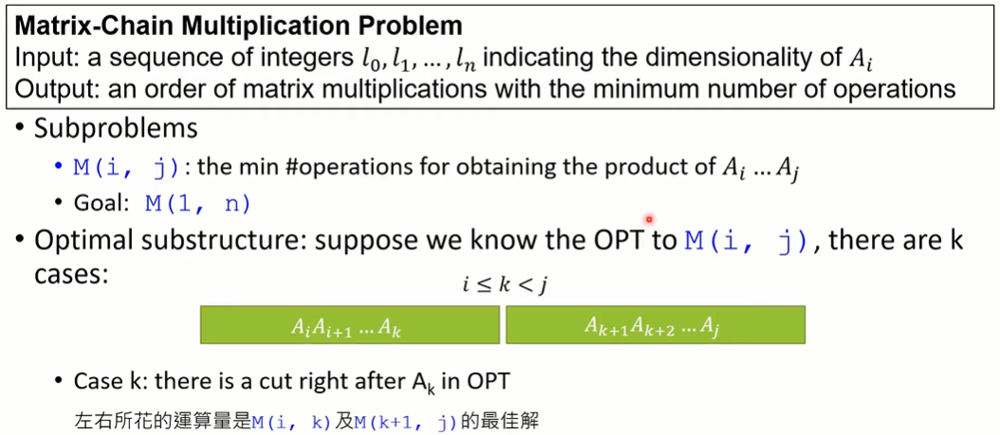

    * 伪码

      ```pseudocode
      Matrix-Chain (n, l)
      {
      	initialize two tables M[1..n][1..n] and B[1..n-1][2..n]
      	for i = 1 to n
      		M[i][i] = 0 // boundary case
      	for p = 2 to n // p is the chain length
      		for i = 1 to n - p + 1 // all i,j combinations
      			j = i + p - 1
      			M[i][j] = ∞
      			for k = i to j - 1 // find the best k
      				q = M[i][k] + M[k+1][j] + l[i-1] * l[k] * l[j]
      				if q < M[i][j]
      					M[i][j] = q
      	return M
      }
      ```

  * Weight Interval Scheduling

    * 定义

      * Input : n job requests with start times s_i, finish times f_i, and values v_i
      * Output : the maximum total value obtainable from compatible jobs

    * 分析

      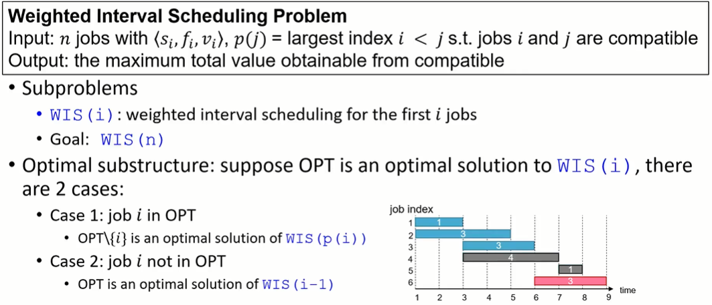

    * 伪码

      ```pseudocode
      WIS (n, s, f, v, p)
      {
      	M[0] = 0
      	for i = 1 to n
      		M[i] = max(v[i] + M[p[i]], M[i-1])
      	return M[n]
      }
      ```

  * Knapsack Problem

    * 定义

      * Input : n items where i-th item has value v_i and weight w_i (v_i and w_i are positive integers)
      * Output : the maximum value for the knapsack with capacity of W

    * Variants of knapsack problem

      * 0/1 Knapsack problem : 每项物品只能拿一个

        * 分析

          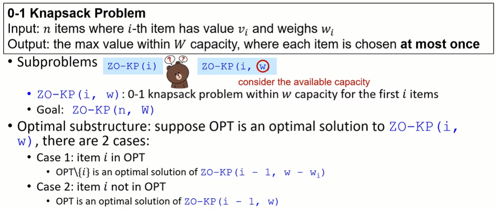

        * 伪码

          ```pseudocode
          ZO-KP (n, v, W)
          {
          	for w = 0 to W
          		M[0, w] = 0
          	for i = 1 to n
          		for w = 0 to W
          			if (w_i > w)
          				M[i, w] = M[i-1, w]
          			else
          				M[i, w] = M[i-1, w]
          	return M[n. W]
          }
          
          Find-Solution (M, n, W)
          {
          	S = { }
          	w = W
          	for i = n to 1
          		if M[i, w] > M[i-1, w] // case 1
          		S = S U {i}
          	return S
          }
          ```

      * Unbounded Knapsack : 每项物品可以拿多个

        * 分析

          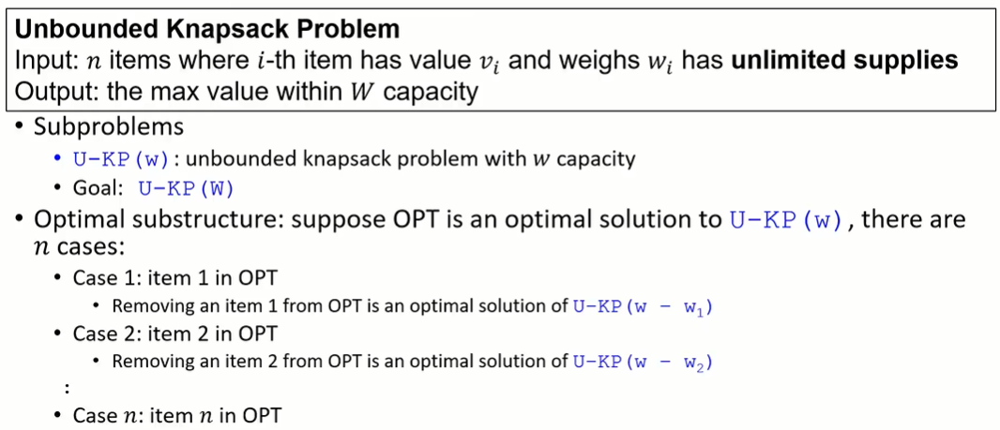

        * 伪码

          ```pseudocode
          U-KP (v, W)
          {
          	for w = 0 to W
          		M[w] = 0
          	for w = 0 to W
          		for i = 1 to n
          			if (w_i <= w)
          				tmp = v_i + M[w - w_i]
          				M[w] = max(M[w], tmp)
          	return M[W]
          }
          
          Find-Solution (M, n, W)
          {
          	for i = 1 to n
          		C[i] = 0
          	w = W
          	for i = i to n
          		while w > 0
          			if (w_i <= w && M[w] == (v_i + M[w-w_i]))
          				w = w - w_i
          				C[i] += 1
          	return C
          }
          ```

      * Multidimensional Knapsack Problem : 背包空间有限

        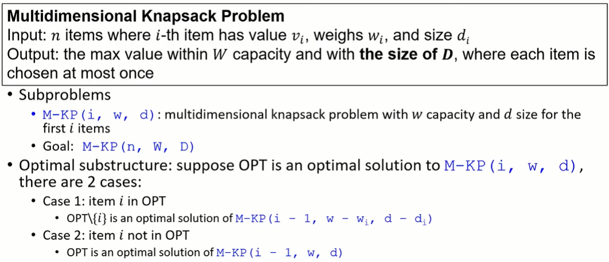

      * Multiple-Choice Knapsack Problem : 每一项物品最多拿一个

        * 定义

          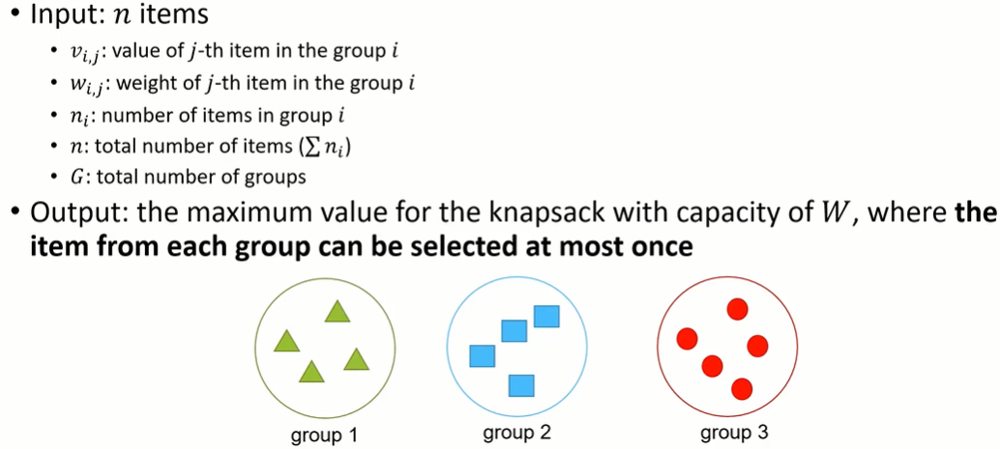

        * 分析

          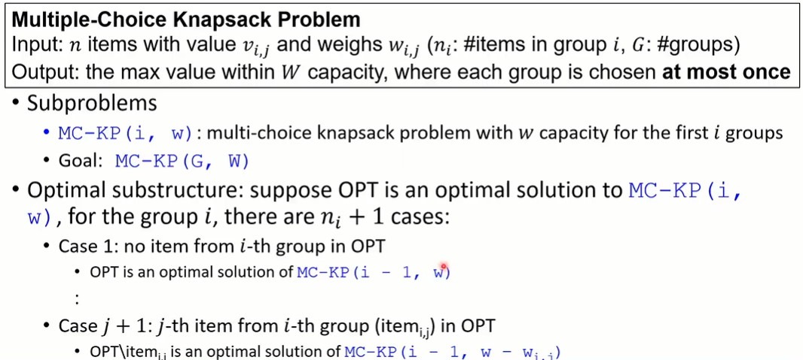

        * 伪码

          ```pseudocode
          MC-KP (n, v, W)
          {
          	for w = 0 to W
          		M[0, w] = 0
          	for i = 1 to G // consider groups 1 to i
          		for w = 0 to W // consider capacity = w
          			M[i, w] = M[i-1, w]
          			for j = 1 to n_i // check j-th item in group i
          				if (v_{i,j} + M[i-1, w-w_{i,j}] > M[i, w])
          					M[i, w] = v_{i,j} + M[i-1, w-w_{i,j}]
          	return M[G, W]
          }
          ```

      * Fractional Knapsack : 物品可以只拿部分

        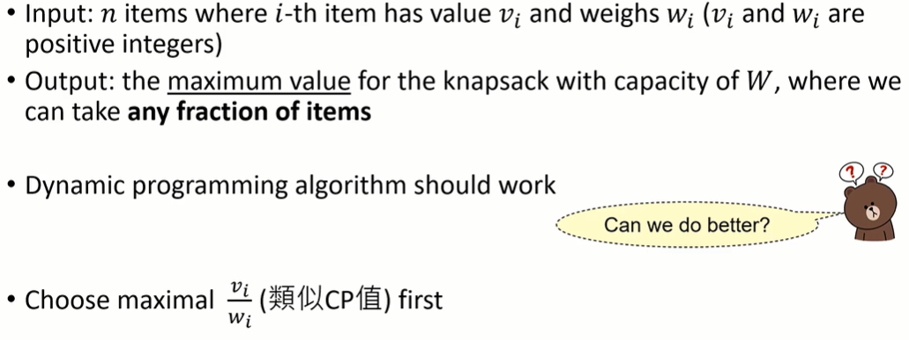

  * 总结

    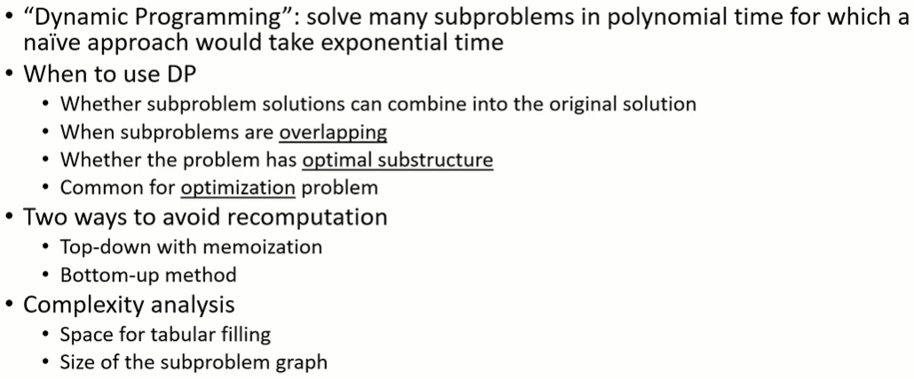

---

* **3.3 Pseudo-Polynomial Time**

  * polynomial : polynomial in the length of the input (#bits for the input)

  * Pseudo-polynomial : polynomial in the numeric value

    

  * The time complexity of 0-1 knapsack problem is O(nW)

    * n : number of objects

    * W : knapsack's capacity (non-negative integer)

    * polynomial in the numeric value 

      = pseudo-polynomial in input size

      = exponential in the length of the input

    * Note : the size of the representation of W is log_2 W

  * 时间复杂度

    * 时间复杂度是算法运行所需的时间，它是输入比特长度的函数
    * 而不是输入值的函数

