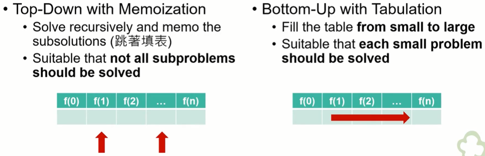
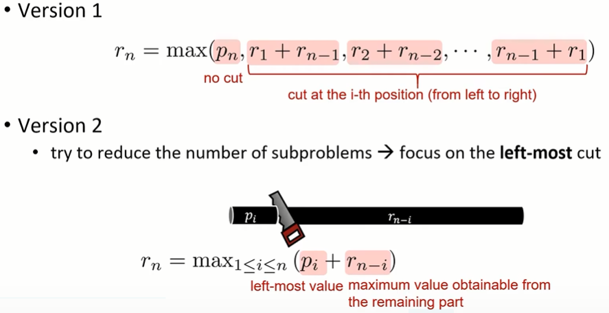

#### 3.动态规划（Dynamic Programming）

* ##### 3.1 概述

  * 功能

    * Overlapping subproblems 
    * Optional substructures

  * 方法

    

  * 步骤

    * 描述可选解决方案的结构
    * 递归地定义一个可选解决方案的值
    * 计算可选解决方案的值，通常采用自底向上的方式
    * 根据计算信息构造一个可选的解决方案

  * 举例

    * Fibonacci Sequence（斐波那契数列）

      * 定义

        * Base case : F(0) = F(1) = 1
        * Recursive case : F(n) = F(n-1) + F(n-2)

      * 伪码

        ```pseudocode
        Fibonacci (n)
        {
        	if n < 2
        		return 1
        	return Fibonacci(n-1) + Fibonacci(n-2)
        }
        
        // Top-Down with Memoization
        Memoized-Fibonacci (n)
        {
        	a[0] = 1
        	a[1] = 1
        	for i = 2 to n
        		a[i] = 0
        	return Memoized-Fibonacci-Aux(n, a)
        }
        
        Memoized-Fibonacci-Aux (n, a)
        {
        	if a[0] > 0
        		return a[n]
        	// save the result to avoid recomputation
        	a[n] Memoized-Fibonacci-Aux(n-1, a) + Memoized-Fibonacci-Aux(n-2, a)
        	return a[n]
        }
        
        // Bottom-Up Method
        Bottom-Up-Fibonacci (n)
        {
        	if n < 2
        		return 1
        	a[0] = 1
        	a[1] = 1
        	for i = 2 ... n
        		a[i] = a[i-1] + a[i-2]
        	return a[n]
        }
        ```

    * Shortest Path Problem

      * 定义
        * Input : a graph where the edges have positive costs
        * Output : a path from S to T with the smallest cost

    * Rod Cutting Problem

      * 定义

        * Input : a rod of length n and a table of prices p_i for i = 1, ..., n

          | length i (m) |  1   |  2   |  3   |  4   |  5   |
          | :----------: | :--: | :--: | :--: | :--: | :--: |
          |  price p_i   |  1   |  5   |  8   |  9   |  10  |

        * Output : the maximum revenue r_n obtainable by cutting up the rod and selling the pieces

      * 分析

        

      * 伪码

        ```pseudocode
        Cut-Rod (p, n)
        {
        	// base case
        	if n == 0
        		return 0
        	// recursive case
        	a = -∞
        	for i = 1 to n
        		q = max(q, p[i] + Cut-Rod(p, n-i))
        	return q
        }
        
        // Top-Down with Memoization
        Memoized-Cut-Rod (p, n)
        {
        	// initialize memo (an array r[] to keep max revenue)
        	r[0] = 0
        	for i = 1 to n
        		r[i] = -∞ // r[i] = max revenue for rod with length = i
        	return Memorized-Cut-Rod-Aux(p, n, r)
        }
        
        Memoized-Cut-Rod-Aux (p, n, r)
        {
        	if r[n] >= 0
        		return r[n] // return the saved solution
        	q = -∞
        	for i = 1 to n
        		q = max(q, p[i] + Memoized-Cut-Rod-Aux(p, n-i, r))
        	r[n] = q // update memo
        	return q
        }
        
        // Bottom-Up with Tabulation
        Bottom-Up-Cut-Rod (p, n)
        {
        	r[0] = 0
        	for j = 1 to n // compute r[1], r[2], ..., in order
        		q = -∞
        		for i = 1 to j
        			q = max(q, p[i] + r[j - i])
        		r[j] = q
        	return r[n]
        }
        
        Extended-Bottom-Up-Cut-Rod (p, n)
        {
        	r[0] = 0
        	for j = 1 to n // compute r[1], r[2], ... in order
        	q = -∞
        	 for i = 1 to j
        	 	if q < p[i] + r[j - i]
        	 		q = p[i] + r[j - i]
        	 		cut[j] = i // the best first cut for len j rod
        	 	r[i] = q
        	 return r[n], cut
        }
        
        Print-Cut-Rod-Solution(p, n)
        {
        	(r, cut) = Extended-Bottom-Up-Cut-Rod (p, n)
        	while n > 0
        		print cut[n]
        		n = n - cut[n] // remove the first piece
        }
        ```

    * Sequence Alignment


