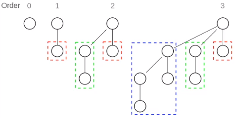

#### 5.树（Tree）

* ##### 5.1 概述

  * 分层访问 Hierarchical access

  * 定义

    * 递归定义 Recursive definition

      * T = (root; T1, T2, T3, ..., Tn)

    * 终止条件 Termination condition

      * T1 = (sub-root; T11, T12, ..., T1n)
      * Tterm = (root; xxx)

    * 深度 Depth/Level

    * 高度 Height

    * 复杂度 Degree

    * Node

      * Root node

      * Internal node

      * External node/Leaf node

        

      * Parent node

      * Sibling node

      * Children node

  * 二叉树 Binary tree

    * child <= 2
  
    * degree <= 2
  
    * ordered
  
    * 节点个数（h 层）
      * 最少：h+1
      * 最多：2^(h+1)-1
      * 节点个数 n 范围：h+1  <=  n  <=  2^(h+1)-1
      * 深度 h 的范围：lg(n+1)  <=  h  <=  n-1
      
    * 满二叉树
  
    * 完全二叉树
      * 编号：1、10、11、100、101、110、111
      * 先序遍历：1、10、100、101、11、110、111
      * 中序遍历：100、10、101、1、110、11、111
      * 后序遍历：100、101、10、110、111、11、1
      * 层序遍历：1、10、11、100、101、110、111
      
    * 二项树 Binomial tree
  
      * B0：1
  
        B1：2
  
        B2：4
  
        ...
  
        Bk：2^k
  
        
  
  * 类比
  
    * Binomial forest
    * Binomial heap
  
  * 函数
  
    ```pseudocode
    func constructTree(data)
    	if data empty
    		return null
    	else
    		create root node from data[0]
    		partition data to n sets
    		for i = 1 to n
    			T[i] = constructTree(i-th partition of data)
    		link root to T[i]'s 
    		return address of root node
    		
    // （3）*（（5）+（7））
    InfixPrint(T)
    {
    	// stopping
    	if (isLeaf(T))
    		print(T.data)
    	else {
    	// recursion
    		print("(")
    		InfixPrint(T.left);
    		print(")")
    		print(T.data)
    		print("(")
    		InfixPrint(T.right)
    		print(")")
    	}
    }
    
    PostfixPrint(T)
    {
    	// stopping
    	if (isLeaf(T))
    		print(T.data)
    	else {
    	// recursion
    		InfixPrint(T.left);
    		InfixPrint(T.right)
    		print(T.data)
    	}
    }
    ```
    
  * BST
  
    ```pseudocode
    BST-Search(K, T)
    {
    	mid <- root of T
    	if (k < mid)
    		return BST-Search(K, T->Left)
    	else if (k > mid)
    		return BST-Search(K, T->right)
    	else
    		return mid.value
    }
    ```

---

* **5.2 平衡二叉树（Balanced Binary Tree）**

  * 概念

    * 又被称为AVL树（有别于AVL算法）
    * 性质
      * 它是一 棵空树或它的左右两个子树的高度差的绝对值不超过1
      * 并且左右两个子树都是一棵平衡二叉树
    * 这个方案很好的解决了二叉查找树退化成链表的问题，把插入，查找，删除的时间复杂度最好情况和最坏情况都维持在O(logN)
    * 但是频繁旋转会使插入和删除牺牲掉O(logN)左右的时间，不过相对二叉查找树来说，时间上稳定了很多

  * 构造

    * $|h_L - h_R| \leq 1$​

    * 转换

      * RR, LL : one rotation
      * RL, LR : two rotations

    * eg

      初始数据：{1, 2, 3, 4, 5, 6, 7}

      左序遍历：{1, 2, 3, 4, 5, 6, 7}

  * 方法

    * 插入
    * 寻找

---

* **5.3 红黑树（Red-Black Tree）**
  * 2-4 tree
    * (2, 3, 4) tree
    * 性质
      * 每个内部节点(根节点除外)都有2到4个子节点
      * 每个节点中的键按从小到大的顺序排列
      * 内部节点比它们的子节点少一个键。每个这样的键在概念上被定位在两个连续的子节点之间。它的值比它左边的子树中最大的键要大，比它右边的子树中最小的键要小
      * 树的所有叶节点都在相同的深度
    * 效率
      * 树的高度是O(log n)
      * 搜索需要O(log n)
      * 插入需要O(log n)
      * 删除需要O(log n)
    * search
      * 搜索value，将value与每个键进行比较
      * 如果value == key，则返回相关的数据
      * 如果value < key，递归搜索键左边的子树
      * 如果value > key,使用下一个键重复这个过程，如果没有下一个键，搜索最后一个子树
    * ordered
  * 红黑树
    * R-B Tree，全称是Red-Black Tree，又称为“红黑树”，它一种特殊的二叉查找树
    * 红黑树的每个节点上都有存储位表示节点的颜色，可以是红(Red)或黑(Black)
    * 性质
      * 每个节点或者是黑色，或者是红色
      * 根节点是黑色
      * 每个叶子节点（NIL）是黑色。 [注意：这里叶子节点，是指为空(NIL或NULL)的叶子节点]
      * 如果一个节点是红色的，则它的子节点必须是黑色的
      * 从一个节点到该节点的子孙节点的所有路径上包含相同数目的黑节点
    * 时间复杂度是O(lgn)，效率非常之高

