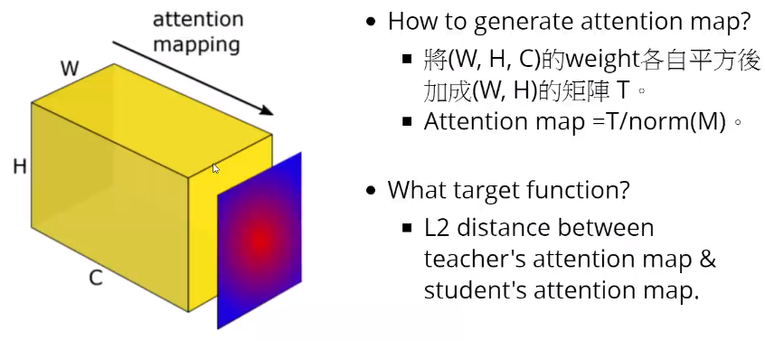

#### 12.网络压缩技术（Network Compression）

* ##### 12.1 网络压缩

  * 背景

    * 设备资源限制
    * 内存限制
    * 算力限制

  * 网络裁剪 Network Pruning

    * 网络是典型的过参数化的（weight or neurons）
    * 过程
      * Pre-trained Network (large)
      * Evaluate the Importance (Importance of a weight or neuron)
      * Reomve (smaller)
      * Fine-tune
      * Smaller Network (不影响原始精确度)
    * 实践
      * weight 裁剪
      * neuron 裁剪

  * 知识蒸馏 Knowledge Distillation

    * 原理

      * 先 training 一个大的网络
      * 再  training 一个小的网络

    * 举例

      

  * 参数量化 Parameter Quantization

    * 方法

      * 使用更少位去记录值
      * weight 集群
      * 更少的位表示频率高的集群，更多的位表示少的集群

    * 举例

      * Binary Connect

        

  * 体系结构设计 Architecture Design

    * 方法

      * 低秩近似 Low rank approximation

        

      * 切除分离卷积 Depthwise Separable Convolution

        * 切除卷积 Depthwise Convolution
          * Filter number = Input channel number
          * Each filter only considers one channel
          * The filters ara k x k matrices
          * There is no interaction between channels
        * 逐点卷积 Pointwise Convolution

        

        

  * 动态计算 Dynamic Computation

    * 方案
      * 训练多种 classifiers
      * 在中间层添加 classfiers
    * 多尺度的网络

---

* **12.2 介绍模型压缩**

  * 知识蒸馏 Knowledge Distillation

    * Distill Logits (输出值)

      * Baseline KD

        透过 soft target 让小 model 可以学到 class 之间的关系

      * Deep Mutual Learning

        让两个 Network 同时 train，并互相学习对方的 logits

        * 第一步：Update Net1

          

        * 第二步：Update Net2

          

      * Born Again Neural Networks

        * 初始 Model 是 KD 来的
        * 迭代使用 Cross Entropy
        * 最后 Ensemble 所有 Student Model

      * TAKD

        用一个参数量介于 Teacher & Student 的 TA 做中间人来帮助 Student 学习，以此避免 model 差距过大学不好

    * Distill  Feature (中间值）

      * FitNet

        先让 Student 学习如何产生 Teacher 的中间 Feature，之后使用 Baseline KD

        * Step 1 : Fit feature

          

        * Step 2 : Fit logits

          

      * Attention

        让 Student 学习 Teacher 的 Attention Map 以此位导

        

  * 关系蒸馏 Relational Distillation

    * Relational KD

      Individual KD：以每个 sample 为单位做知识蒸馏

      Relational KD：以 sample 之间的关系做知识蒸馏

      

      

    * Similarity - Preserving KD

      

      

---

* **12.3 网络裁剪 Network Pruning**

  * Neuron Pruning in DNN

    *   Neuron Pruning in DNN (a=4, b=3, c=2)

      

  * 评估 Evaluate

    * Evaluate by weight - sum of L1 norm

      

    * Eval by weight - FPCM

      

      

    * Eval by BN's  $\gamma$  - Network Slimming

      

      

    * Eval by Os after ReLU - APoZ

      

