#### 14.新架构（New Architecture）

* ##### 14.1 Review

  * Fully Connected Network
  * Convolutional Neural Network
    * ResNet
    * DenseNet
    * Inception Network
  * Recurrent Neural Network
    * Seq2seq
    * LSTM
    * Pointer Network

---

* **14.2 新架构**

  * 原因

    * 增加 Performance
    * 从数据中提取更好的特征
    * 生成器
    * 减少参数或者是可解释的

  * RNN less structure

    * Transformer

      * Encoding & Decoding

        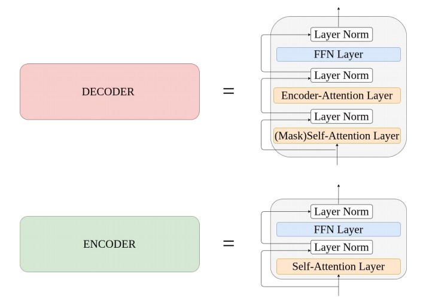

      * Sandwich transformers

        * 为了设计一个更好的 Transformer

        * 具有更多 self-attention 底层和更多 feedforward 子层的模型通常表现更好

        * 没有额外参数、内存要求

        * 参数相同但排序不同

          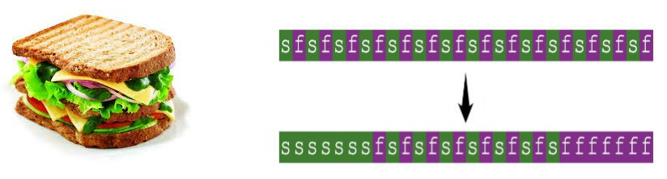

      * Universal Transformer

        * 背景

          * Transformer：翻译得好/算法任务差
          * Neural GPU：翻译得差/算法任务好
          * Neural Turing Machine：翻译得差/算法任务好

        * 图示

          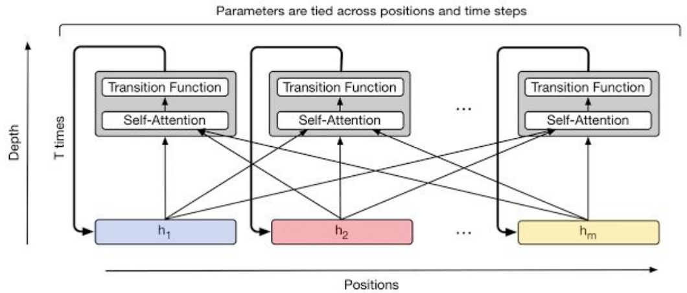

    * 剩余洗牌交换网络 Residual Shuffle Exchange Network

      * 同样的任务比其他模型使用更少的参数

      * 时间复杂度为 O(nlogn) 时间序列处理，专门应用于长序列

      * 洗牌和交换操作获取远距离信息取代了 attention

        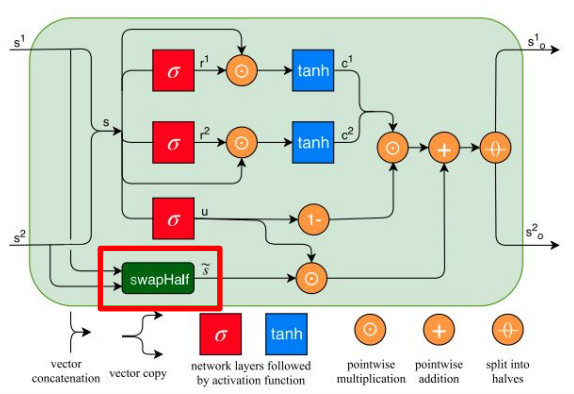

        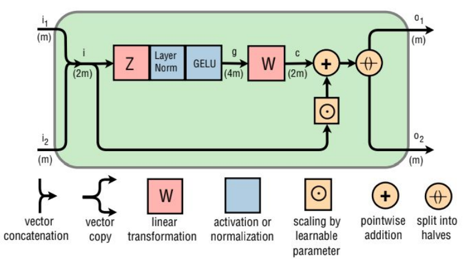

    * BERT

      * 模型

        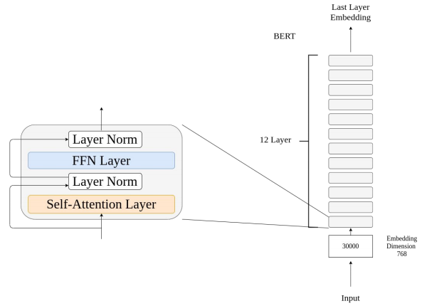

      * ALBERT

        * 因式分解嵌入矩阵
          * 原始 BERT：30000 x 768 = 23.04M
          * ALBERT：30000 x 128 = 3.8M，128 x 768 = 0.098M，Total：3.898M
        * 跨层共享相同的参数：1/ 12 BERT Parameter
        * 减少参数

        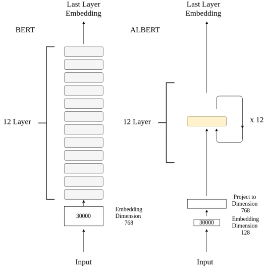

      * Reformer

        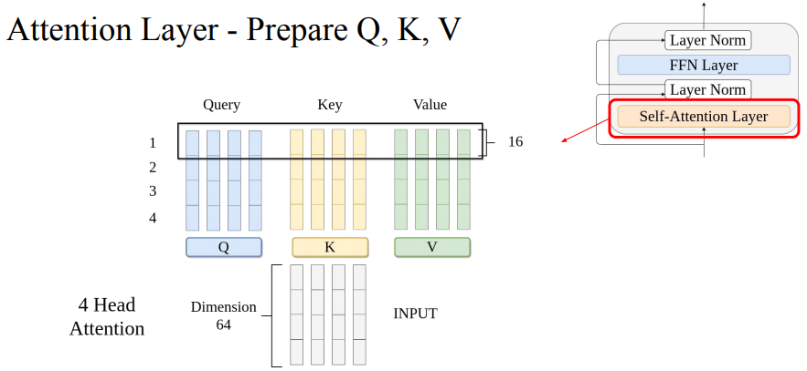

        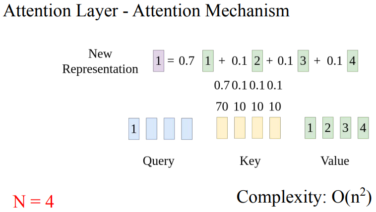

        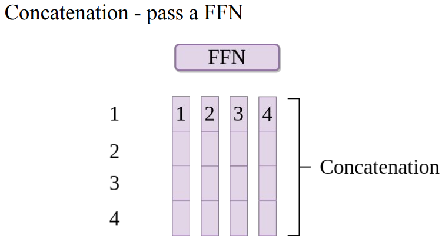

        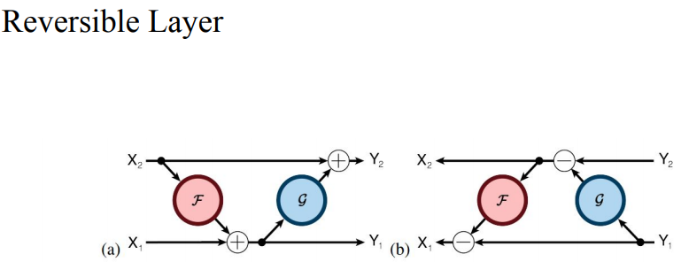

  * Style GAN

