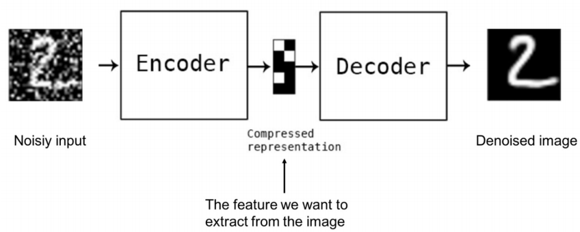
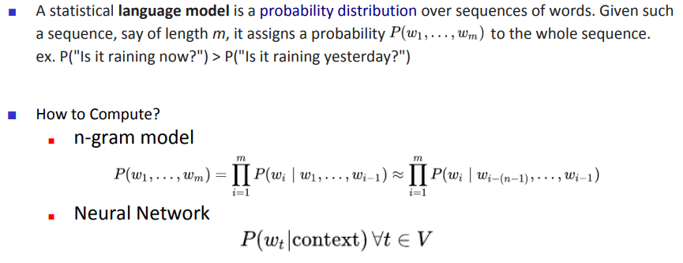
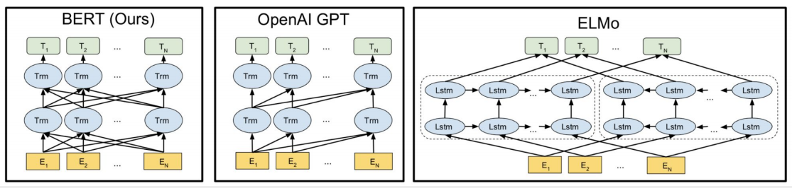
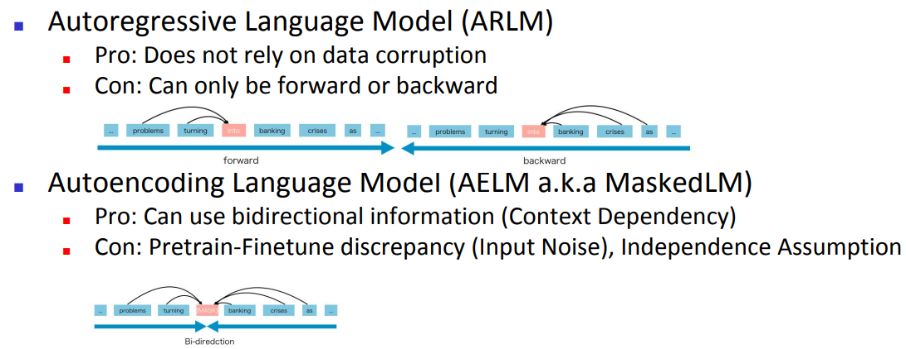
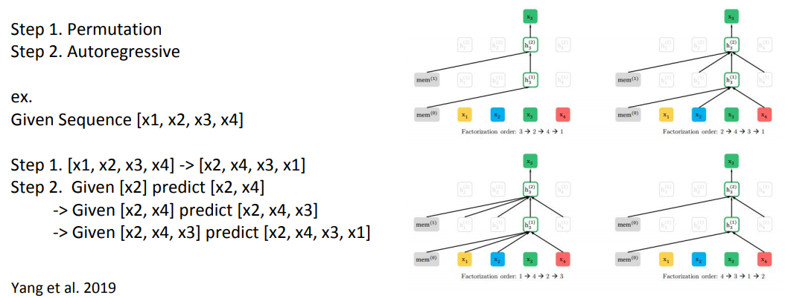
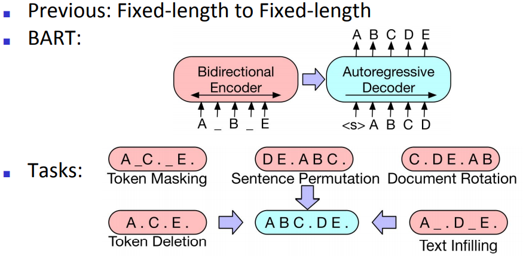
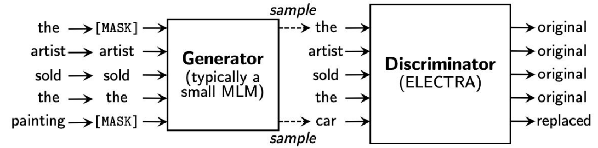
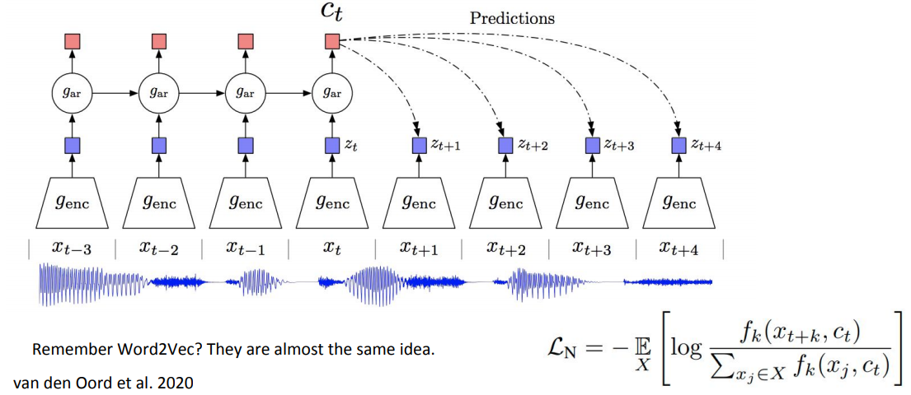
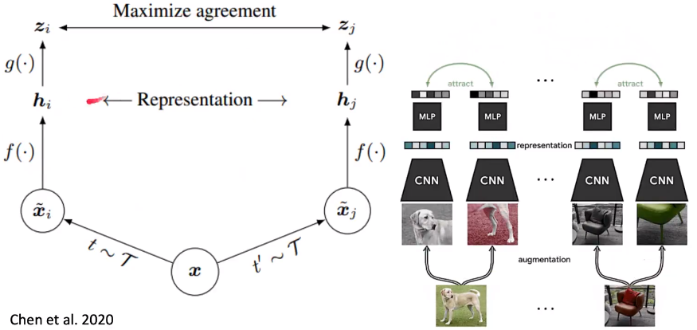

#### 14.自我监督学习（Self-Supervised Learning）

* ##### 14.1 概述

  * Review

    * Supervised Learning

      * Given :

        a dataset $D = \{(x, y)_i\}^N_{i=1}\}$ and

        a loss function $l : \widehat{y} \times y \rightarrow R, (\widehat{y}, y) \rightarrow l(\widehat{y}, y)$

      * Goal :

        $min_{\theta} E_{(x,y)-D}[l(f_{\theta}(x), y)]$

      * 当标记数据丰富时工作良好
      * 在监督下学习有用的表示

  * 原因

    * 标记数据成本高，未标记数据成本低
    * 非监督学习的一个版本，其中数据提供监督
    * 一般来说，保留一部分数据，让神经网络从剩余部分中预测它
    * 目标:在学习任务之前学习表达世界

---

* **14.2 自我监督学习的方法**

  * Reconstruct from a corrupted (or partial) data

    * Denoising Autoencoder

      

    * Bert-Family (Text)

      * Language Model

        

      * ELMO & GPT & BERT

        

      * ARLM vs AELM

        

      * XLNet - Permutation LM

        

      * BART - Encoder & Decoder

        

      * ELECTRA - Discriminator

        

    * In-painting (Imagae)

      * 预测图片的缺失的部分
      * 从另一个角度预测，如灰度图 - 彩色图

  * Visual common sense tasks 

    * 拼图游戏（Jigsaw puzzles）
    * 旋转（Rotation）

  * Contrastive Learning

    * word2vec

    * 对比预测编码（Contrastive Predictive Coding, CPC）

      

    * SimCLR

      

