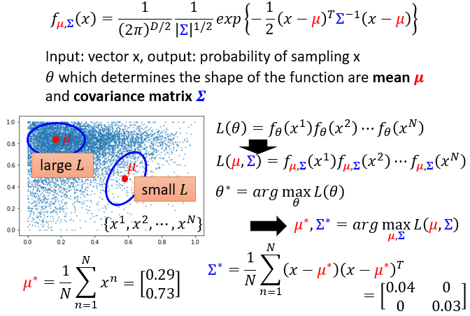

#### 16.异常检测（Anomaly Detection）

* ##### 16.1 概述

  * Problem Formulation

    

  * 应用

    * Fraud Detection
    * Network Intrusion Detection
    * Cancer Detection

  * 检测

    * Binary Classification

      

    * Categories

      

    * 举例

      * Case 1 : With Classifier

        * 使用分类器

          

        * Example Framework

          

        * Evaluation

          * 正确率高并不意味着系统好
          * 一个系统有很高的正确率，但它什么也没有做

      * Case 2  : With Labeled

        * Maximum Likelihood

          

        * Gaussian Distribution

          

          

          

---

* **16.2 异常检测的分类方法和应用**
  * Classic Method
    * With Classifier
    * GMM (Gaussian Mixture Model)
    * Auto-Encoder
    * PCA
    * Isolation Forest
    * Summary
  * Anomaly Detection on image
    * AnoGAN
    * EGBAD
    * GANomaly
    * Summary
  * Anomaly Detection on Audio
    * GMGAN

