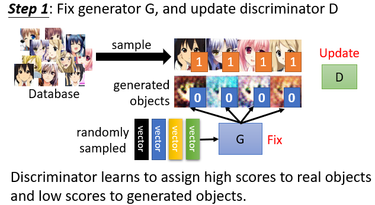
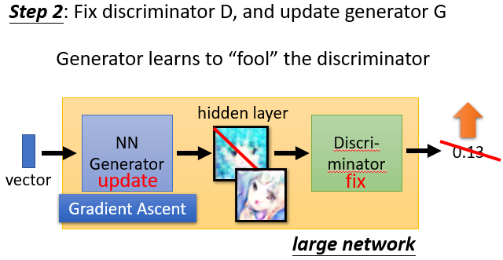
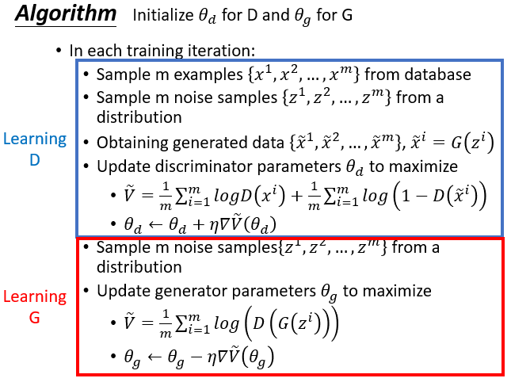

#### 17.生成对抗网络（Generative Adversarial Network, GAN）

* ##### 17.1 概述

  * GAN 基本概念
  
    * Generator 
  
      * 它是一个神经网络（NN）或函数
      * Vector  ------  Generator  ------ Image (高维向量)
  
    * Discriminator
  
      * 它也是一个神经网络（NN）或函数
      * Image  ------  Discriminator  ------ Scalar (较大的值表示真实，较小的值表示虚假)
  
    * 两者不断进化，彼此对抗
  
    * 关系：generator（student），discriminator（teacher）；写作敌人，念作朋友
  
    * GAN Algorithm
  
      * Initialize generator and discriminator : G D
  
      * In each training iteration
  
        
  
        
  
        
  
  * GAN 可作为结构化学习
  
  * Generator 能自我学习
  
  * Discriminator 也能 generate
  
  * 其他理论

