#### 18.迁移学习（Transfer Learning）

* ##### 18.1 概述

  * 背景

    * 有与所考虑的任务不直接相关的数据
    * 相同的域，不同的任务
    * 不同的域，相同的任务

  * 框图

    

  * Model Fine-tuning

    * 结构

      

    * 方法

      * Conservative Training

        

      * Layer Transfer

        

        

        

  * Multitask Learning
  
    * 结构
    
      
    
    * 应用
    
      * Multilingual Speech Recognition
    
        
    
      * Progressive Neural Network
    
        

  * Domain-adversarial training

    * Task description

      

    * Domain-adversarial training

      

      

  * Zero-shot learning

    * 结构

      

    * 用属性表示每个类
  
      * Training : 丰富的 attributes 对于一一映射
      * Testing : 找到最相似的 attributes 类，丰富的 attributes 对于一一映射

    * 举例

      

      
  
      
      
      

---

* **18.2 域适应（Domain Adaptation）**

  * 概述

    * Domain Adaptation Foundations

      * Transfer Learning v.s. Domain Adaptation

        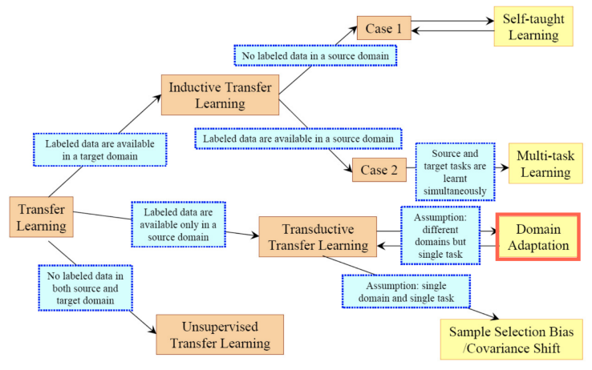

      * 背景
        * Task 针对 target domain，但在 training 时 target doamin 没有（或是很少）label
        * Source Domain 是 fully labelled
      * DA Settings
        * Homogeneous DA
        * Eg, Source / Target are both images

    * Domain Adaptation Methods Overview

      * Discrepancy-based methods

        * 图解

          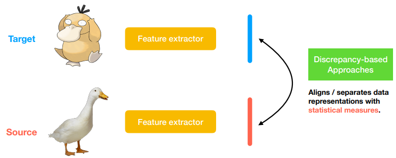

        * 方法

          * Deep Domain Confusion (MMD)

            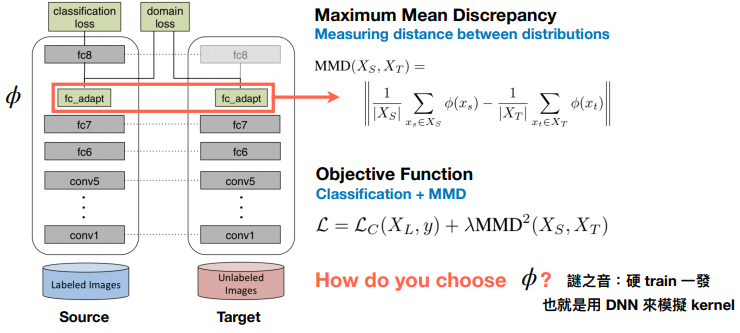

          * Deep Adaptation Networks

            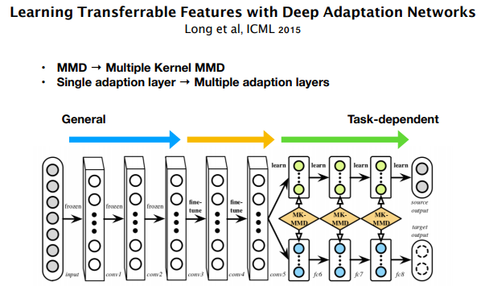

          * CORAL, CMD

            * CORAL : use 2nd order meoments

              

            * CMD : use even higher moments

              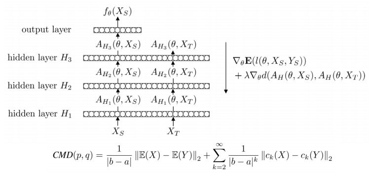

      * Adversarial-based methods

        * 图解

          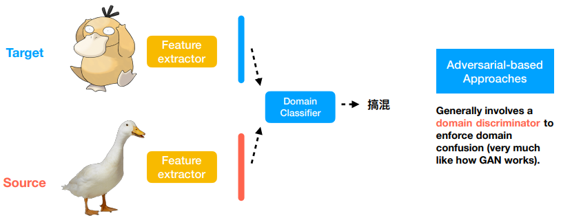

        * 方法

          * Simultaneous Deep Transfer Across Domains and Tasks

            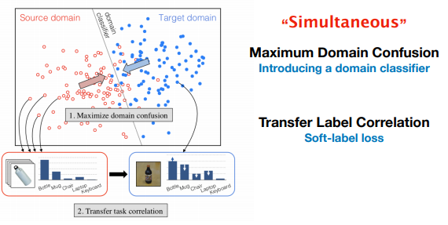

          * Domain Adversarial Training of Neural Networks (quick recap)

            * Input sampled from target domain

            * Class label: Unlabelled, domain label 0

              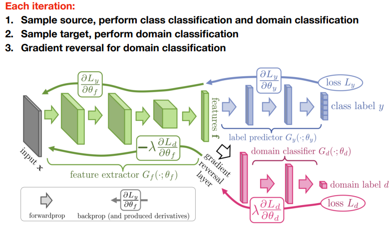

          * PixelDA

            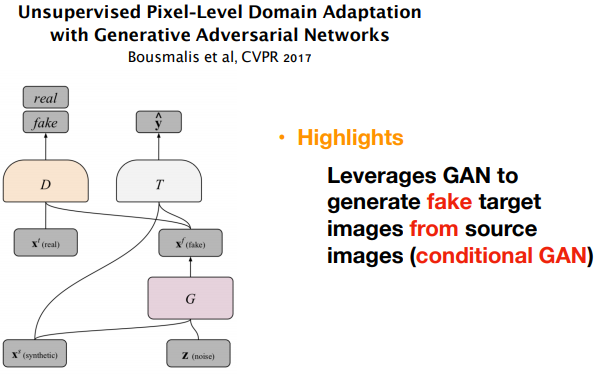

      * Reconstruction-based methods

        * 图解

          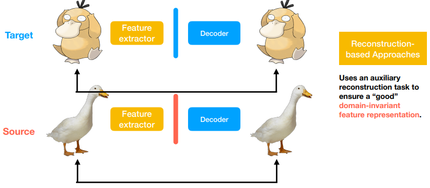

        * Deep Separation Networks

          * 亮点 : 特性解缠，共享/独占特性

            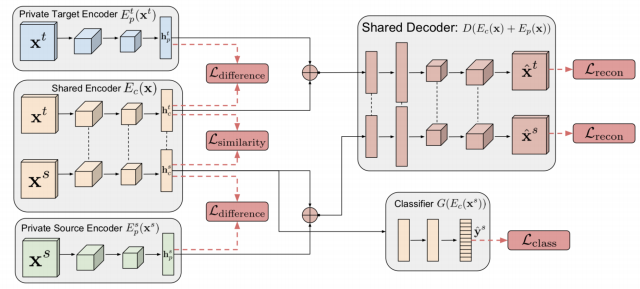

  * 应用

    * Image to Image Translation

      * UNIT (Unsupervised Image-to-Image Translation Networks)

        * Two distincu domains

        * Unpaired tarining data

        * Share the same latent space

        * Domain Invariant feature

          

        * Weight Sharing in high-dimensional space

        * Learning share latent space

          

        * VAE Loss

        * GAN Loss

        * Cycle Consistency Loss

          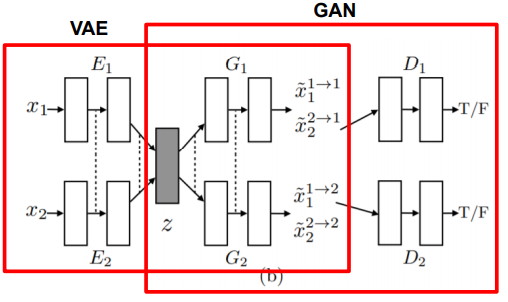

      * Multi-model Image Translation

        * Multimodal Unsupervised Image-to-Image Translation (MUNIT)

          * Two distinct domains (Diverse image)

          * Unpaired training data

          * Disentangle features into content and style features

            

          * Bidirectional  reconstruction loss

          * Adversarial loss

        * Diverse Image-to-Image Translation via Disentangled Representations (DRIT)

    * Semantic Segmentation

      * Learning to Adapt Structured Output Space for Semantic Segmentation (AdaptSegNet)

        * Two distinct domains (Syntheic vs Real)

        * Only source domain has labeled data

        * Structured output share many similarities

          

        * Segmentation Loss

        * Adversarial Loss

          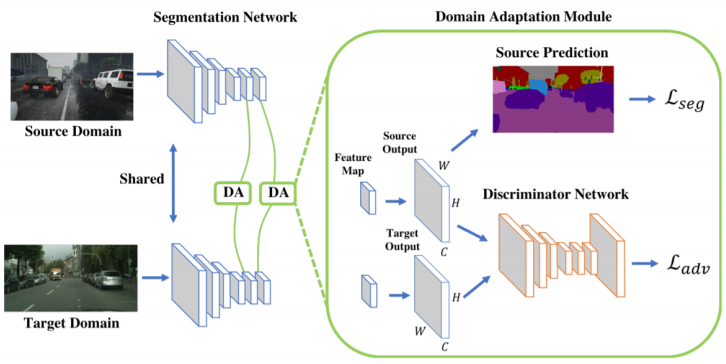

      * Unsupervised Domain Adaptation for Semantic Segmentation via Class-Balanced Self-Training (CBST)

        * Two distinct domains  (Syntheic vs Real)

        * Only source domain has  labeled data

        * Iterative self-training  (pseudo label)

          

        * Self-Training Scheme

        * Each class has unique threshold to  determine its pseudo labels

        * Incorporate with spatial priors

          

        * Some classes are easy to optimize, some are not

        * k should be dependent on class

        * Different classes have different prior distributions

        * Softmax output multiplies spatial prior (0~1)

          

        * Self-Training

          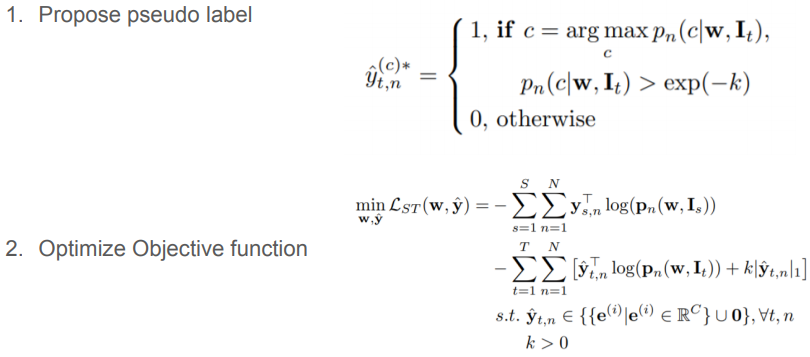

          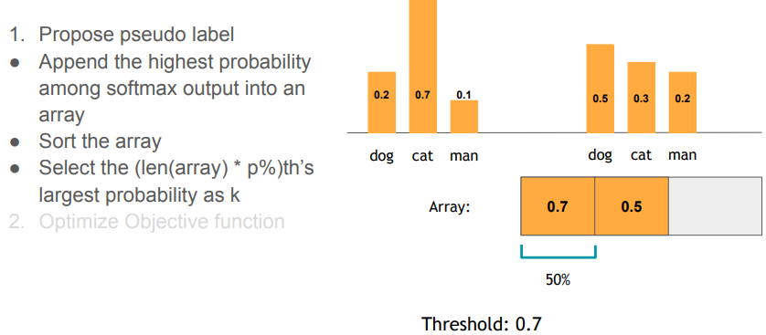

    * Person Re-ID

      * Image-image domain adaptation with preserved self-similarity and domain-dissimilarity for person re-identification (SPGAN)

        * Two distinct domains (Market vs Duke)

        * Only source domain has labeled data

        * Self-Similarity and Domain-Dissimilarity

          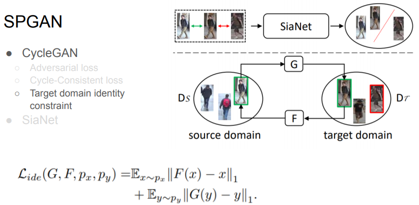

      * Invariance matters: Exemplar memory for domain adaptive person re-identification (ECN)

        * Two distinct domains (Market vs Duke)

        * Only source domain has labeled data

        * Intra-domain variation (Three kinds of invariance)

          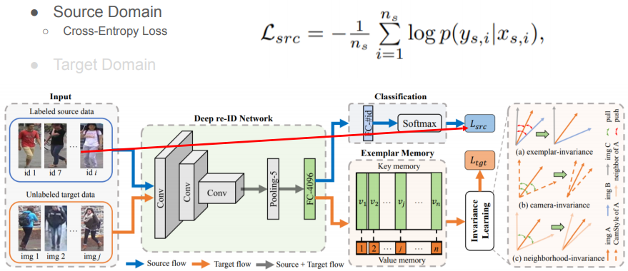

