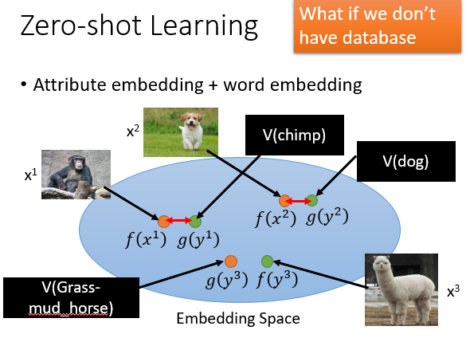

#### 18.迁移学习（Transfer Learning）

* ##### 18.1 概述

  * 背景

    * 有与所考虑的任务不直接相关的数据
    * 相同的域，不同的任务
    * 不同的域，相同的任务

  * 框图

    

  * Model Fine-tuning

    * 结构

      

    * 方法

      * Conservative Training

        

      * Layer Transfer

        

        

        

  * Multitask Learning
  
    * 结构
    
      
    
    * 应用
    
      * Multilingual Speech Recognition
    
        
    
      * Progressive Neural Network
    
        

  * Domain-adversarial training

    * Task description

      

    * Domain-adversarial training

      

      

  * Zero-shot learning

    * 结构

      

    * 用属性表示每个类
  
      * Training : 丰富的 attributes 对于一一映射
      * Testing : 找到最相似的 attributes 类，丰富的 attributes 对于一一映射

    * 举例

      

      
  
      
      
      

