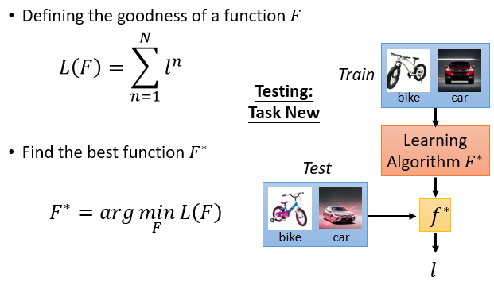

#### 19.元学习法（Meta Learning）

* ##### 19.1 概述

  * 定义
    * Meta learning = Learn to learn
    * Life-long : one model for all the tasks
    * Meta : How to learn a new model

  * 比较

    * Machine Learning : 根据资料找一个函数 f 的能力
    * Meta Learning : 根据资料找一个  找一个函数 f 的  函数 F 的能力

  * 元学习

    * Define a set of learning algorithm

      

    * Defining the goodness of a function F

      

    * Pick the best function F*

      

  * Model

    * MAML

      * 定义

        

        

      * 算法

        

      * Real Implementation

        

    * Reptile

      

      

---

* **19.2 Meta Learning & More**

  * 定义

    

  * 优势

    * 需要学习太多的 tasks ，为了学习更有效率  ->  learning to learn (机器学习 model)
      * Faster learning methods (adaptation)
      * Better hyper-parameters / learning algorithms
      * Related to :
        * transfer learning
        * domain adaptation
        * muti-task learning
        * life-long learning
    * 数据太少，无法更准确地拟合  ->  few-shot learning (更好的学习者，适应得更快)
      * 传统的监督可能不起作用

  * 内容

    * Model Parameters (suitable for Few-shot framework)
      * Initializations
      * Embeddings /Representations/Metrics
      * Optimizers
      * Reinforcement learnng (Policies/other settings)
    * Hyperparameters (e.g. AutoML)
      * Hyperparameters search ((training) settings)
      * Network architectures à Network architecture search (NAS)
    * Others
      * Algorithm itself (literally, not a network)

  * 方法

    * Categories

      * Black-box ((memory) Model) based

        

      * Optimization (Gradient) based  (Parametric)

        * Optimization (Gradient) based  (Parametric)

        * Learn model initialization

          * MAML (Model Agnostic Meta Learning) 
          * Reptile
          * Meta-LSTM (can be also viewed as RNN black-box)

        * different meta-parameters

        * improvements of MAML

          

          

          

        * Meta-SGD

          

        * iMAML

          

          

      * Non-parametric (Metric based)

        * Learn to compare
        
          

    * Datasets
  
      * Omniglot
        * Launched by linguist Simon Ager in 1998
        * As a dataset by Lake in 2015, Science
        * Concept learning
      * miniImageNet
        * from ImageNet but few-shot
      * CUB (Caltech-UCSD Birds)

    * Models
  
  * 机器学习相关的主题

