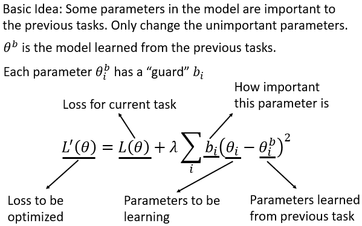
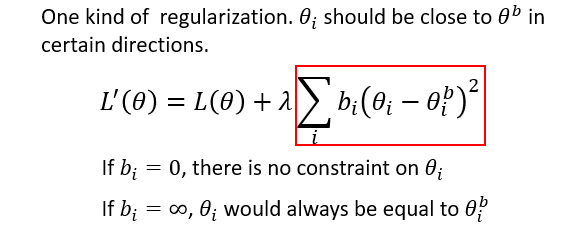
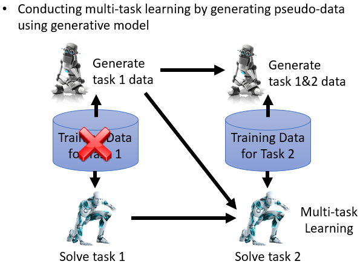
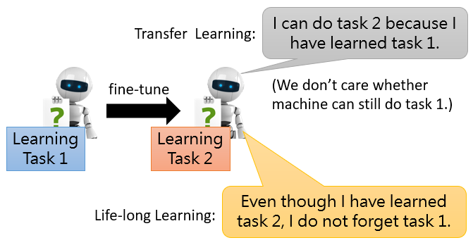
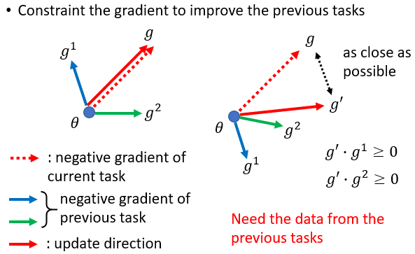
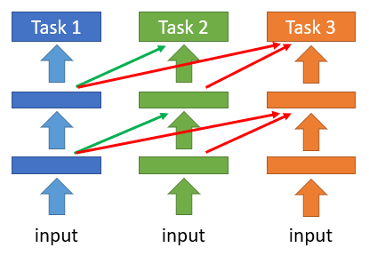
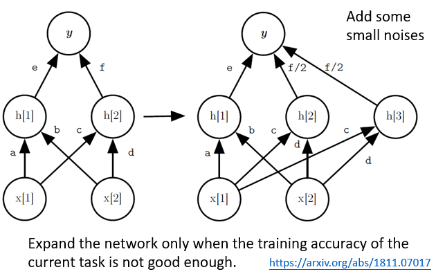

#### 20.终身学习（Life Long Learning, LLL）

* ##### 20.1 概述

  * 定义

    * 不断学习
    * 永不停止学习
    * 增量学习

  * 重点

    * Knowledge Retention

      * but NOT Intransigence

      * Catastrophic Forgetting 灾难性的忘记

        * 多任务训练能解决问题

          * 使用所有的数据来训练  ->  计算问题
          * 始终保存数据  ->  存储问题

        * Elastic Weight Consolidation (EWC)

          

          

      * Generating Data

        

    * Knowledge Transfer

      * 为每一个任务训练一个模型

        * 知识不能转换处理其他任务

        * 最终我们不能存储所有的模型

          

      * Gradient Episodic Memory (GEM)

        

    * Model Expansion

      * but Parameter Efficiency

      * Progressive Neural Networks

        

      * Net2Net

        

---

* **20.2 Life Long Learning & More**
  * 

