#### 21.强化学习（Reinforcement Learning）

* ##### 21.1 深度强化学习（Deep Reinforcement Learning）

  * 概述

    * AI = RL + DL

    * 强化学习情境

      * Review

        * Agent 学会采取行动最大化期望的 reward

        * 机器学习 ≈ 找函数

          

      * Learning to play Go
        * supervised learning + reinforcement learning
        * policy-based + value-based + model-based
      * Learning a chat-bot
        * 机器从用户获取反馈
        * Chat-bot 学会采取行动最大化期望的 reward
        * 使用这个方法，我们能 generate 大量的对话
        * 使用一些预先定义的规则评估一个对话的好坏
      * Playing Video Game
        * 机器和人类一样学习电子游戏
        * 机器观察像素是什么
        * 机器学会自己采取适当的行动

    * 强化学习的难点

      * Reward delay 
      * Agent's actions affect the subsequent data it receives

    * Supervised Learning v.s. Reinforcement Learning

      * Supervised Learning  : Learning from teacher
      * Reinforcement Learning : Learning from experience
      
    * 架构图

      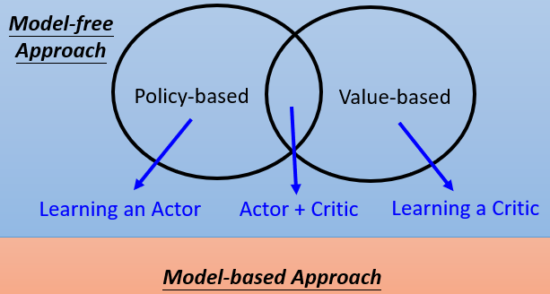

  * Policy-based Approach (Learning an Actor)

    * Three Steps for Deep Learning

      * Step 1 : Neural Network as Actor

        * Input of neural network : the observation of machine represented as vector or a matrix
        * Output neural network : each action corresponds to a neuron in output layer

      * Step 2 : Goodness of Actor

        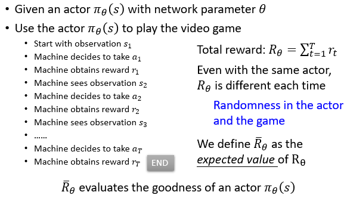

        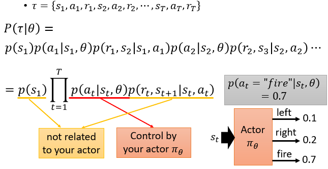

        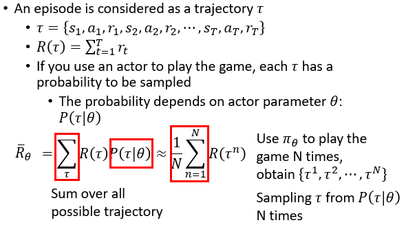

      * Step 3 : Gradient Ascent

        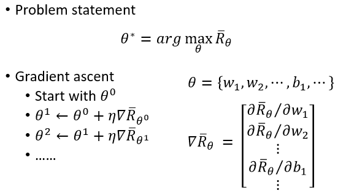

        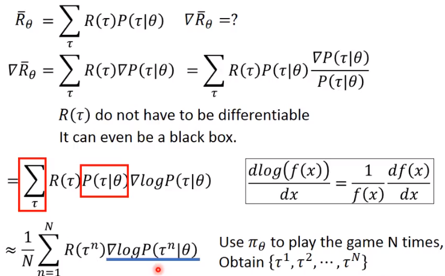

        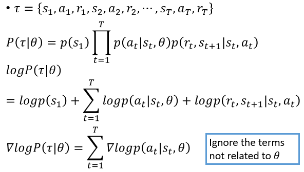

        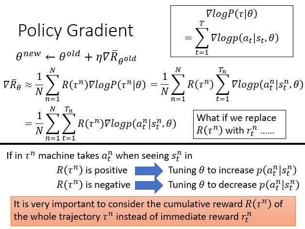

        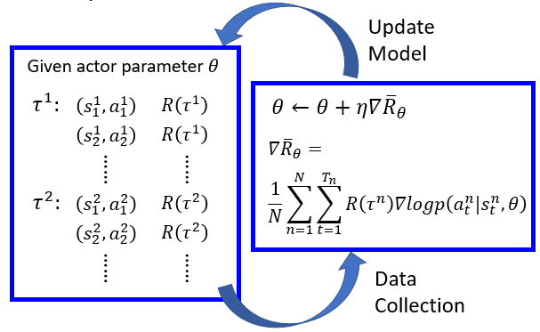

  * Value-based Approach (Learning a Critic)

    * 一个 critic 不能决定 action 

    * 给一个 actor Π，它评估 actor 有多好

    * State value function $V^{\pi}(s)$

      * 当使用 actor Π，累积的奖励期望在观察后获得 (state) s

        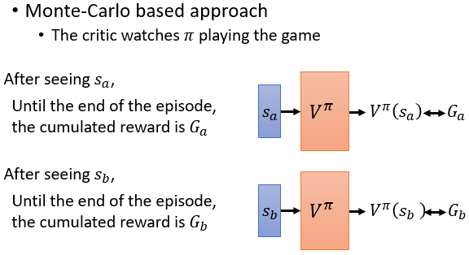

        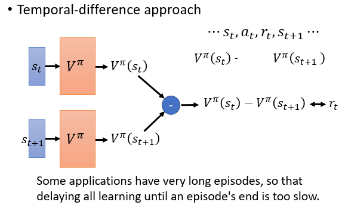

    * State-action value function $Q^{\pi}(s,a)$

      * 当使用 actor Π，累积的奖励期望在观察后获得 s 和 a

        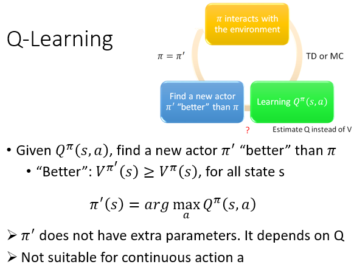
        
        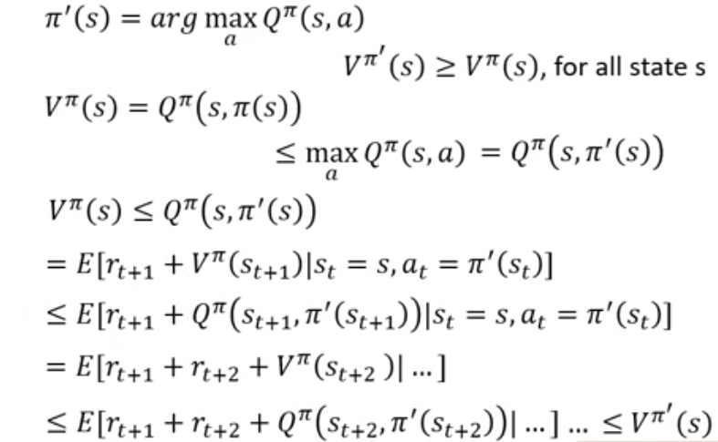

---

* **21.2 机器和环境互动**

  * 概述

    * 机器观察一些输入，然后采取行动，最后实现目标

      * Go playing
      * Machine plays video games
      * Self-driving car
      * Dialogue system

    * Network 作为一个函数，作为典型的监督学习

      * Inpits  ----  Network  ----  Outputs
      * Behavior Cloning

    * 交互的特点

      * 机器不知道一些行为必须学习，但是一些能被无视
      * 机器不知道每个行为的作用
      * Agent's actios 影响接下来它收到的数据
      * Reward delay

    * 方案

      * Reinforcement Learning

        * 机器和环境交互

        * 机器从环境中获取收益，所以它知道它性能的好坏

          

        * Training an Actor

          * Neural network as Actor
          * Input of neural network : the observation of machine represented as vector or a matrix
          * Output neural network : each action corresponds to a neuron in output layer
          * 基于概率采取行动

        * Training a Critic 

          * 一个 critic 不能决定 action 
          * 给一个 actor Π，它评估 actor 有多好
          * State value function $V^{\pi}(s)$
          * State-action value function $Q^{\pi}(s,a)$

        * Actor + Critic

          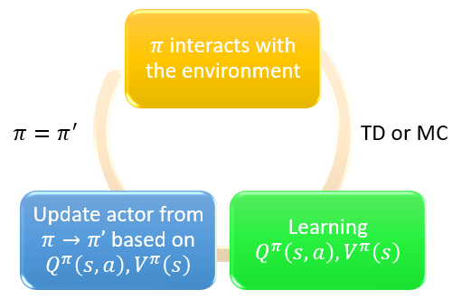

          

        * Actor 

        * Environment

        * Reward

    * Learning by demonstration
      * 又称模仿学习、学徒学习
      * 专家演示如何解决任务，机器从演示中学习

  * Inverse Reinforcement Learning

    * Motivation

      * 在一些任务中很难定义 reward
      * 手工制作的奖励可能导致不受控制的行为

    * 架构图

      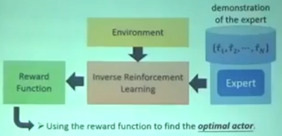

---

* **21.3 Proximal Policy Optimization (PPO)**

  * Default reinforcement learning algorithm at OpenAI

  * Policy Gradient

    * Basic Components

      * Actor + Env + Reward Function

        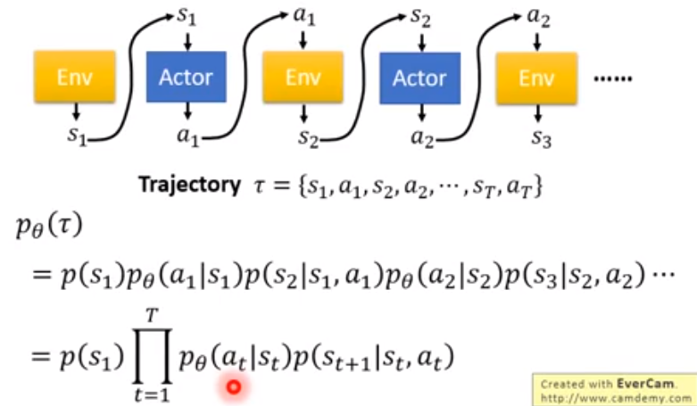

      * Expected Reward
        $$
        \large R_{\theta} = \sum_{\tau}R(\tau)p_{\theta}(\tau) = E_{\tau~p_{\theta}(\tau)}[R(\tau)]
        $$
        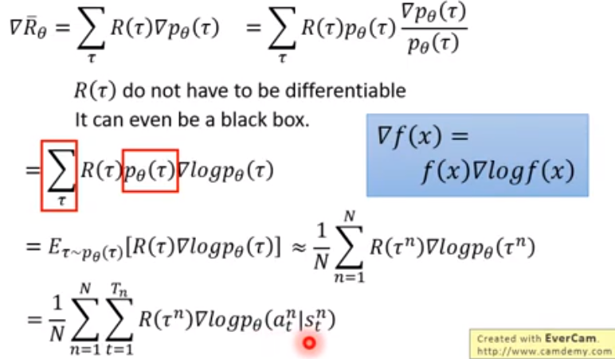

        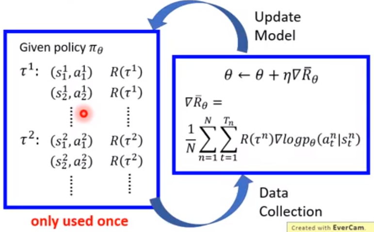

    * Policy of Actor

      * policy Π is a network with parameter $\theta$
      * Input of neural network : the observation of machine represented as vector or a matrix
      * Output neural network : each action corresponds to a neuron in output layer

    * 实现

      * Tip 1 : Add a Baseline

        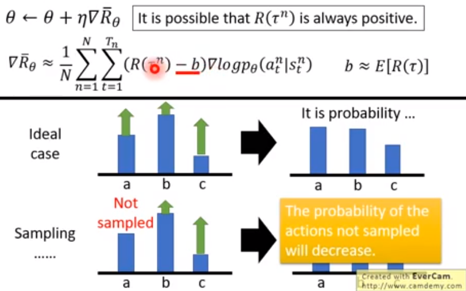

      * Tip 2 : Assign Suitable Credit

        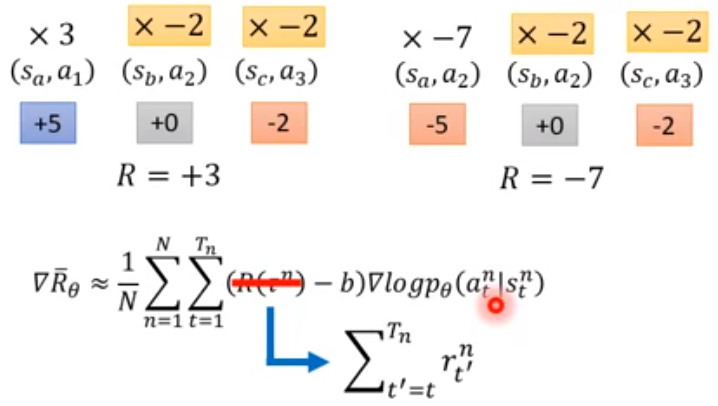

        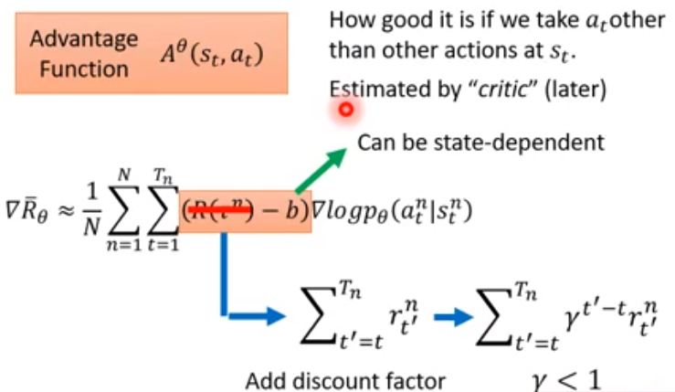

  * On-policy  --  Off-policy

    * Using the experience more than once

    * On-policy : The agent learned and the agent interacting with the enviroment is the same

    * Off-policy : The agent learned and the agent interacting with the environment is different

      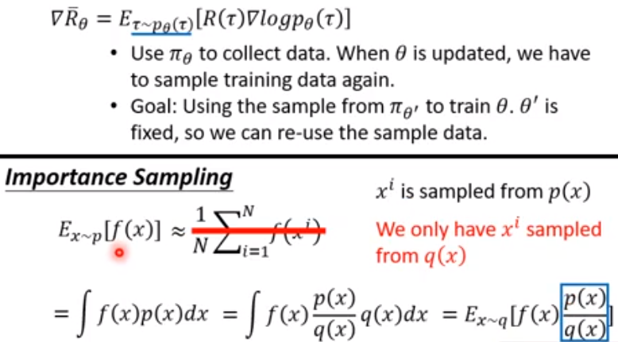

      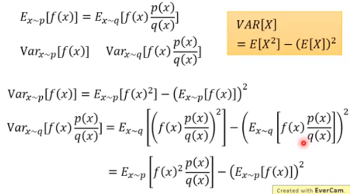

      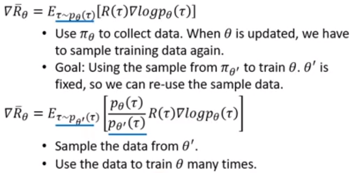

      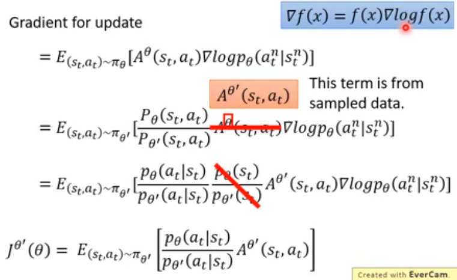

    * PPO/TRPO

      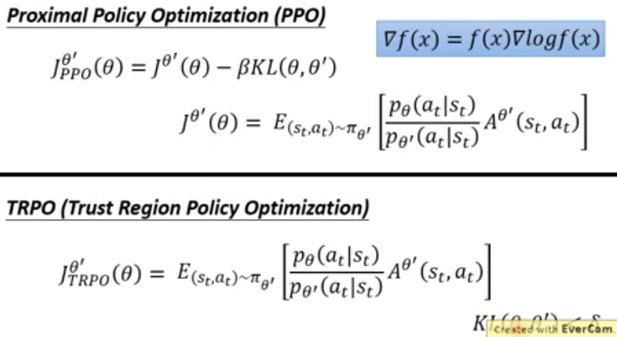

      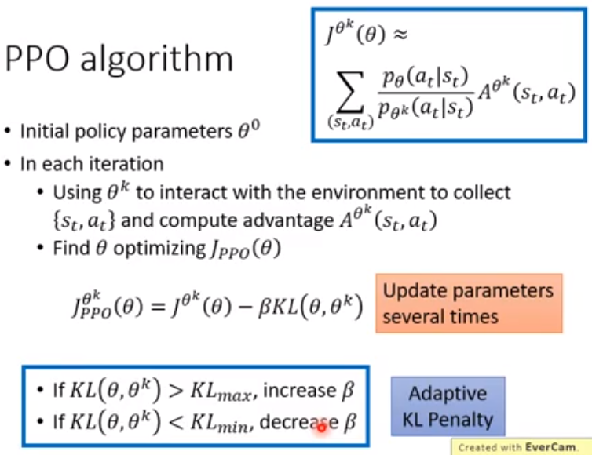

      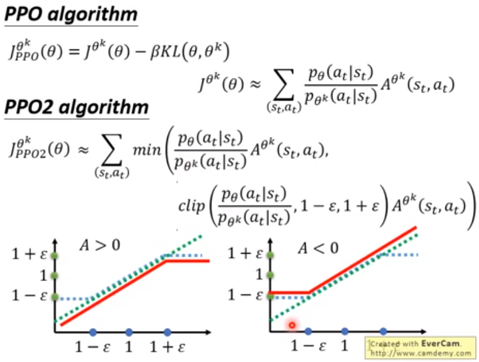

  * Add constraint

  * Q-Learning

    * Introduction of Q-Learning

      * 一个 critic 不能决定 action 

      * 给一个 actor Π，它评估 actor 有多好

      * State value function $V^{\pi}(s)$

        * 当使用 actor Π，累积的奖励期望在观察后获得 (state) s
        * How to estimate $V^{\pi}(s)$

      * State-action value function $Q^{\pi}(s,a)$

        * 当使用 actor Π，累积的奖励期望在观察后获得 s 和 a

      * Target Network

        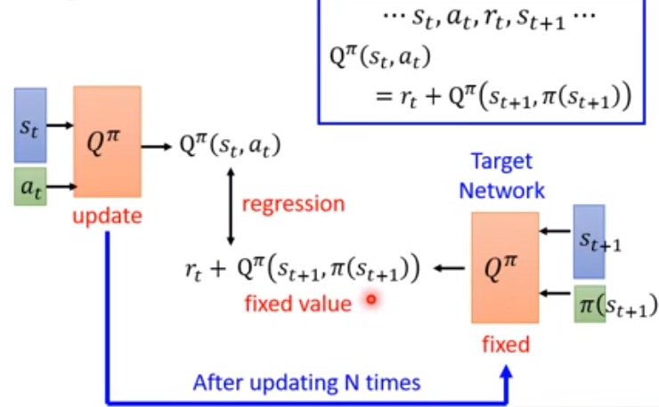

      * Exploration

        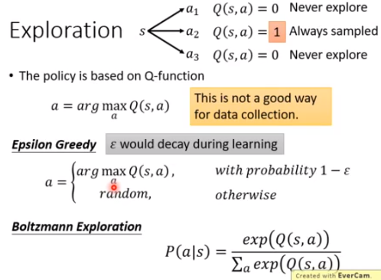

      * Typical Q-Learning Algorithm

        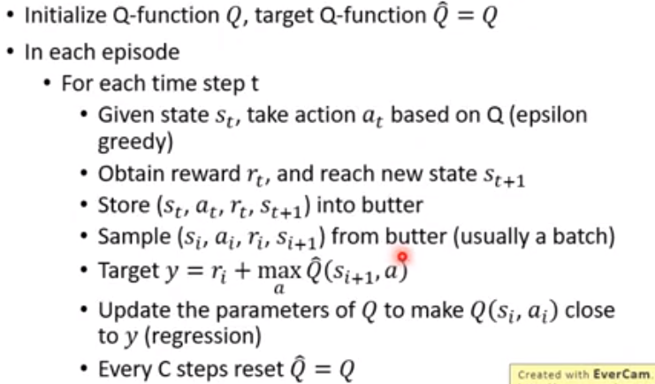

    * Tips of Q-Learning

      * Double DQN
        * Q value is usually over-estimated

    * Q-Learning for Continuous Actions

