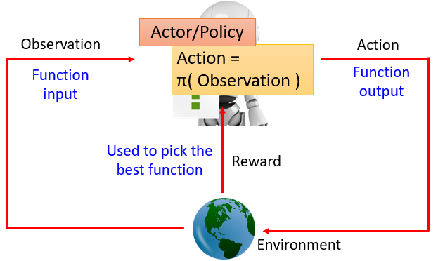

#### 21.强化学习（Reinforcement Learning）

* ##### 21.1 深度强化学习（Deep Reinforcement Learning）

  * 概述

    * AI = RL + DL

    * 强化学习情境

      * Review

        * Agent 学会采取行动最大化期望的 reward

        * 机器学习 ≈ 找函数

          

      * Learning to play Go
        * supervised learning + reinforcement learning
        * policy-based + value-based + model-based
      * Learning a chat-bot
        * 机器从用户获取反馈
        * Chat-bot 学会采取行动最大化期望的 reward
        * 使用这个方法，我们能 generate 大量的对话
        * 使用一些预先定义的规则评估一个对话的好坏
      * Playing Video Game
        * 机器和人类一样学习电子游戏
        * 机器观察像素是什么
        * 机器学会自己采取适当的行动

    * 强化学习的难点

      * Reward delay 
      * Agent's actions affect the subsequent data it receives

    * Supervised Learning v.s. Reinforcement Learning

      * Supervised Learning  : Learning from teacher
      * Reinforcement Learning : Learning from experience

  * Policy-based Approach (Learning an Actor)

