#### 21.强化学习（Reinforcement Learning）

* ##### 21.1 深度强化学习（Deep Reinforcement Learning）

  * 概述

    * AI = RL + DL

    * 强化学习情境

      * Review

        * Agent 学会采取行动最大化期望的 reward

        * 机器学习 ≈ 找函数

          

      * Learning to play Go
        * supervised learning + reinforcement learning
        * policy-based + value-based + model-based
      * Learning a chat-bot
        * 机器从用户获取反馈
        * Chat-bot 学会采取行动最大化期望的 reward
        * 使用这个方法，我们能 generate 大量的对话
        * 使用一些预先定义的规则评估一个对话的好坏
      * Playing Video Game
        * 机器和人类一样学习电子游戏
        * 机器观察像素是什么
        * 机器学会自己采取适当的行动

    * 强化学习的难点

      * Reward delay 
      * Agent's actions affect the subsequent data it receives

    * Supervised Learning v.s. Reinforcement Learning

      * Supervised Learning  : Learning from teacher
      * Reinforcement Learning : Learning from experience
      
    * 架构图

      

  * Policy-based Approach (Learning an Actor)

    * Three Steps for Deep Learning

      * Step 1 : Neural Network as Actor

        * Input of neural network : the observation of machine represented as vector or a matrix
        * Output neural network : each action corresponds to a neuron in output layer

      * Step 2 : Goodness of Actor

        

        

        

      * Step 3 : Gradient Ascent

        

        

        

        

        

  * Value-based Approach (Learning a Critic)

    * 一个 critic 不能决定 action 

    * 给一个 actor Π，它评估 actor 有多好

    * State value function $V^{\pi}(s)$

      * 当使用 actor Π，累积的奖励期望在观察后获得 (state) s

        

        

    * State-action value function $Q^{\pi}(s,a)$

      * 当使用 actor Π，累积的奖励期望在观察后获得 s 和 a

        
        
        

---

* **21.2 机器和环境互动**

  * 概述

    * 机器观察一些输入，然后采取行动，最后实现目标

      * Go playing
      * Machine plays video games
      * Self-driving car
      * Dialogue system

    * Network 作为一个函数，作为典型的监督学习

      * Inpits  ----  Network  ----  Outputs
      * Behavior Cloning

    * 交互的特点

      * 机器不知道一些行为必须学习，但是一些能被无视
      * 机器不知道每个行为的作用
      * Agent's actios 影响接下来它收到的数据
      * Reward delay

    * 方案

      * Reinforcement Learning

        * 机器和环境交互

        * 机器从环境中获取收益，所以它知道它性能的好坏

          

        * Training an Actor

          * Neural network as Actor
          * Input of neural network : the observation of machine represented as vector or a matrix
          * Output neural network : each action corresponds to a neuron in output layer
          * 基于概率采取行动

        * Training a Critic 

          * 一个 critic 不能决定 action 
          * 给一个 actor Π，它评估 actor 有多好
          * State value function $V^{\pi}(s)$
          * State-action value function $Q^{\pi}(s,a)$

        * Actor + Critic

          

          

        * Actor 

        * Environment

        * Reward

    * Learning by demonstration
      * 又称模仿学习、学徒学习
      * 专家演示如何解决任务，机器从演示中学习

  * Inverse Reinforcement Learning

    * Motivation

      * 在一些任务中很难定义 reward
      * 手工制作的奖励可能导致不受控制的行为

    * 架构图

      

---

* **21.3 Proximal Policy Optimization (PPO)**

  * Default reinforcement learning algorithm at OpenAI

  * Policy Gradient

    * Basic Components

      * Actor + Env + Reward Function

        

      * Expected Reward
        $$
        \large R_{\theta} = \sum_{\tau}R(\tau)p_{\theta}(\tau) = E_{\tau~p_{\theta}(\tau)}[R(\tau)]
        $$
        

        

    * Policy of Actor

      * policy Π is a network with parameter $\theta$
      * Input of neural network : the observation of machine represented as vector or a matrix
      * Output neural network : each action corresponds to a neuron in output layer

    * 实现

      * Tip 1 : Add a Baseline

        

      * Tip 2 : Assign Suitable Credit

        

        

  * On-policy  --  Off-policy

    * Using the experience more than once

    * On-policy : The agent learned and the agent interacting with the enviroment is the same

    * Off-policy : The agent learned and the agent interacting with the environment is different

      

      

      

      

    * PPO/TRPO

      

      

      

  * Add constraint

  * Q-Learning

    * Introduction of Q-Learning

      * 一个 critic 不能决定 action 

      * 给一个 actor Π，它评估 actor 有多好

      * State value function $V^{\pi}(s)$

        * 当使用 actor Π，累积的奖励期望在观察后获得 (state) s
        * How to estimate $V^{\pi}(s)$

      * State-action value function $Q^{\pi}(s,a)$

        * 当使用 actor Π，累积的奖励期望在观察后获得 s 和 a

      * Target Network

        

      * Exploration

        

      * Typical Q-Learning Algorithm

        

    * Tips of Q-Learning

      * Double DQN
        * Q value is usually over-estimated

          $Q(s_t, a_t) <------> r_t+max_aQ(s_{t+1}, a)$

          趋势于选择被高估的 action

        * Double DQN : two functions Q and Q'

          $Q(s_t, a_t) <------> r_t+Q'(s_{t+1}, arg max_a Q(s_{t+1}, a))$

          如果 Q 被高估为 a, 所以它被选择。Q‘ 将给一个合适的值

          Q'过高，这个 action 将不被 Q 选择

      * Dueling DQN 

        * 修改 network 的架构

        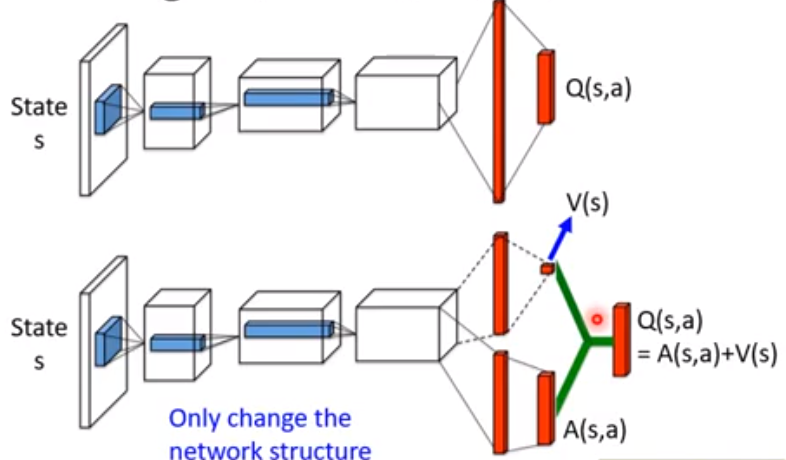

      * Prioritized Reply

        * Multi-step
        * Balance between MC and TD

        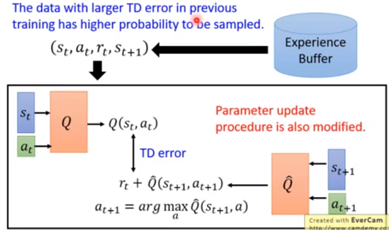

      * Noisy Net

        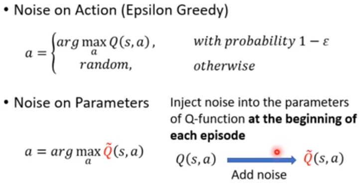

        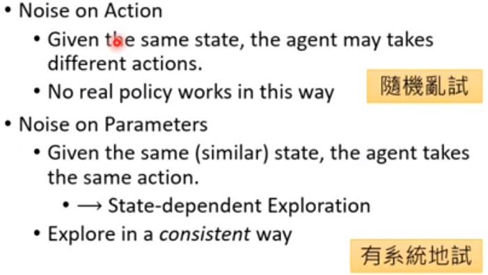

      * Distributional Q-function

        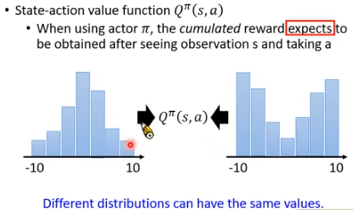

        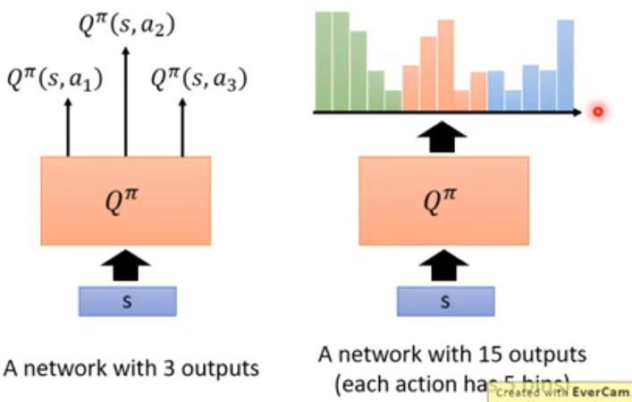

    * Q-Learning for Continuous Actions

      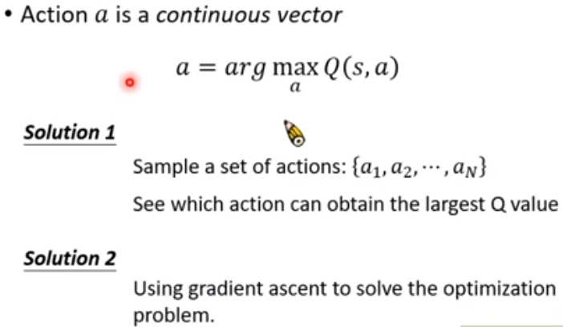

      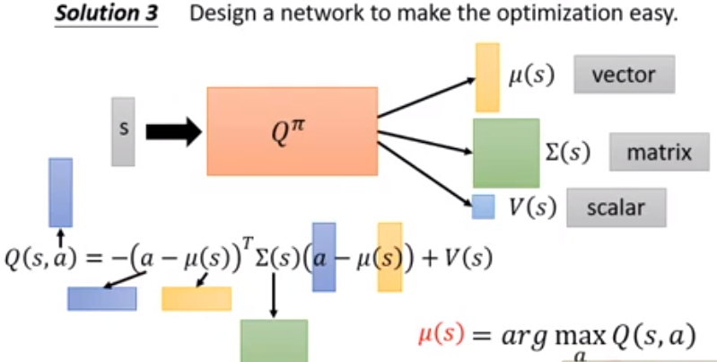

---

* **21.4 Actor-Critic**

  * Asynchronous Advantage Actor-Critic (A3C)

    * 原理

      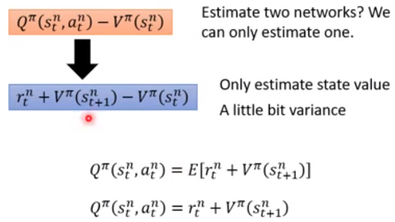

      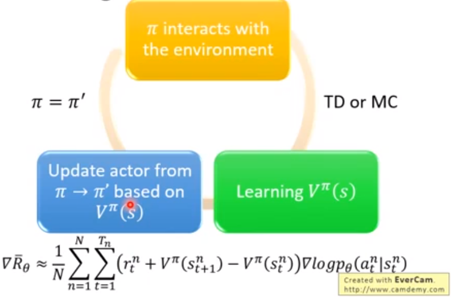

    * Tips

      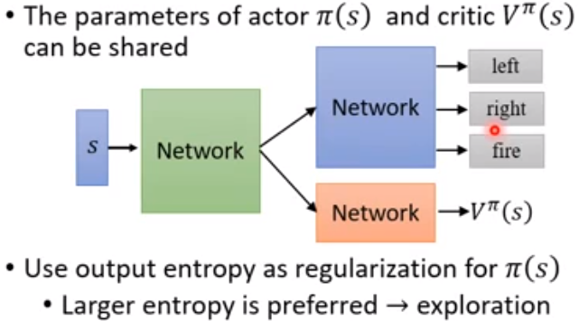

    * 步骤
      * Copy global parameters
      * Sampling some data
      * Compute gradients
      * Update global models

  * Pathwise Derivative Policy Gradient

    * Action a is a continuous vector

      $a = arg max_a Q(s,a)$

      s  ----  Actor Π  ---- a

      Actor 作为优化问题的解决者

    * 原理

      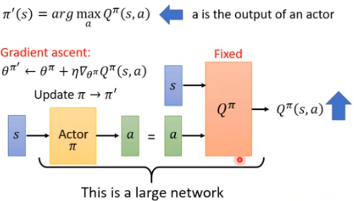

      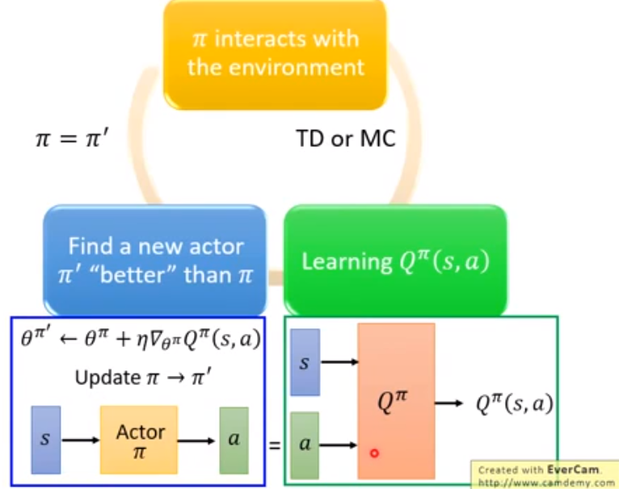

---

* **21.5 Sparse Reward**
  * Reward Shapping
  
    * 举例
  
      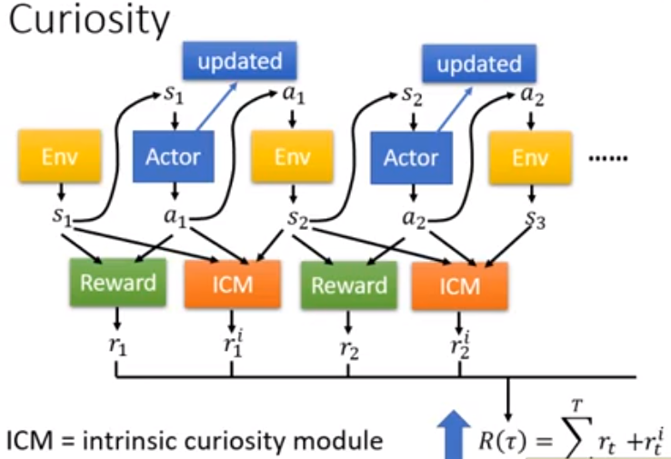
  
      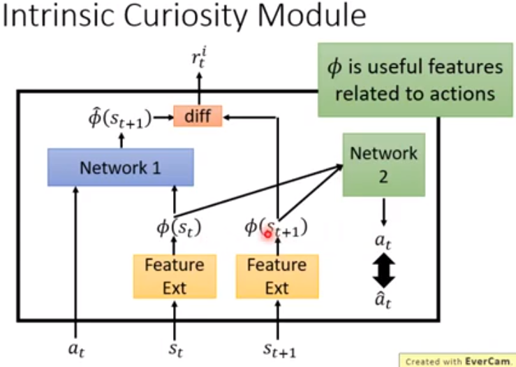
  
  * Curriculum Learning
    * 从简单的训练例子开始，然后变得越来越难
    * Reverse Curriculum Generation
      * Given a goal state s_g
      * Sample some states s_1 "close" to s_g
      * Start from states s_1, each trajectory has reward R(s_1)
      * Delete s_1 whose reward is too large (already learned) or too small (too diffcult at this moment)
      * Sample s_2 from s_1, start from s_2
  * Hierarchical Reinforcement Learning
    * Hierarchical RL
      * Target : 发表期刊  <----  做实验
      * Provide goal : 校长
      * Provide subgoal : 教授
      * Action : 研究生
      * 如果更低的 agent 不能实现这个目标，则更上层的 agent 将不能得到奖励
      * 如果一个 agent 完成错误的目标，且假设这个原始的目标是错的

---

* **21.6 Imitation Learning**

  * 概述

    * 又称示范学习（Learning by demonstration）、学徒学习（Apprenticeship learning）
    * 一个 expert 示范如何解决这个任务
      * 机器也能和环境交互，但是不能明确获取的 reward
      * 在一些任务中很难定义 reward
      * 手工制作的 reward 能导致无法控制的行为
    * Two approaches:
      * Behavior Cloning
      * Inverse Reinforcement Learning (inverse optimal control)

  * Behavior Cloning

    * Self-driving cars as example

    * Problem

      * Expert only samples imited observation (states)

      * Dataset Aggregation

      * The agent will copy every behavior, even irrelevant actions

        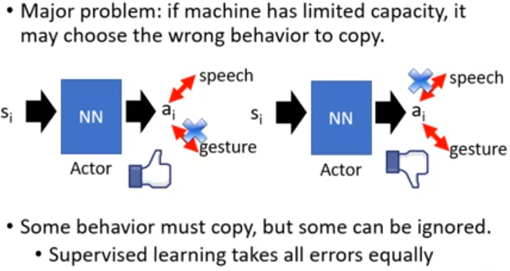

        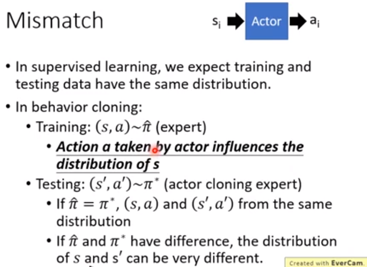

  * Inverse Reinforcement Learning

    * 原理

      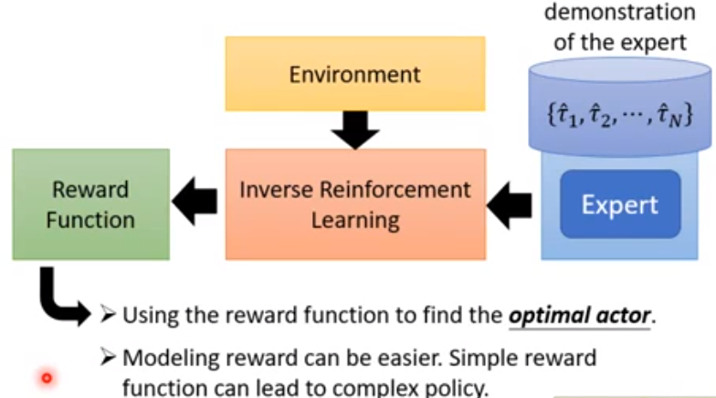

    * Framework of IRL

      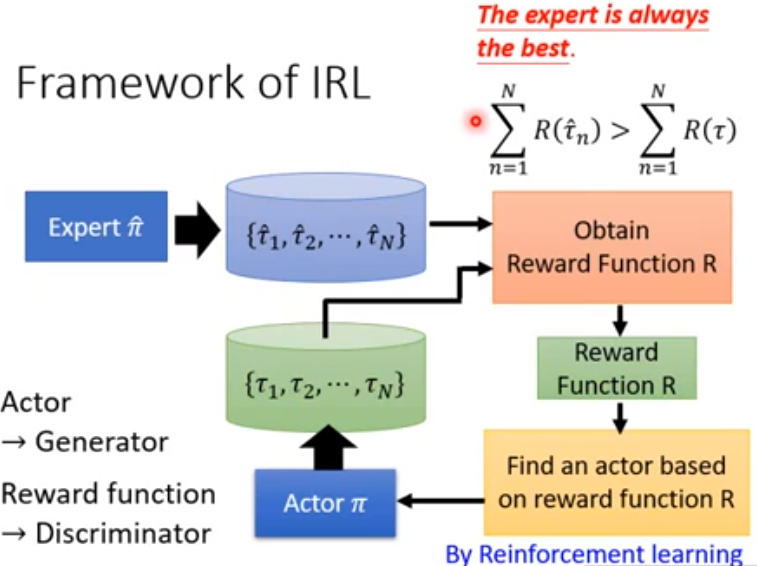

    * GAN v.s. IRL

      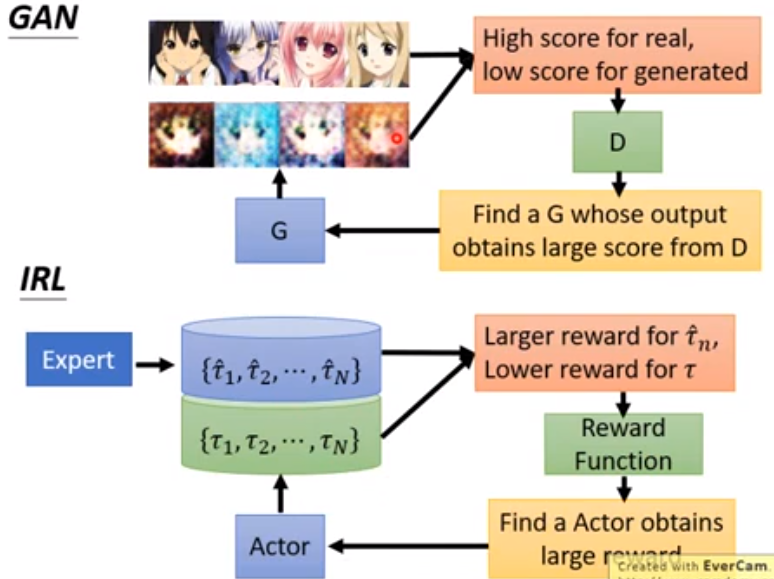

    * 实践

      * Parking lot navigation
      * Robot
      * Third Person Imitation Leaning

---

* **21.7 Research trends of deep reinforcement learning**

  * Deep RL Algorithms

    * According to rlpyt, model-free algorithms can be categorized into:
    * Policy Gradient
      * A2C
      * PPO
    * Deep Q-Learning
      * DQN
      * Double, Dueling DQN, and so on
      * Rainbow, etc
    * Q-Function Policy Gradient
      * DDPG
      * TD3
      * SAC

  * Model-based RL

    * RL 基于：

      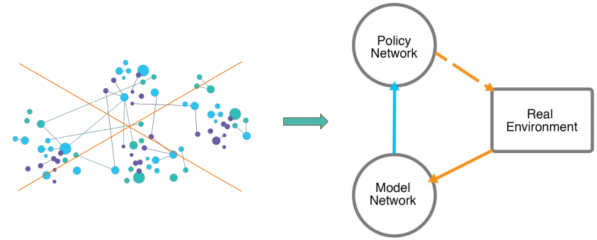

    * 原理

      * 能够访问环境(一个完美的模拟器)

      * 学习一个模型来表示环境

        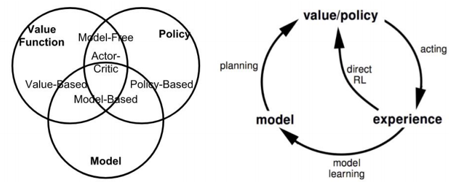

    * 举例

      * AlphaGo

        * Traning
          * 使用监督学习对 policy network 进行预训练
          * 利用 policy gradient，自我发挥和完善 policy network
          * 用状态-结果对(自玩时收集)训练 value network
        * Inferencing using MCTS
          * 根据 policy network 展开树状节点
          * 利用 value network 对状态进行评估

      * MuZero

        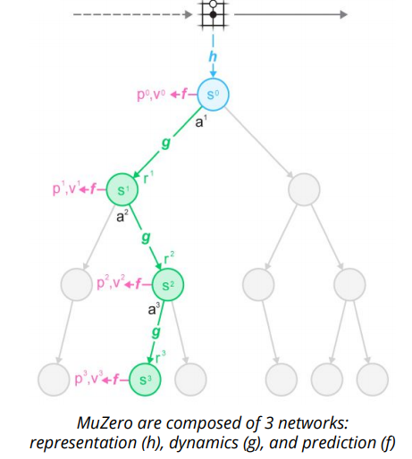

        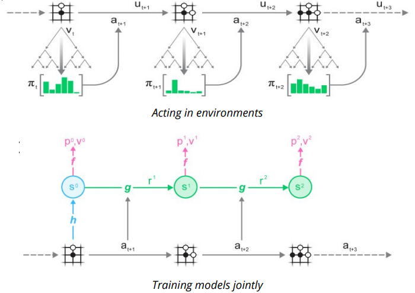

      * Dream to Control

        * 使用表示学习学习动态

          * Representation
          * Transition
          * Reward

        * 通过想象的轨迹学习行为

          * Action

          * Value

            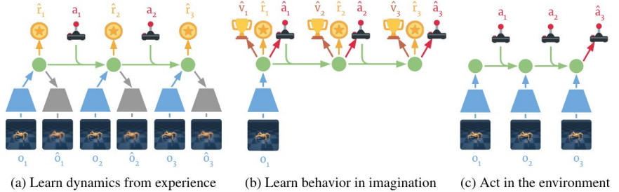

  * Large-scale RL projects

    * 用机器手臂还原魔方

    * Problem Definition

      * Observation

      * State

        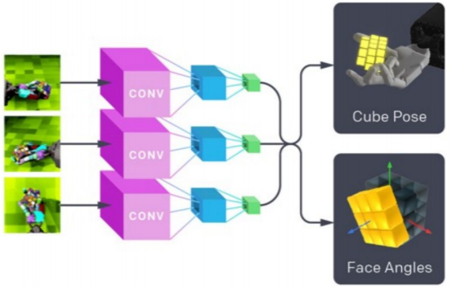

      * Action

        * 一组动作是已知的
        * 离散；每个动作坐标11个箱子：
          * 3个关节
          * 指尖
          * 相对于当前位置的运动

      * Reward

    * 方法

      * Sim2real Transfer

      * Domain Randomization

      * Automatic Domain Randomization

        * 不断地在模拟中生成越来越困难的环境

        * 环境参数：

          * 机器人手指的摩擦力

          * 立方体的大小

          * 立方体的质量等

            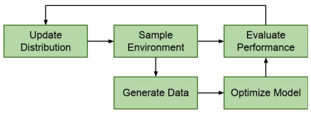

  * Meta-RL

    * 概述

      通过学习强归纳偏差，元强化学习（Meta-reinforcement learning）能够快速适应新的任务。这是通过一个较慢的外部学习循环来完成的，通过对任务的分配进行训练，形成一个内部循环，通过保持过去的行动和观察的历史来快速适应

    * Deep Meta-RL

      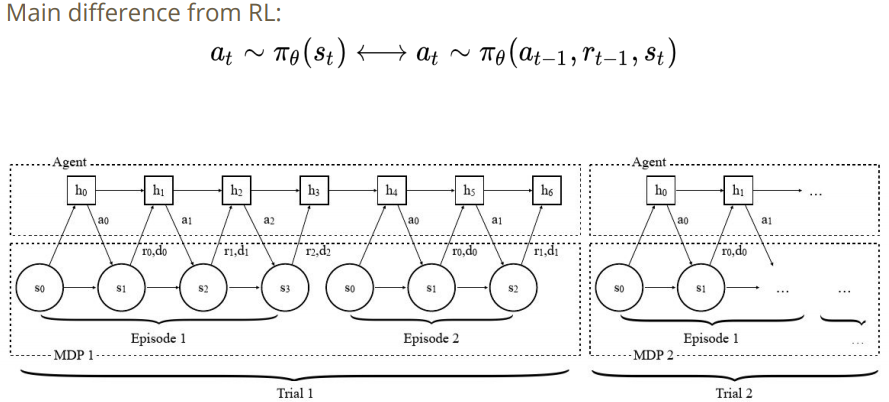

    * Meta Learn Hyperparameters

      * 定义返回函数为:
        $$
        \large g_{\eta}(\tau_t) = R_{t+1}+\gamma(1-\lambda)v_{\theta}(S_{t+1})+\gamma \lambda g_{\eta}(\tau_{t+1})
        $$

      * 典型的 RL 算法会手动选择元参数。相反,我们可以查看返回作为元参数参数化的函数:
        $$
        \large \eta = \{\gamma, \lambda\}
        $$

    * Meta Learn Loss Functions

      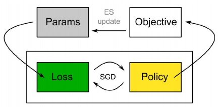

    * Meta Learn Exploration Strategies

      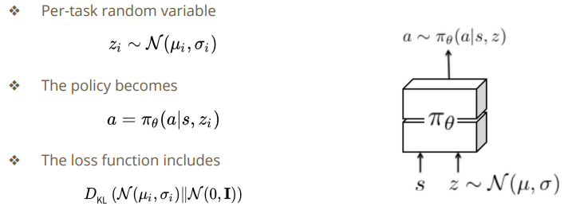

  * Priors

    * 概述

      * 为了获得有效的、快速适应的 agent，agent 可以依赖以前以先验分布的形式提取知识

      * 举例
        * Simultaneous learning of a goal-agnostic default policy
        * Learning a dense embedding space to represent a large set of expert  behaviors

    * Goal-agnostic Prior Policy

      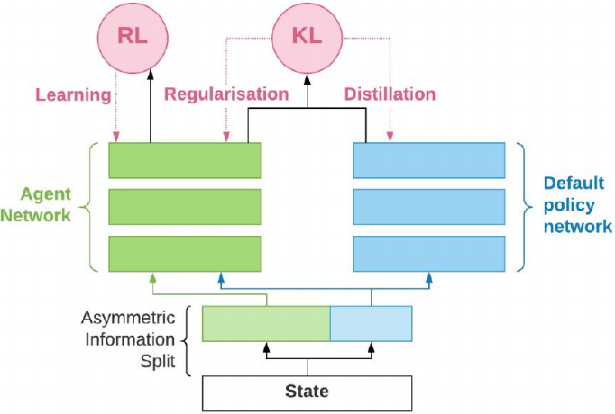

    * Learn from Experts

      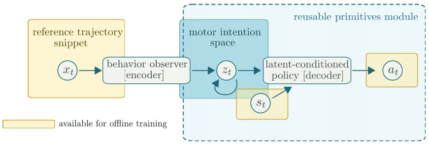

  * Multi-agent RL

    * Multi-agent v.s. Single-agent

      Agents 与环境相互作用，并可能相互作用，这使得多 agent 学习成为一个更加复杂的问题
      $$
      \large \tau(s_{t+1}|a_t,s_t) \leftarrow \rightarrow \tau(s_{t+1}|a^1_t,...,a^N_t,s_t)
      $$
      有一些问题：

      1. 最优策略依赖于其他 agent 的策略

      2. 不能保证收敛到最优行为

    * Categories of Different Multi-agent RL Works

      * 突发行为分析
      * 学习交流
      * 学习合作
      * Agents 建模

    * 举例

      * MADDPG

      * Hide-and-seek

      * Social Influence as Intrinsic Motivation

        * 在多 agent RL 中，通过奖励对其他 agent 行为产生因果影响的 agent 来实现协调的机制

          * 导致其他 agent 行为更大变化的行为被认为是有影响力的，并得到奖励
          * 采用反事实推理来评估影响

        * 在 Sequential Social Dilemmas (SSD) 游戏中，个体 agent 可以选择背叛而不是合作

        * Agent 的即时奖励会被修改：

          environmental reward + causal influence reward

          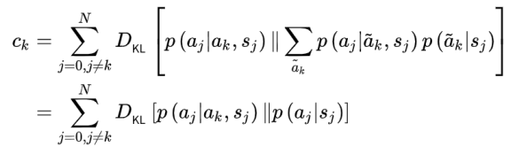

      * AlphaStar

