#### 2.回归（Regression）

* ##### 举例

  * 股市预测 (Stock Market Forecast)

  * 自动驾驶 (Self-driving Car)

  * 商品推荐 (Recommendation)

    * f(x) = y

    * Example Application (pokemon)

      * x: xs(species), xhp(health value), xw(weight), xh(height)

      * y: combat power(cp) after evolution

        * Step 1: 线性模型 (Model)

          * y = b + w · xcp(most suitale) 
            $$
            y = b + \sum w_ih_i (Linear\ model)
            $$

        * Step 2 : 损失函数 (Goodness of Function)

          * Training Data: 10 pokemon

            (x1, $\widehat{y}$1), (x2, $\widehat{y}$2), ......,  (x10, $\widehat{y}$10) 

            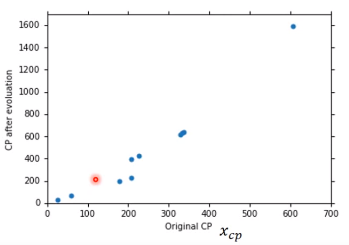

          * Loss function L: bad

            $L(f) = L(w, b) = \sum_{n=1}^{10}(\widehat{y}^n - (b + w · x_{cp}^n))^2$

          * Best Function

            $f^* = arc\ min_{\{f\}} L(f)$

            $w^*, b ^* = arg\ min_{\{w,b\}} L(w, b) = arg\ min_{w,b}\sum_{n=1}^{10}(\widehat{y}^n - (b + w · x_{cp}^n))^2$

        * Step 3: 梯度下降法 (Gradient Descent)

          * L : w

            * (Randomly) Pick an initial value w0

            * Compute $\frac{dL}{dw}|_{w=w^1}$

            * ......

          * L : w, b

            * (Randomly) Pick an initial value w0, b0

            * Compute $\frac{\partial{L}}{\partial{w}}|_{w=w^0,b=b^0}, \frac{\partial{L}}{\partial{b}}|_{w=w^0,b=b^0}$

            * ......

            * Results

              y = b + w · xcp (b = -188.4, w = 2.7)

              Average Error on Training Data = $\sum_{n=1}^{10}e^n = 31.9$

              Another 10 pokemons

            * Selecting another Model

              $y = b + w_1 · x_{cp} + w_2 · (x_{cp})^2 + w_3 · (x_{cp})^3 + ...$

              Compute ......

      * Reflection

        * Model Selection

          * Training
        * Testing
          * Overfitting 
      
        * Hidden factors

          * Species
        * Health value
      
        * Redesign

          If xs = Pidgey, $y = b_1 + w_1 · x_{cp}$

          If xs = Weedle, $y = b_1 + w_1 · x_{cp}$

          ......

        * Line regrassion

          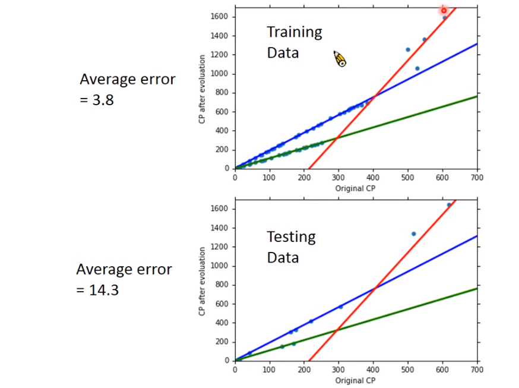

  ***

* ##### 步骤

  * Model（确定一个模型）——线性模型

  * Goodness of function（确定评价函数）——损失函数

  * Best function（找出最好的一个函数）——梯度下降法

    

  * Redesign the Model Again

  * Regularization (正则化)

    * smooth functions (suitable)
    * less influence
    * $ \lambda $,  training, testing

  * Validation

    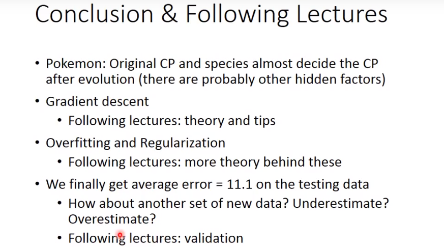

***

* ##### 梯度下降（优化）

  * 模型选择

    * Review

    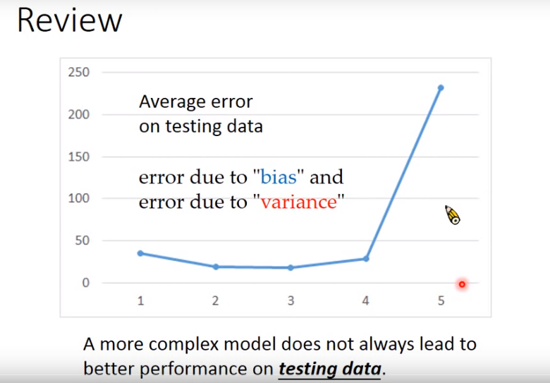

    * Estimator

      * $\widehat{y} = \widehat{f}(pokemon)$
      * Bias and Variance of Estimator
        * Estimate the mean of a variavle x
          * Assume the mean of x is $\mu$
          * Assume the variance of x is $\sigma$
        * Estimator of mean $\mu$
          * Sample N points: {x1, x2, ..., xN}

      $$
      \begin{align} \\
      &m = \frac{1}{N}\sum_n x^n \neq \mu \\
      &E[m] = E[\frac{1}{N}\sum_n x^n] = \frac{1}{N}\sum_n E[X^n] = \mu \\
      &Var[m] = \frac{\sigma}{N} (depen\ on\ the\ number\ of\ samples) \\ 
      \\ \\
      &m = \frac{1}{N}\sum_n x^n,\ s^2 = \frac{1}{N}\sum_n (x^n - m)^2 \\
      &E[s^2] = \frac{N-1}{N} \sigma^2
      \end{align}
      $$

    

    * Vriance

      Simpler model is less influenced by the sampled data

    * Bias

      $E[f^*] = \overline{y}$

      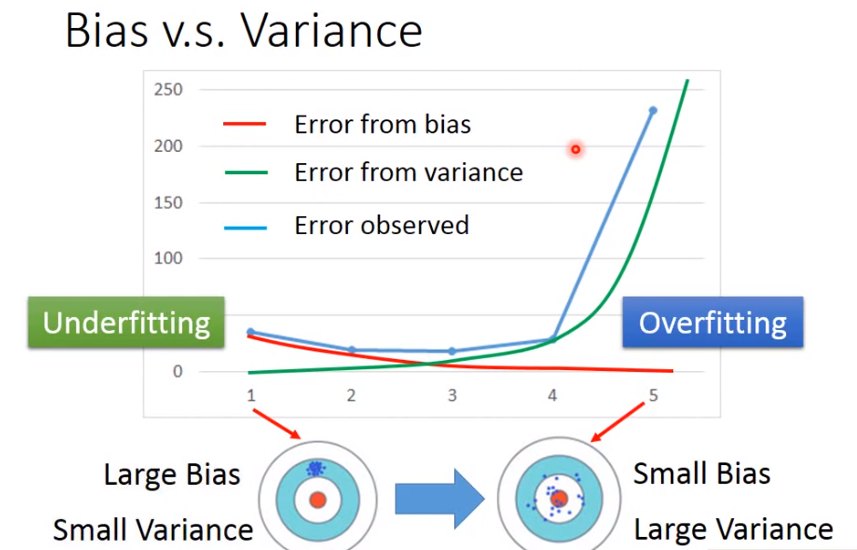

  * 优化

    * Review

      * $\theta^* = arg\ min_{\theta} L(\theta)$

        L: loss function

        $\theta$: parameters
        $$
        \Large \nabla L(\theta) = \left ( \begin{matrix} \frac{\partial{C(\theta_1)}}{\partial{\theta_1}} \\ \frac{\partial{C(\theta_2)}}{\partial{\theta_2}} \end{matrix} \right ) \\
        \Large \theta^1 = \theta^0 - \eta \nabla L(\theta^0) \\
        \Large \theta^2 = \theta^1 - \eta \nabla L(\theta^1)
        $$

      * 偏微分法

        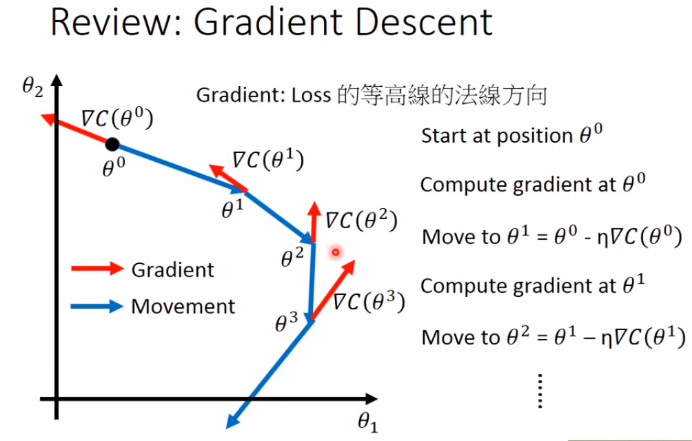

    * Learning Rate :  $\eta$

      * 每隔几代通过一些因素减少学习速率

      * 给不同的参数不同的学习速率

      * 将每个参数的学习速率除以其先前导数的均方根

        $\LARGE \eta^t = \frac{\eta}{\sqrt{t+1}}$

      * vanilla gradient descent 批梯度下降

        $\LARGE w^{t+1} \leftarrow w^t \leftarrow \eta^tg^t$

      * Adagrad 小批量随机梯度

        $\LARGE w^{t+1} \leftarrow w^t - \frac{\eta^t}{\sigma^t}g^t$

        $\LARGE w^{t+1} \leftarrow w^t - \frac{\eta}{\sqrt{\sum_{i-0}^t(g^i)^2}g^t}$

    * 随机梯度下降 (Stochastic Gradient Descent)

      $\large L = \sum_n(\widehat{y}^n - (b+\sum w_i {x_i}^n))^2$

      * Gradient Descent

        $\large \theta^i = \theta^(i-1) - \eta \nabla L(\theta^(i-1))$

      * Stochastic Gradient Descent

        $\large L^n = \sum_n(\widehat{y}^n - (b+\sum w_i {x_i}^n))^2$

        $\large \theta^i = \theta^(i-1) - \eta \nabla L^n(\theta^(i-1))$

    * 特征缩放 (Feature Scaling)

      $\large y = b + w_1x_1 + w_2x_2$

    * 推导

      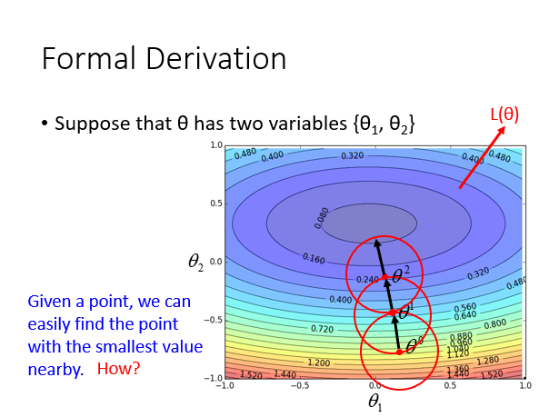

      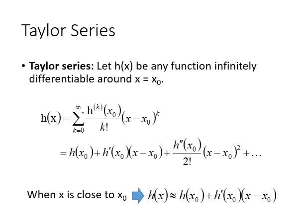

      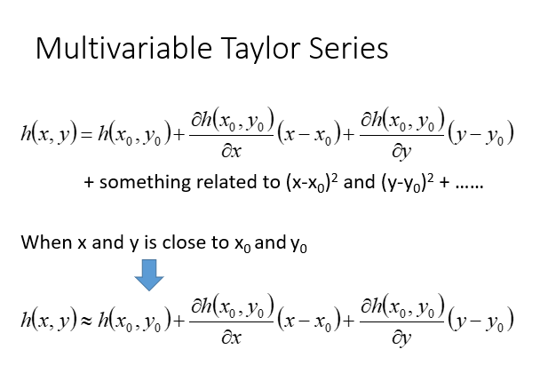

      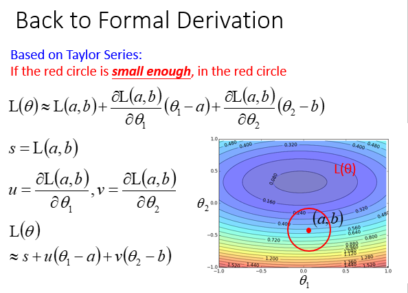

      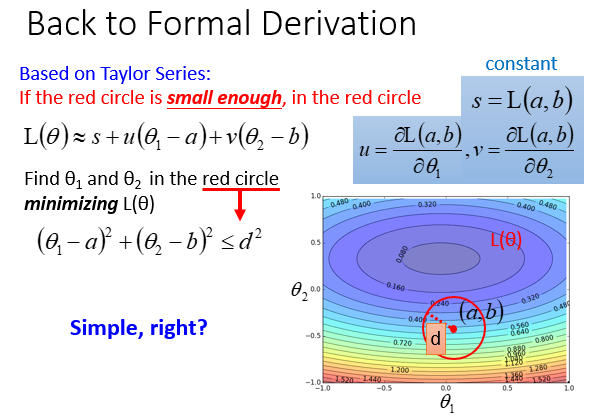

      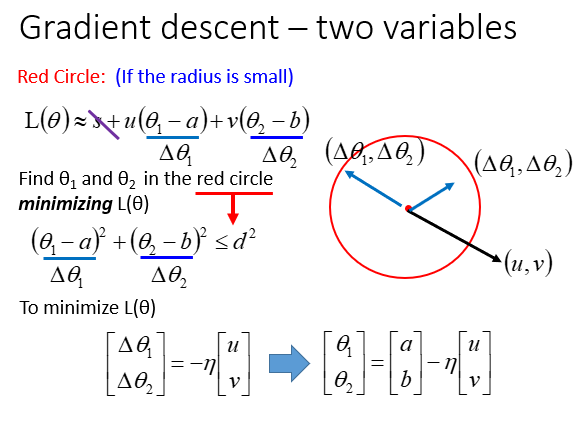

      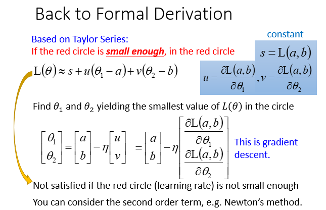

    * 梯度下降的更多限制

      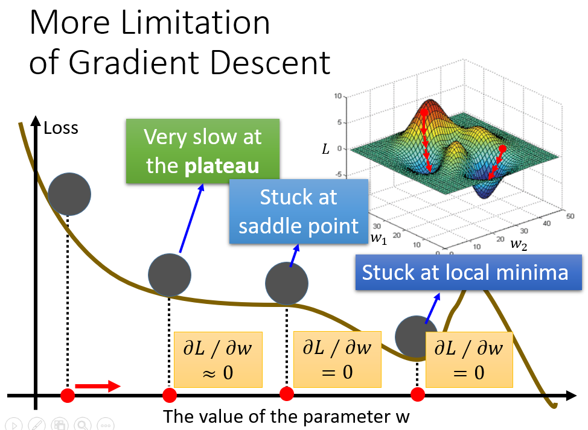

***

* ##### 新优化器

  * 背景知识

    * μ-强凸性（μ-strong convexity）

    * 利普席茨连续性 （Lipschitz continuity）

    * 布雷格曼不等式 （Bregman proximal inequality）

    * 参数

      $\theta_t$ : 时间步模型参数 t

      $\nabla L(\theta_t)\ or\ g_t$ : 坡度 $\theta_t$，用于计算 $\theta_{t+1}$

      $m_{t+1}$ : 从时间步长 0 到时间步长累积的动量 t，用来计算 $\theta_{t+1}$

      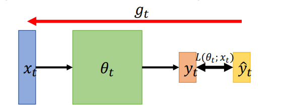

    * 优化内容
      * 找到一个 𝜃 得到最低的 $\sum_x L(\theta;x)$
      * 找一个 𝜃 得到最低的 𝐿(𝜃)
    * On-line vs Off-line
      * On-line：one pair of $(x_t, \widehat{y}_t)$ at a time step
      * Off-line：pour all $(x_t, \widehat{y}_t)$ into the model at  every time step

  * **SGD (Stochastic Gradient Descent 随机梯度下降)**

    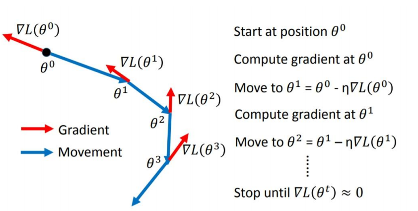

  * **SGDM  (Stochastic Gradient Descent with Momentum 带动量的随机梯度下降)**

  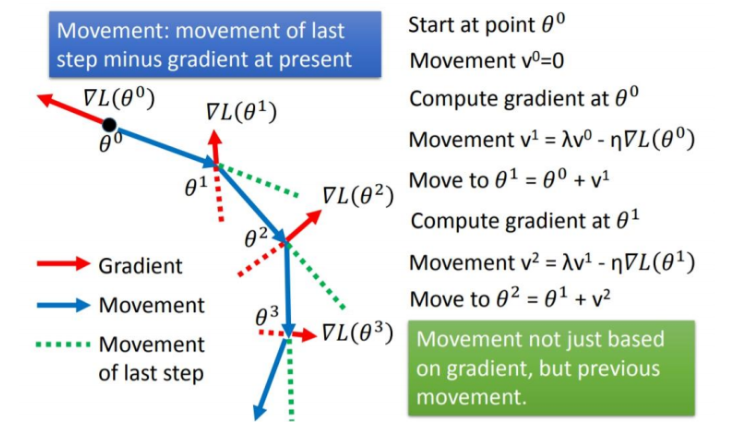

  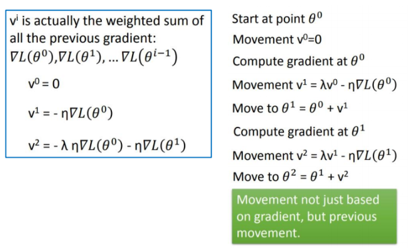

  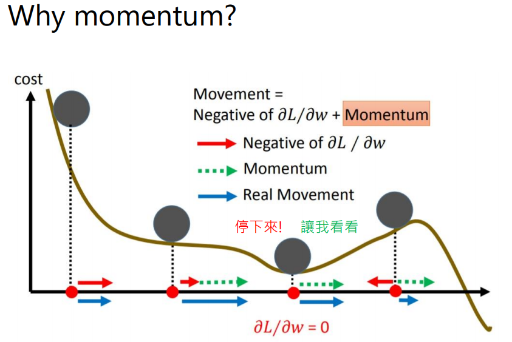

  * **Adagrad 算法**

    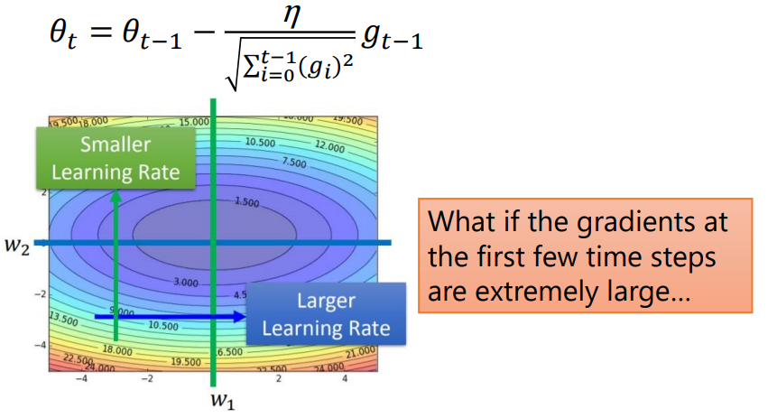

  * **RMSProp 算法**

    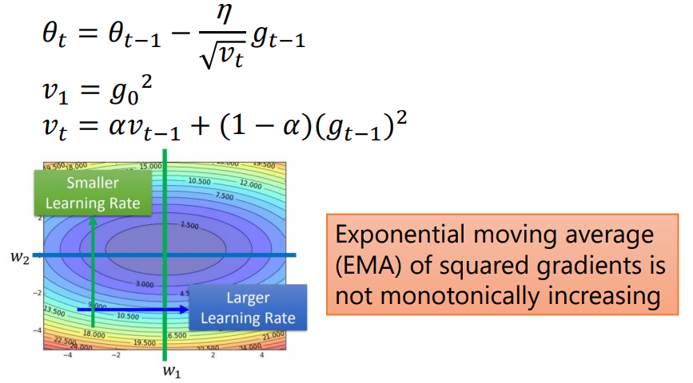

  * **Adam 算法**

    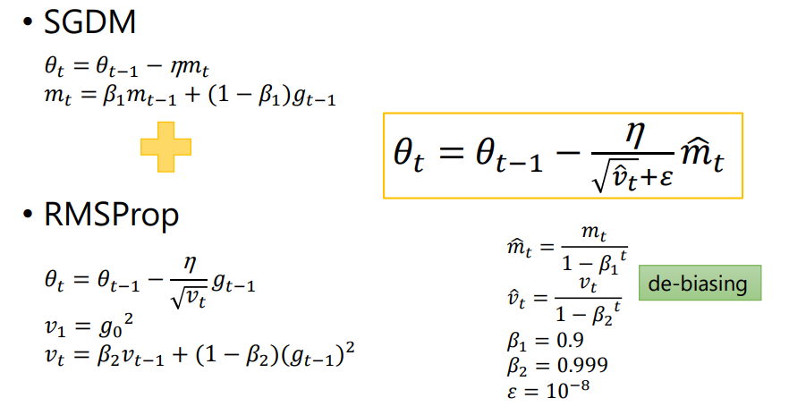

  * SWATS

    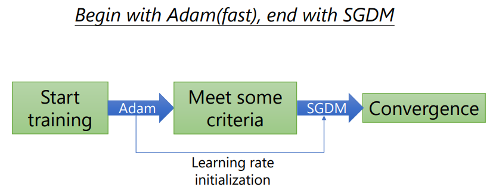

  * Towards Improving Adam…

    * AMSGrad
    * AdaBound

  * Towards Improving SGDM…

    * LR range test
    * Cyclical LR
    * SGDR
    * One-cycle LR

***

* ##### 结论

  * Diagnosis
    * If your model cannot even fit the training examples, then you have large bias ( (Underfitting 欠拟合)
    * If you can fit the training data, but large error on testing data, then you probaly have large variance  (Overfitting 过拟合)
  * For bias, redesign your model
    * Add more feature as input
    * A more comolex model
  * For variance
    * More data : Very effective, but not always practical
    * Regularization

