#### 3.分类（Classification）

* **3.1 举例**

  * 信用评分 Credit Scoring

  * 医学诊断 Medical Diagnosis

  * 手写体字符识别 Handwritten character recognition

  * 人脸识别 Face recognition

    * x $\rightarrow$ Function $\rightarrow$ class n

    

  * Example Application (pokemon)

    * 属性

      * Total : 综合能力
      * HP : 生命值
      * Attack : 攻击力
      * Defence : 防御力
      * SP Atk : 特殊攻击
      * SP Def : 特殊防御
      * Speed : 速度

    * Training data for Classification

    * Function (Model)

      * input : x

      * f(x)

        if g(x) > 0		   Output = class 1

        else					Output = class 2 

    * Loss function

      $\large L(f) = \sum_n \delta(f(x^n) ≠ \widehat{y}^n)$

    * Find the best function

    * 例：分两类

      * 水系 water : 79只

      * 正常 normal : 61只

        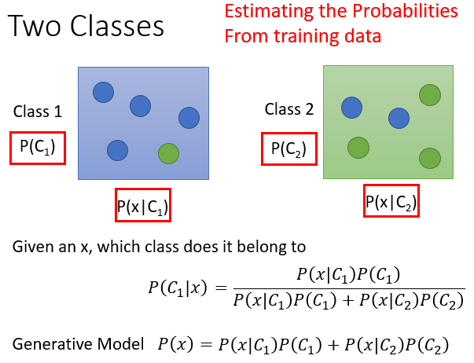

      * 高斯分布 Gaussian Distribution

        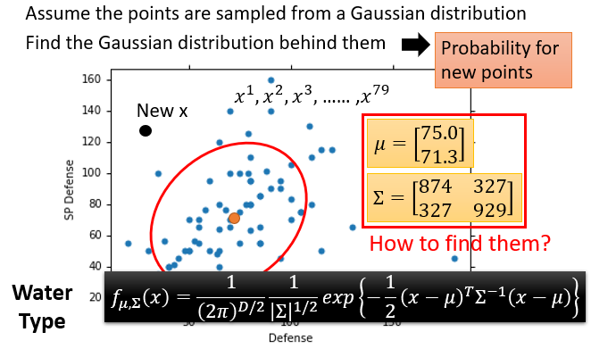

      * 最大似然法 Naximum Likelihood

        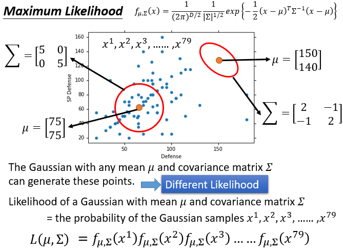

        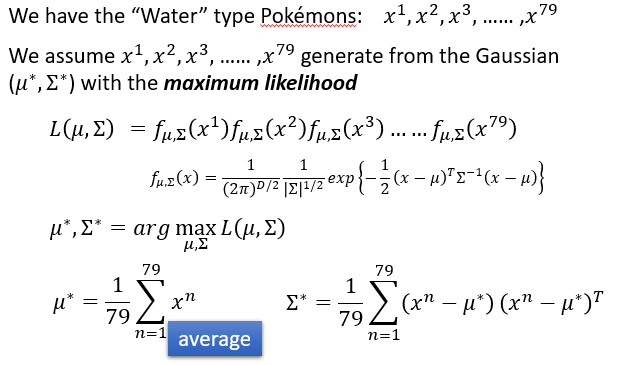
        * 结果

          class 1 : Water
          $$
          \mu^1 = 
          \left \{ \begin{matrix} 
          75.0 \\ 
          71.3
          \end{matrix} \right \}
          \quad
          \Sigma^1 = 
          \left \{ \begin{matrix}
          874 327 \\
          327 929
          \end{matrix} \right \}
          $$
          class 2 : normal
          $$
          \mu^2 = 
          \left \{ \begin{matrix} 
          55.6 \\ 
          59.8
          \end{matrix} \right \}
          \quad
          \Sigma^2 = 
          \left \{ \begin{matrix}
          847 422 \\
          422 685
          \end{matrix} \right \}
          $$
          P(C1) = 79 / (79 + 61) = 0.56

          P(C2) = 61 / (79 + 61) = 0.44

          If P(C1|x)  > 0.5 $\rightarrow$  x belongs to class 1 (Water)

          Testing data : 47% accuracy $\rightarrow$ 准确率低

      * 改变模型

        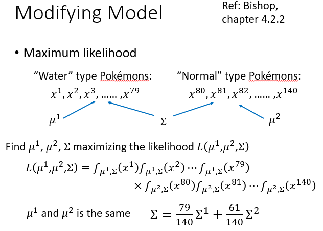

----

* **3.2 步骤**

  * 三步法

    协方差矩阵 covariance matrix

  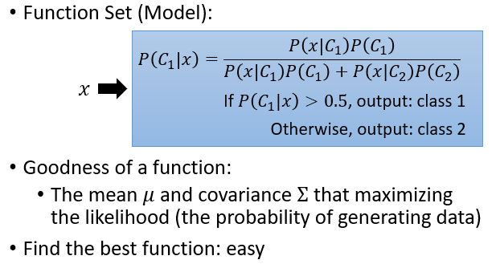

  * 公式变换

    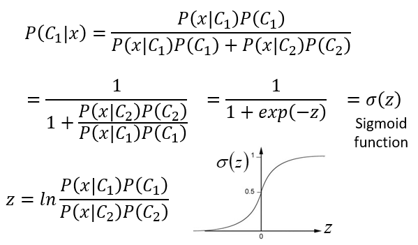

    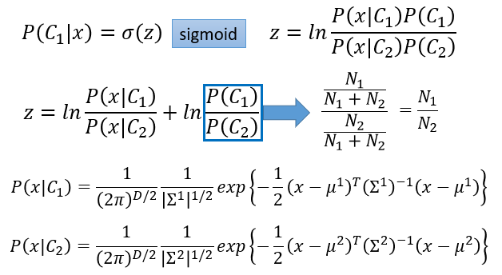

    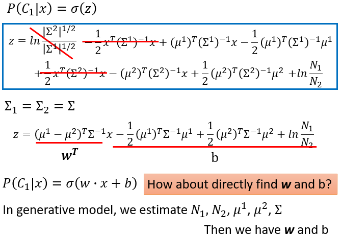

----

* **3.3 逻辑回归 Logistic Regression**

  * 逻辑回归 + 平方误差 Logistic Regression + Square Error

    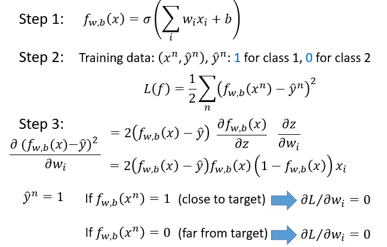

  * 逻辑回归与线性回归 

    * 交叉熵 Cross Entropy
      $$
      \large l(f(x^n),\widehat{y}^n) = -[\widehat{y}^n lnf(x^n) + (1-\widehat{y}^n)ln(1-f(x^n))]
      $$
      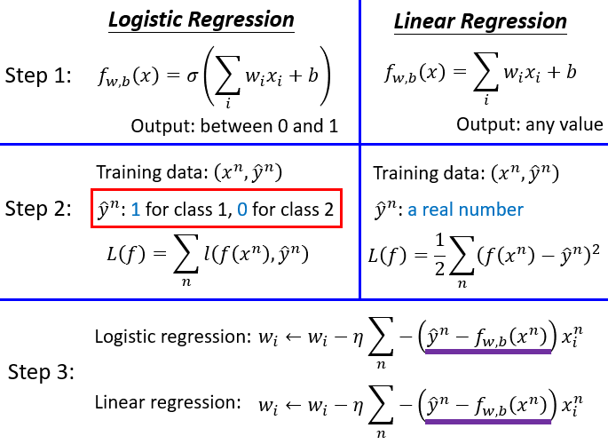

  * 区别性与生成性 Discriminative vs Generative

    * 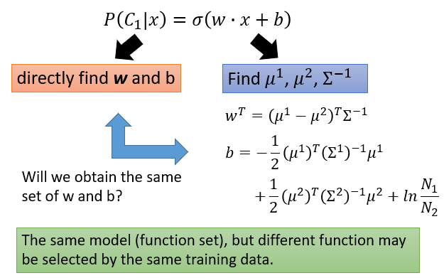

    * Example

      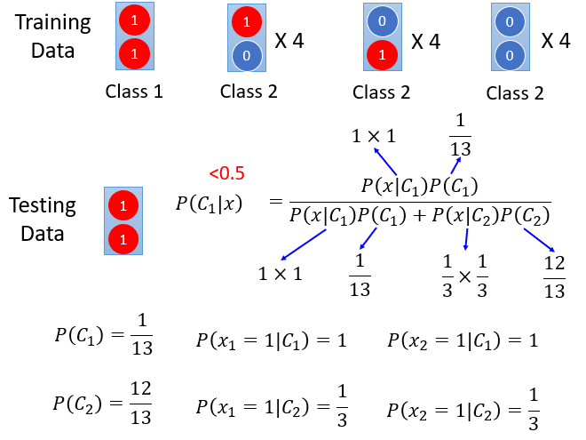

    * 比较
      * 区别性更好
      * 生成性模型优点
        * 在概率分布假设下，需要较少的训练数据
        * 假设概率分布对噪声具有较强的健壮性
        * 先验概率和类相关概率可以从不同的来源估计

  * 多类别分类 Multi-class Classification

    * Example

      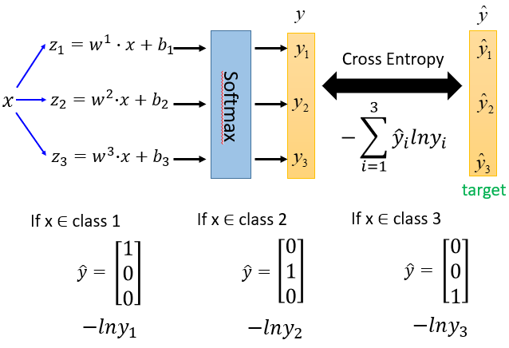

  * 逻辑回归的局限性 Limitation of Logistic Regression

    * 特征变换 Feature Transformation

      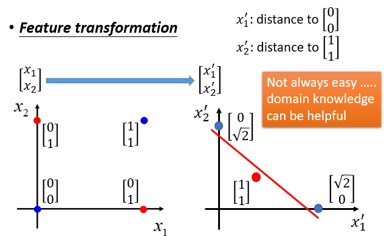

    * 级联逻辑回归模型 Cascading Logistic Regression Models

      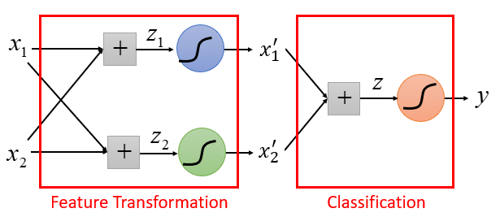

    * 神经网络 Neural Network

      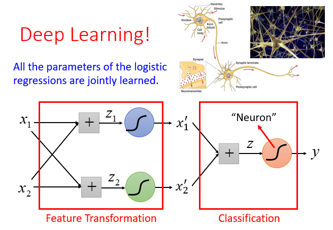

