#### 4.深度学习（Deep Learning）

* ##### 4.1 简介

  * 步骤

    * 神经网络 Neural network
    * 函数优度 Goodness of function
    * 选择最佳函数 Pick the best function

  * 说明

    * 全连接前馈网络 Fully Connect Feedforward Network

      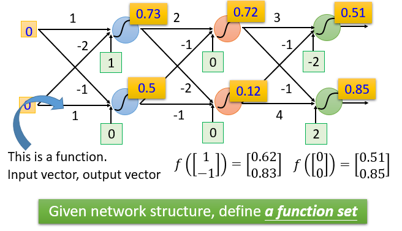

      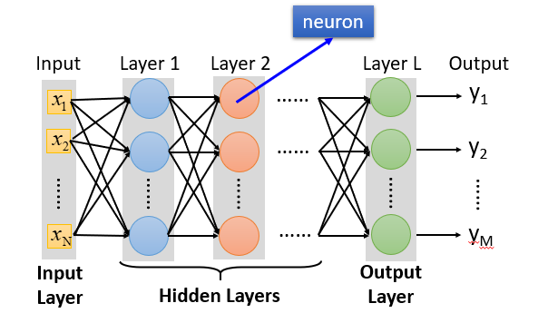

    * Deep = Many hidden layers

    * 矩阵运算 Matrix Operation

      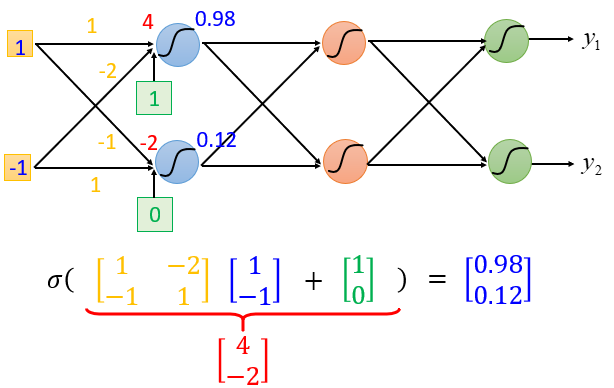

    * 神经网络

      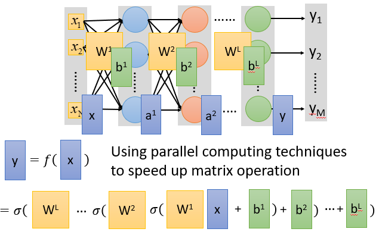

    * 输出层作为多类分类器 Output Layer as Multi-Class Classifier

      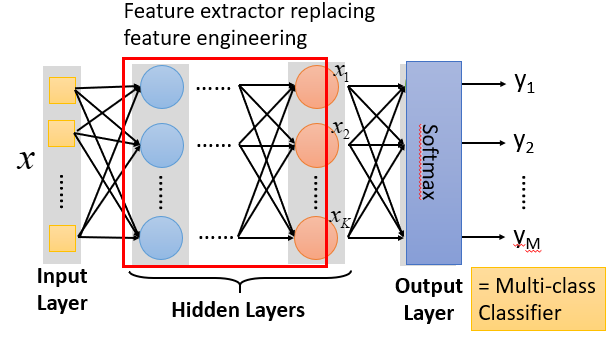

    * Example

      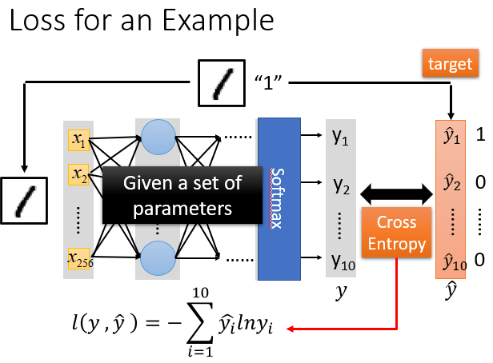

      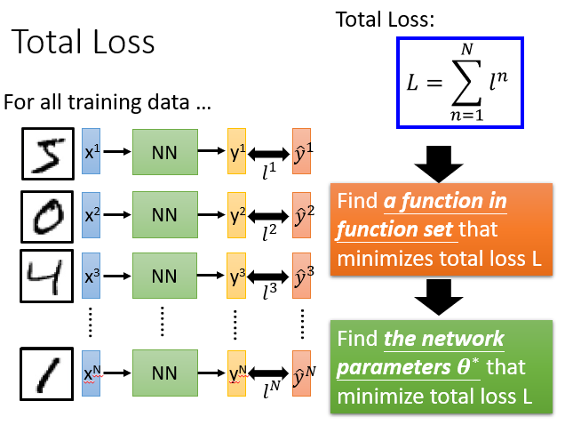

    * 梯度下降 Gradient Descent

      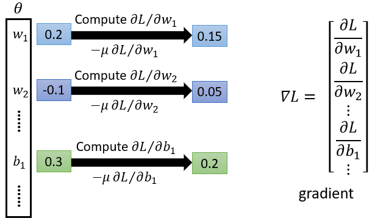

---

* **4.2 反向传播算法 Backpropagation**

  * 梯度下降 Gradient Descent

    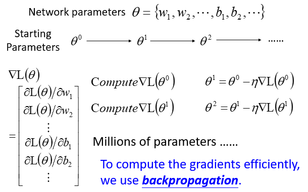

  * 链式法则 Chain Rule

    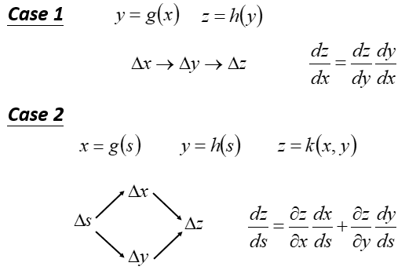

  * 反向传播

    * 简介

      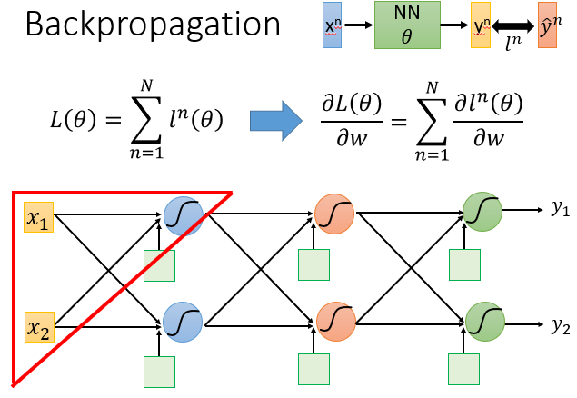

      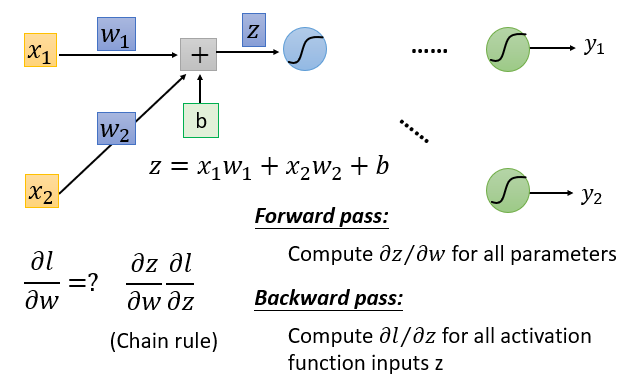

    * Forward Pass

      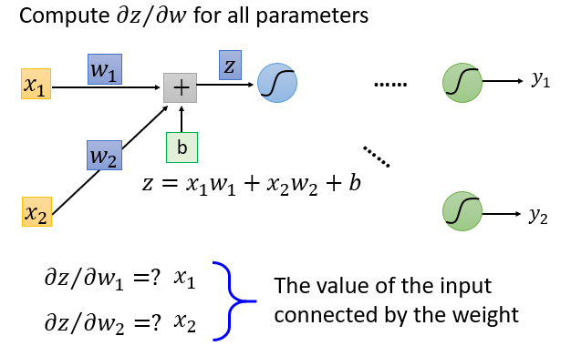

    * Backward Pass

      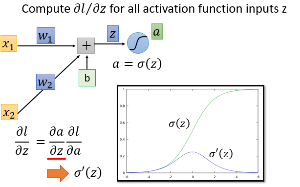

      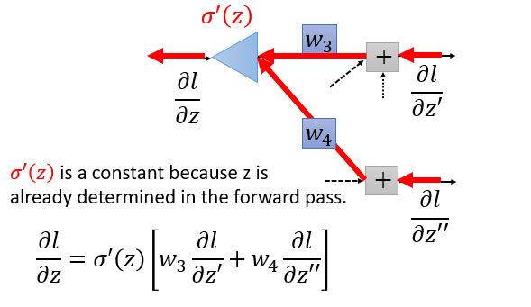

      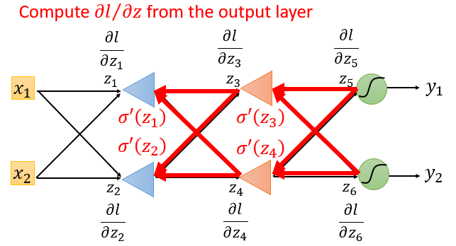

    * 总结

      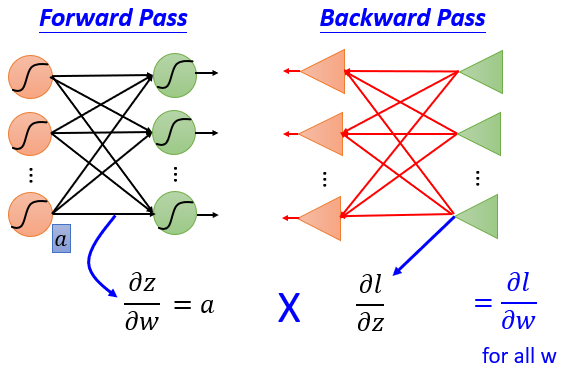

---

* **4.3 深度学习的技巧 Tips for Deep Learning**
  * Recipe of Deep Learning

    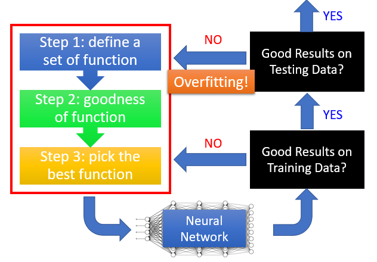

  * 消除梯度问题

    * 整流线性单元 ReLU (Rectified Linear Unit)

      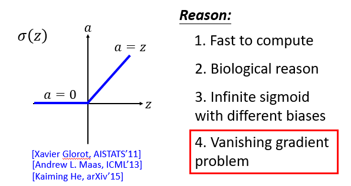

    * 最大输出 Maxout

      * ReLU 是特殊的 Maxout

      * 学习激活函数 Learnable activation function

        * 在最大输出网络中的激活函数可以是任何分段线性凸函数
        * 多少件取决于一组中有多少元素

        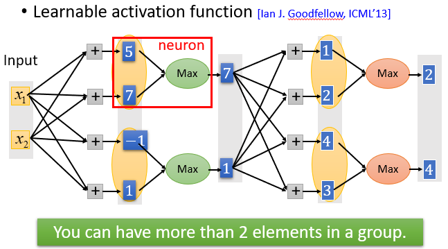

        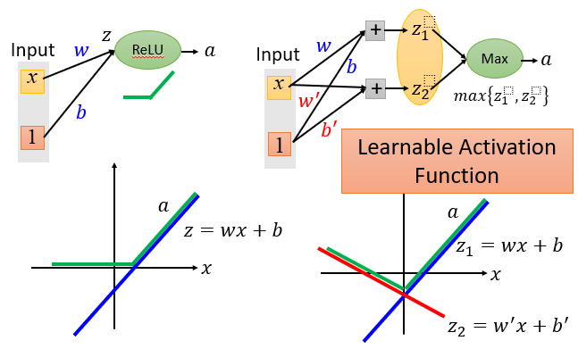

        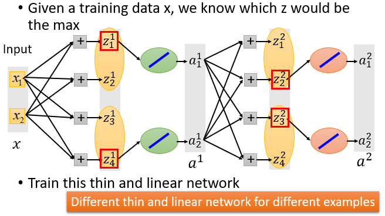

  * Review

    * Adagrad

      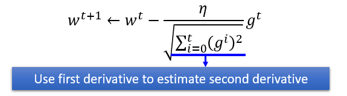

    * RMSProp

      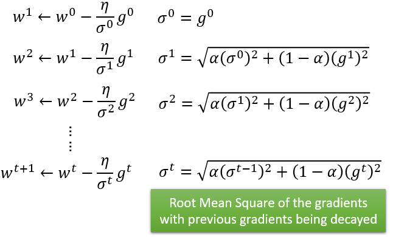

    * Vanilla Gradient Descent

      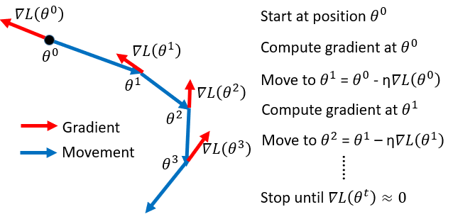

    * Momentum

      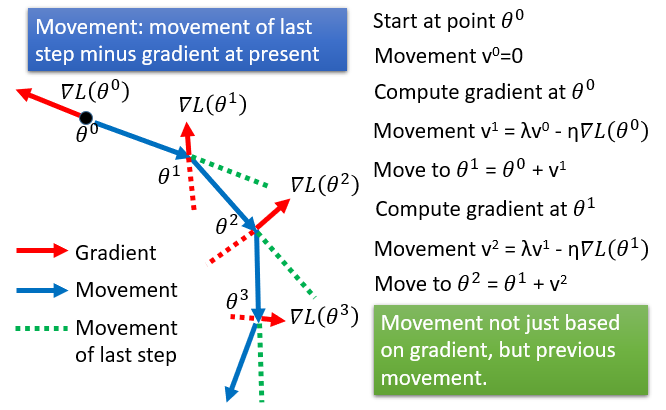

      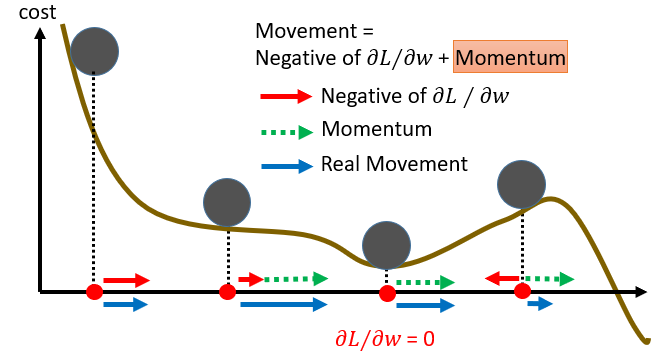

    * Adam (RMSProp + Momentum)

      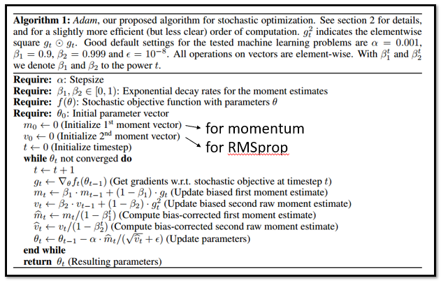

  * 正则化 Regularization

    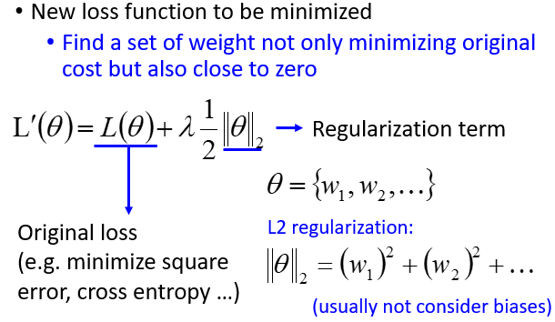

    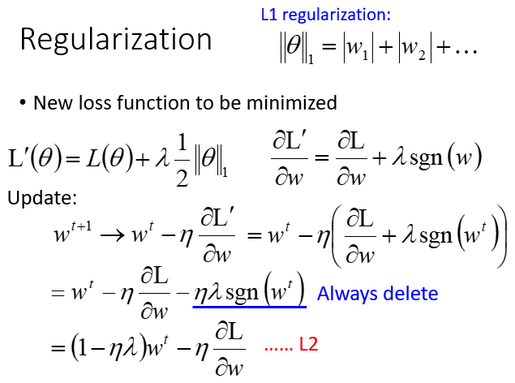

    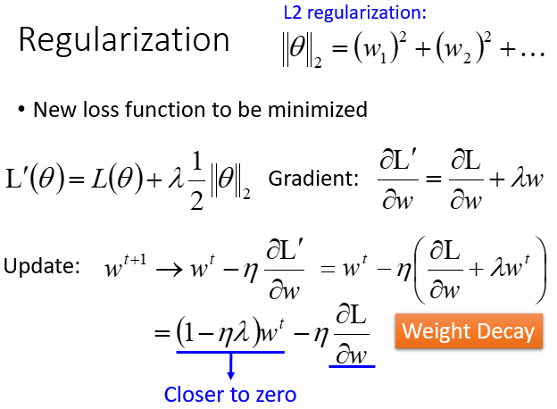

  * Dropout

    * Training 每次更新参数前

      * 每个神经元有 p% 的下降 (网络结构发生变化)
      * 使用新网络进行培训
      * 对于每一个小批次，我们重新取样辍学神经元

    * Testing, no dropout

      * 如果在训练中退出率是 p%，那么所有的比重率是 1-p%
      * 假设退出率是50%，如果训练权重 w = 1，设置 w = 0.5 进行测试

    * 原因

      * 当团队合作时，如果每个人都希望合作伙伴完成工作，那么最终什么也做不了
      * 然而，如果你知道你的伙伴将退出，你会做得更好
      * 测试时，实际上没有人中途退出，所以最终获得了良好的结果

    * 退出率是一套整体

      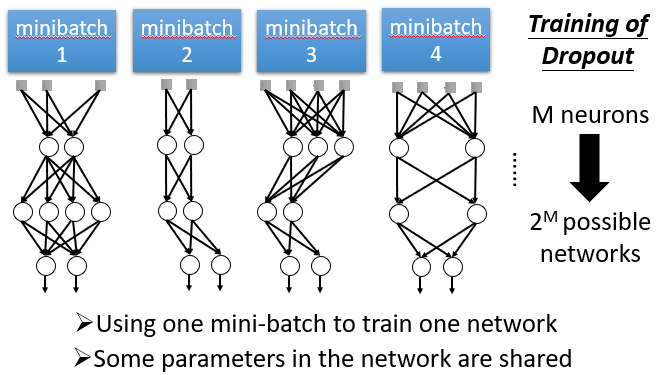

      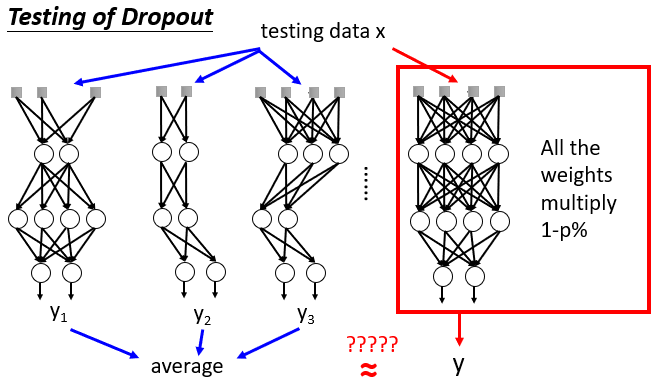

  * 

  

  

  

  

  

