#### 7.图神经网络（Graph Neural Networks, GNN）

* ##### 7.1 概述

  * 图

    * 节点
    * 边

  * GNN

    * 分类 Classification
    * 生成 Generation
    * 标签节点、非标签节点

    

    * 卷积
      * 如何利用卷积将节点嵌入到特征空间中?
        1. 将卷积(相关)的概念推广到图 >> 基于空间的卷积
        2. 回到信号处理中卷积的定义 >> 频谱卷积

---

* **7.2 GNN Roadmap**

  * 理论分析

    * GIN
    * GCN

  * Spatial-based

    | Aggregation  |        Method        |
    | :----------: | :------------------: |
    |     Sum      |         NN4G         |
    |     Mean     | DCNN, DGC, GraphSAGE |
    | Weighted sum |   MoNET, GAT, GIN    |
    |     LSTM     |      GraphSAGE       |
    | Max Pooling  |      GraphSAGE       |

---

* **7.3 Task, Dataset, and Benchmark**
  * Task (Benchmark Tasks)
    * Semi-supervised node classification : Stochastic Block Model dataset
    * Regression : ZINC molecule graphs dataset
    * Graph classification : SuperPixel MNIST and CIFAR10
    * Graph representation learning
    * Link prediction
    * Edge classification : Traveling Salesman Problem
  * Common dataset
    * CORA: citation network. 2.7k nodes and 5.4k links
    * TU-MUTAG: 188 molecules with 18 nodes on average

---

* **7.4 Spatial-based GNN**

  * NN4G (Neural Networks for Graph)

    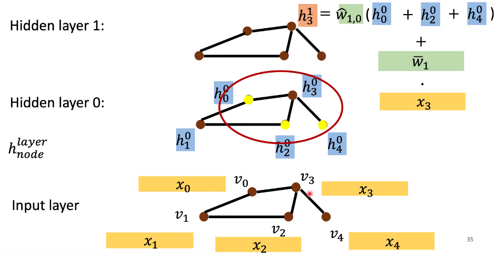

    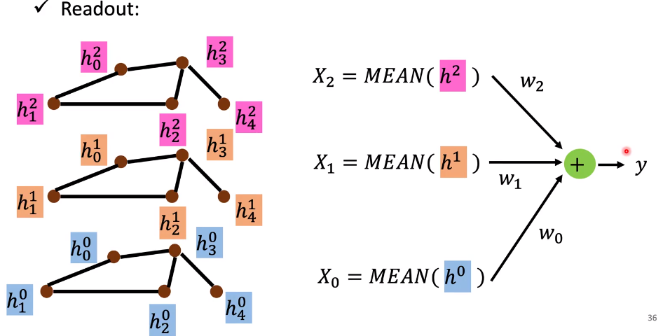

  * DCNN (Diffusion-Convolution Neural Network)

    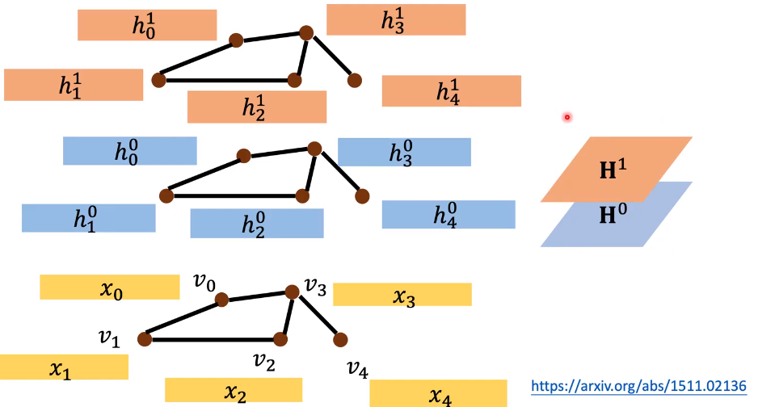

    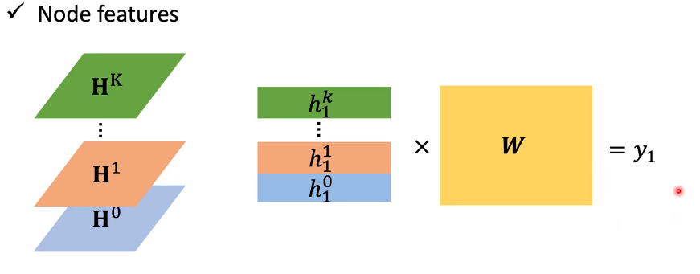

  * GDC (Diffusion Graph Convolution)

    $H^k + ... + H^1 + H^0$

  * MoNET (Mixture Model Networks)

    * 定义节点“距离”的度量

    * 使用加权和(平均值)而不是简单的求和(平均)邻居特征

      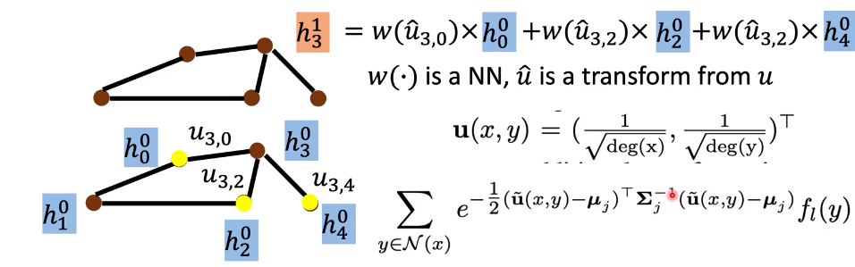

  * GraphSAGE

    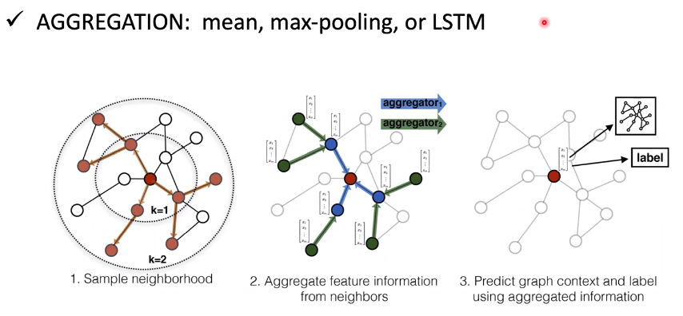

  * GAT (Graph Attention Networks)

    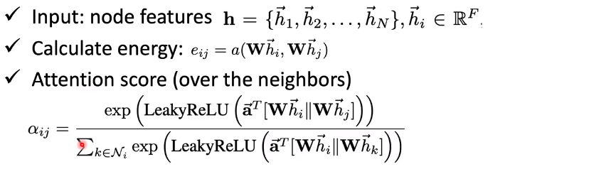

    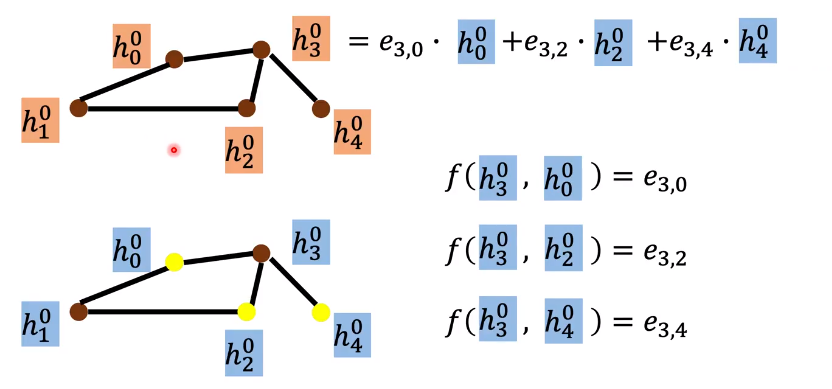

  * GIN (Graph Isomorphism Network)

    * 一个GNN最多可以和WL同构测试一样强大

    * 提供了理论证明

      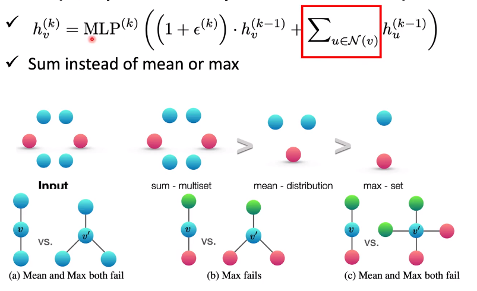

---

* **7.5 图信号处理与基于频谱的图神经网络（Graph Singal Processing and Spectral-based GNN）**

  * Spectral-Based Convolution

    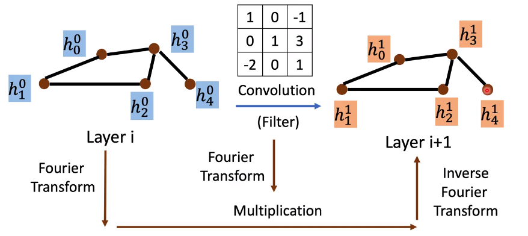

  * Spectral Graph Theory

    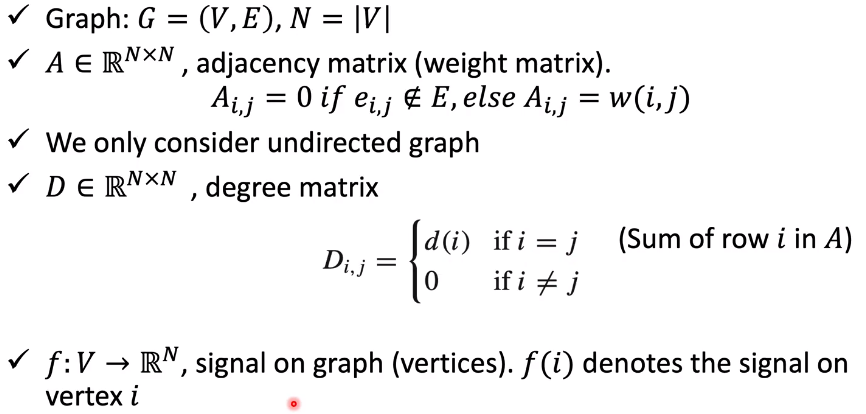

    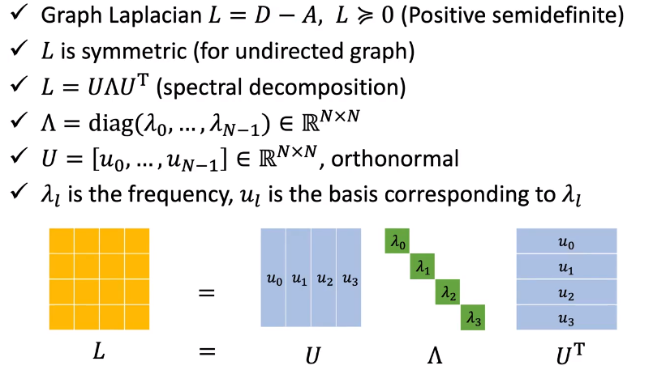

    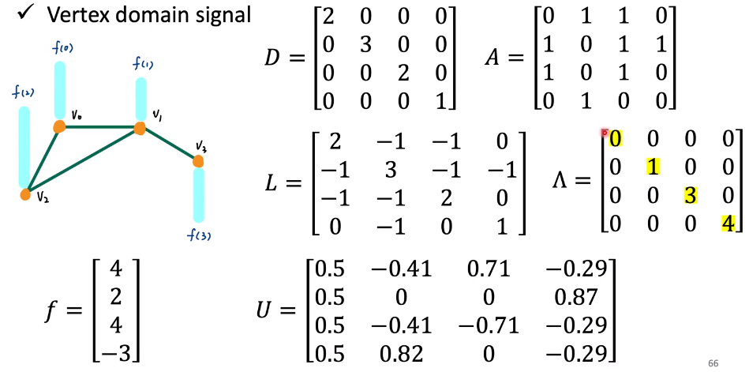

    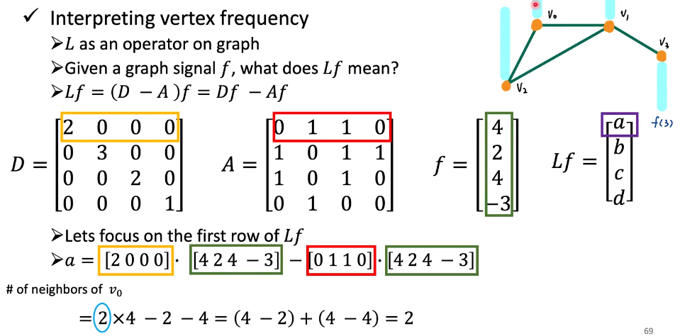

    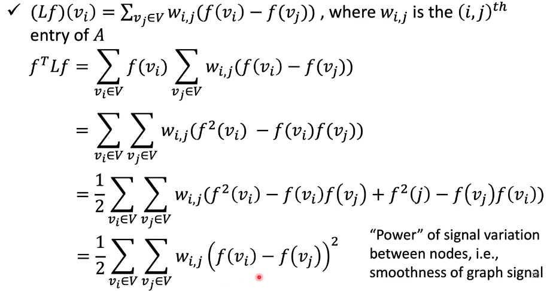

    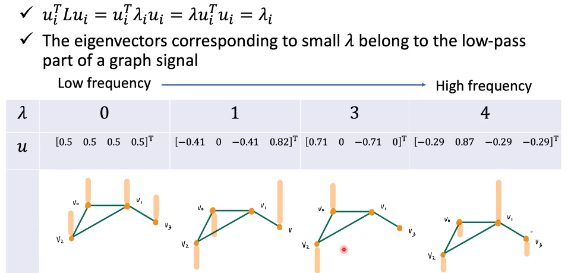

    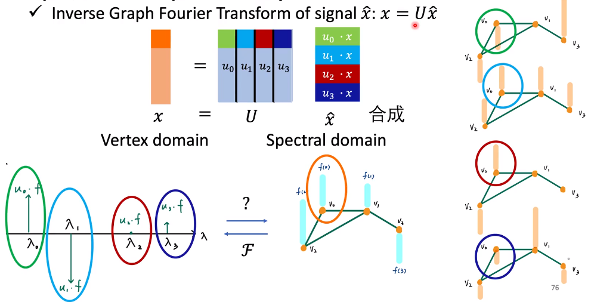

    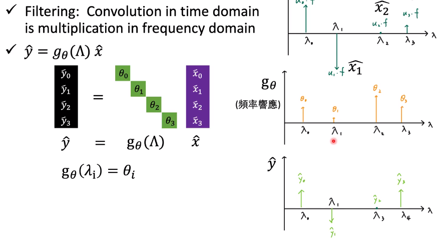

    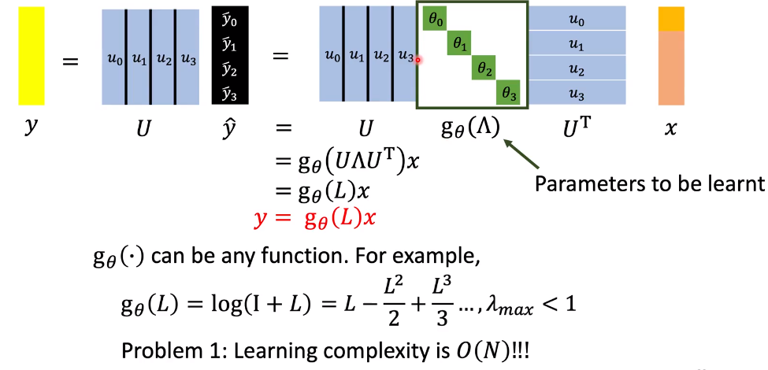

  * ChebNet

    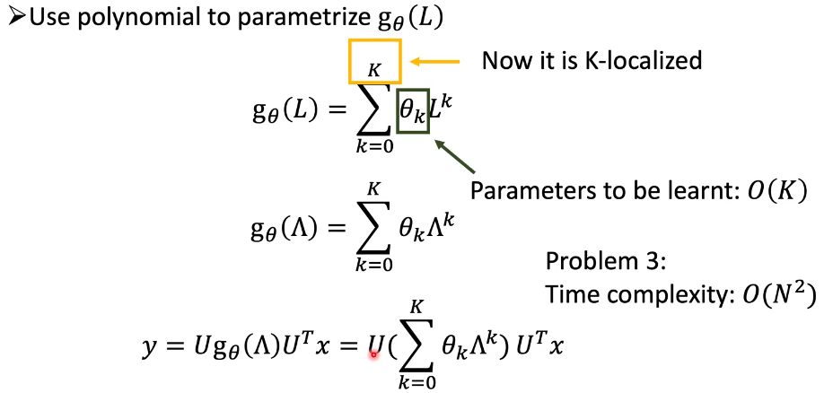

    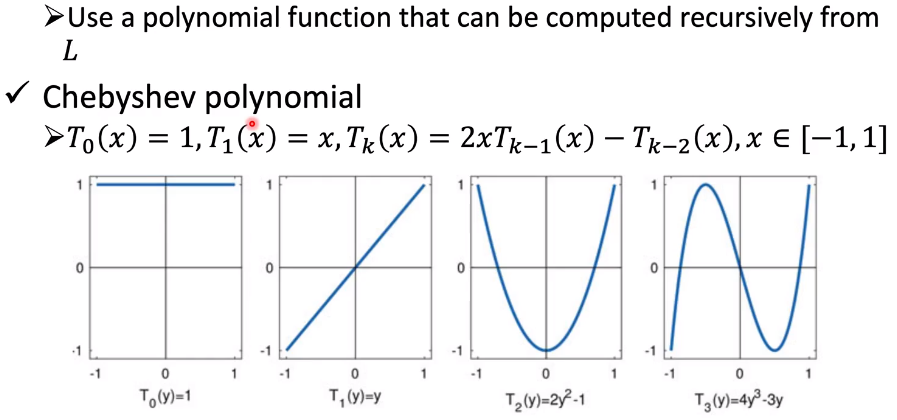

    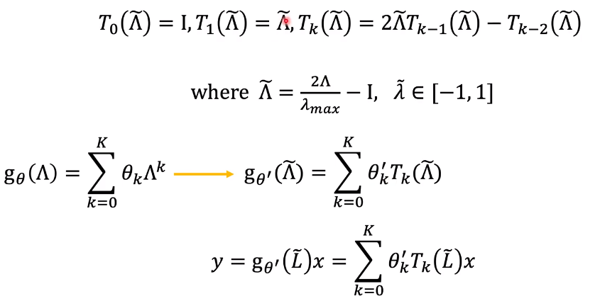

    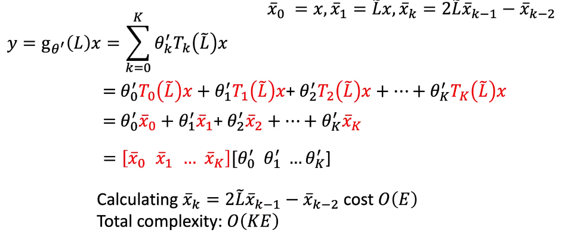

  * GCN

    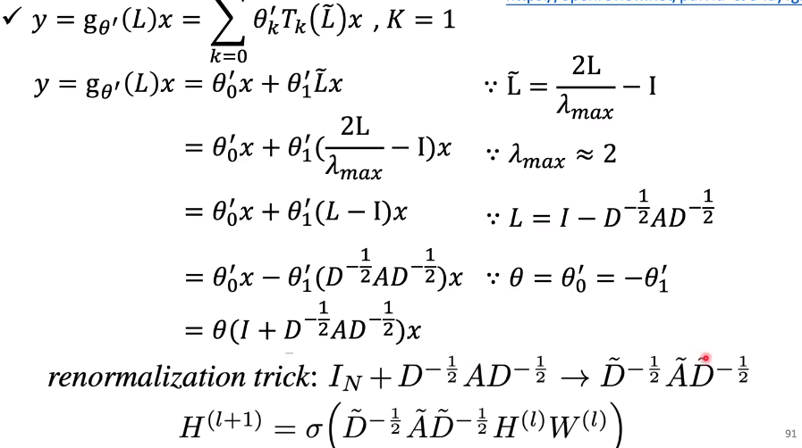

