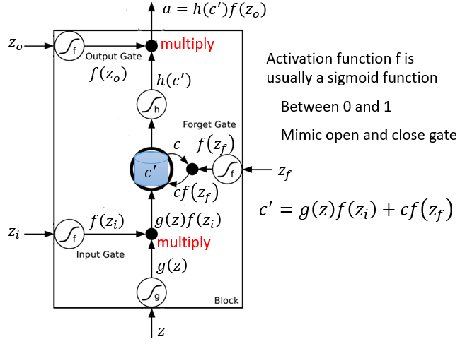
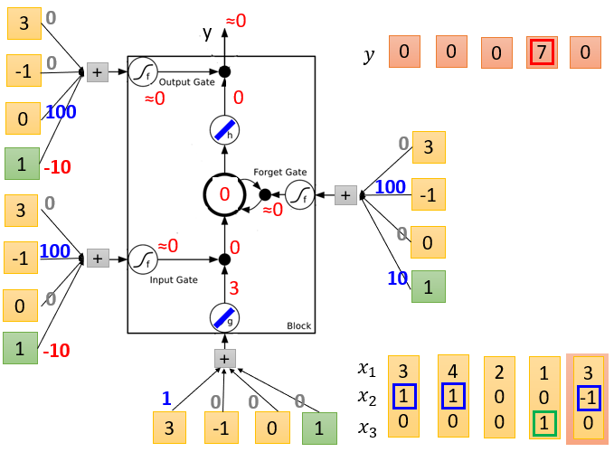

#### 7.循环神经网络（Recurrent Neural Network, RNN）

* ##### 7.1 示例应用程序

  * Slot Filling

    * 方法
      * 1-of-N encoding
      * Beyond 1-of-N encoding
    * Using Feedforward network
      * 输入：一组词 （每组词都可以用一个矢量代替）
      * 输出：输入字属于插槽的概率分布

  * RNN

    * 隐层的输出存储在存储器中
    * 内存可以看作是另一种输入 

  * Elman Network & Jordan Network

  * Bidirectional RNN

  * Long Short-term Memory (LSTM)

    

    

    

  * 

  

