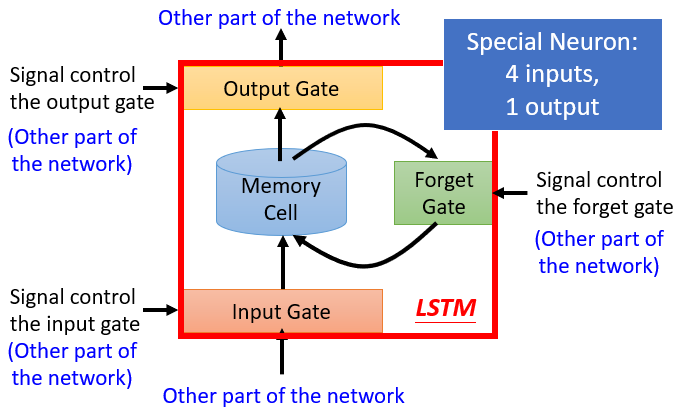
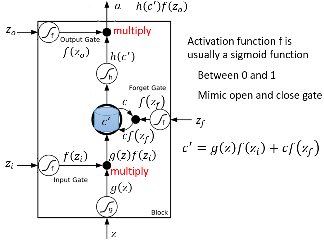
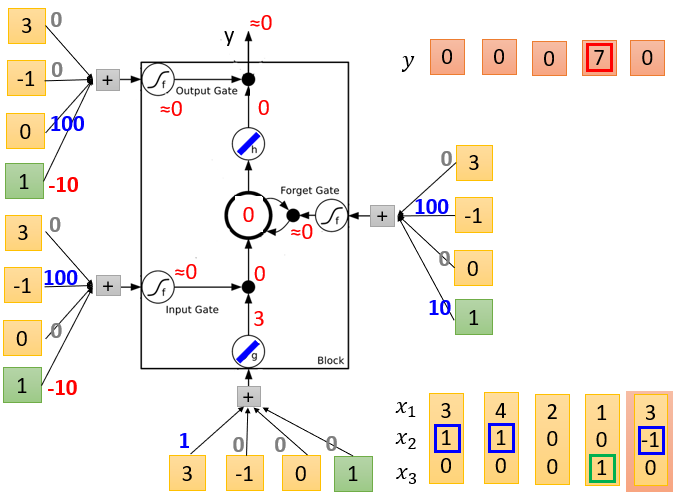
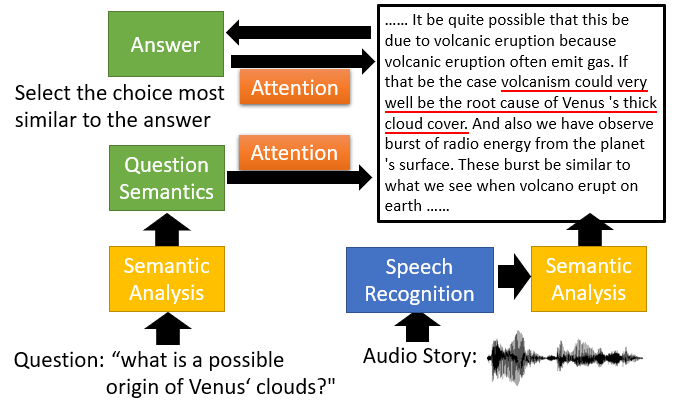
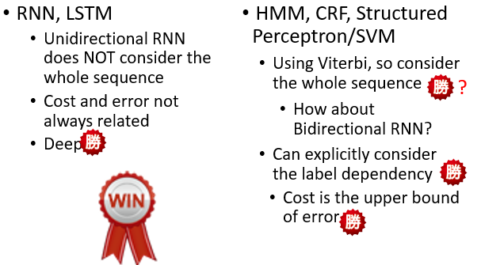
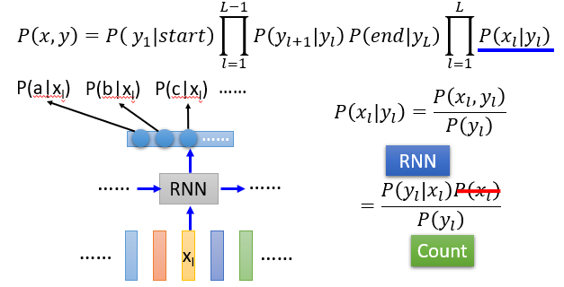
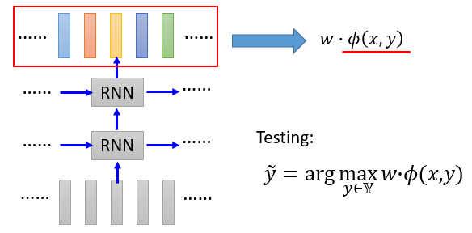

#### 7.循环神经网络（Recurrent Neural Network, RNN）

* ##### 7.1 示例应用程序

  * Slot Filling

    * 方法
      * 1-of-N encoding
      * Beyond 1-of-N encoding
    * Using Feedforward network
      * 输入：一组词 （每组词都可以用一个矢量代替）
      * 输出：输入字属于插槽的概率分布
  * Elman Network & Jordan Network
  * Bidirectional RNN

---

* **7.2 Long Short-term Memory (LSTM)**

  * 性质

    * 可以处理渐变消失(不是渐变爆炸)

    * 添加了内存和输入

    * 除非忘记门关闭，否则这种影响永远不会消失

    * 没有渐变消失(如果忘记门被打开)

    * 门循环单元(Gated Recurrent Unit, GRU) : 比 LSTM 简单

      

      

      

  * 有用的技术

    * Clockwise RNN
    * Structurally Constrained Recurrent Network (SCRN)

---

* **7.3 RNN**

  * 特点

    * 隐层的输出存储在存储器中

    * 内存可以看作是另一种输入

      

    *  Many to One :  输入是矢量序列，但输出是一个矢量

    * Many to Many :

      * 输入和输出都是矢量序列，但输出更短 (CTC)
      * 输入和输出都是不同长度的矢量序列，序列到序列学习
      * 没有限制

  * 应用

    * Beyond Sequence

      * Syntactic parsing

    * Sequence-to-sequence Auto-encoder 

      * Text

      * Speech

        

      * RNN Encoder

      * RNN Decoder

    * Demo 

      * Chat-bot
      * Video Caption Generation
      * Image Caption Generation

    * Attention-based Model

    * Reading Comprehension

      * Visual Question Answering

      * Model Architecture

        

  * RNN vs Structured Learning

    * 比较

      

    * 结合

      * 语音识别：CNN/LSTM/DNN + HMM

        

      * 语义标记：Bi-directional LSTM + CRF/Structured SVM

        
    
  * Conditional GAN
  
    * 将能量模型与GAN连接
      * 生成对抗网络、逆强化学习和能量模型之间的连接
      * 能量模型概率估计的深度定向生成模型
      * 基于能量生成的对抗网络
    * 用于推理的深度学习模型
      * 深度展开 : 基于模型的新深度建筑灵感
      * 作为循环神经网络的条件随机场

