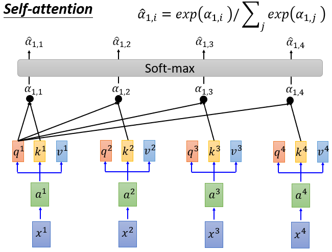
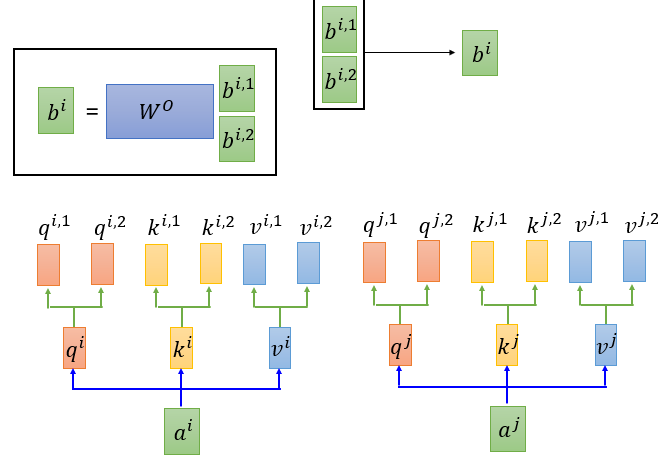

#### 8.无监督学习（Unsupervised Learning）

* ##### 8.1 字嵌入 (Word Embedding)

  * 类比

    * 1-of-N Encoding

      apple      = [1 0 0 0 0]

      bag          = [0 1 0 0 0]

      cat           = [0 0 1 0 0]

      dog          = [0 0 0 1 0]

      elephant = [0 0 0 0 1]

    * Word Class

      class 1 : dog, cat, bird

      class 2 : ran, jumped, walk

      class 3 : flower, tree, apple

    * Woed Embedding

      离散图

  * 概述

    * 机器通过阅读大量的文档而没有监督学习单词的意思
    * 通过内容可以理解一组词的意思
    * 可以从它所交往的人那里知道一组词
    * 无监督生成单词矢量

  * 方法

    * Count based

      如何两组词 wi 和 wj 以相同的频率出现，V(wi) 和 V(wj) 将彼此有关联

      V(wi) · V(wj)		~		Ni,j

      内积								相同的文档中出现大量的 wi 和 wj

    * Predition based

      一组词 wi-1 的 1-of-N encoding ~ 神经网络 ~ 每组词作为下一组词 wi 的可能性

      * 去掉第一层神经元的输入
      * 用它来代表一个单词 wi
      * 单词矢量，单词融合特征：V (wi)

    * Predition-based - Sharing Parameters

      * 同样颜色的重量应该是一样的

      * 一组词将有两个单词矢量

        

      * 如何让 wi 等于 wj
      * 给 wi 和 wj 相同的初始值

      $$
      w_i \leftarrow w_i - \eta \frac{\partial C}{\partial w_i} \\
      w_j \leftarrow w_j - \eta \frac{\partial C}{\partial w_j}
      $$

    * Predition-based - Trainning

    * Predition-based - Various Architectures

      

  * 其他方式

    * Multi-lingual Embedding
    * Muliti-domain Embedding
    * Document Embedding
    * Semantic Embedding

  * Beyond Bag of Word

    * Paragraph Vector
    * Seq2seq Auto-encoder
    * Skip Though

---

* **8.2 迁移学习 (Transformer Learning)**

  * Seq2seq model with "Self-attention"

  * Using CNN to replace RNN

  * Self-attention

    * 定义

      q : query (to match others)
      $$
      q^i = W^qa^i
      $$
      k : key (to be matched)
      $$
      k^i = W^ka^i
      $$
      v : information to be extracted
      $$
      v^i = W^va^i
      $$

    * 模型

      

      

      

      

      

      

  * Multi-head Self-attention

    

    

  * Positional Encoding

    * 在 self-attention 中没有位置信息
    * 原始论文 : 每个位置都有一个唯一的位置向量 e^i (不是从数据中学到的)
    * 换句话说，每个 x^i 加上一个热向量 p^i

  *  Seq2seq with Attention

    

  * Transformer

    

  * Attention Visualization
  * Universal Transformer

