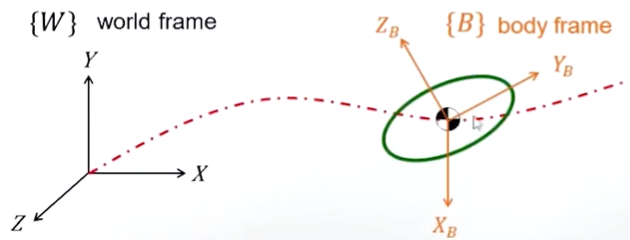
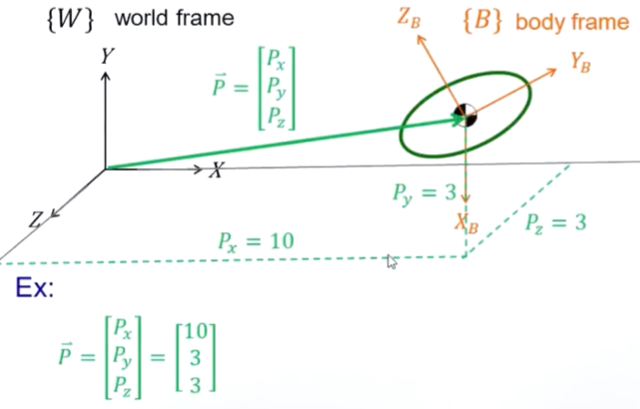
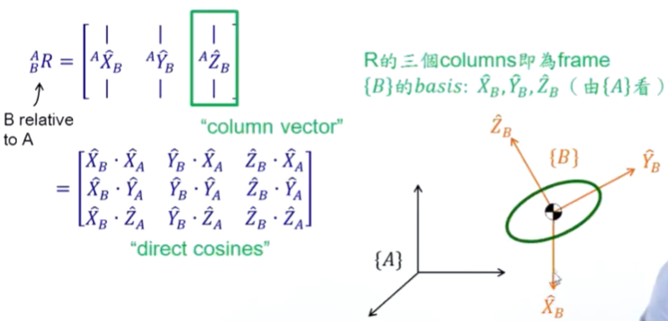
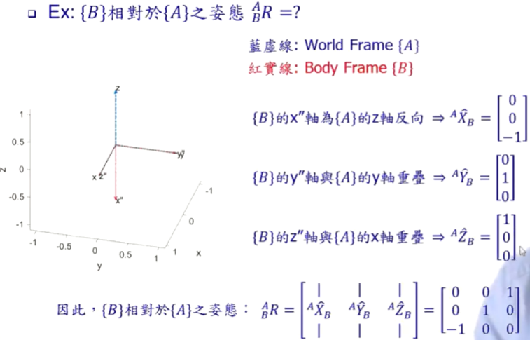
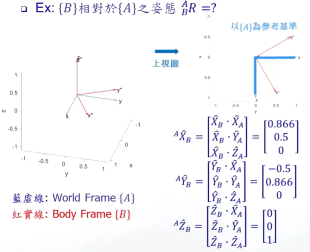
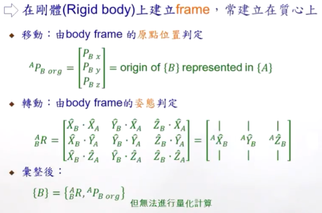

#### 1.概述（Summary）

* ##### 1.1 导读

  * ##### 刚体运动状态描述

    * 状态描述

      * 平面：移动 2DOFs、转动 1DOF (Degree of freedom)
      * 空间：移动 3DOFs、转动 3DOFs

    * 运动描述

      利用各个 DOF 的微分，将位移和姿态转换到速度和加速度等运动状态

    

    * 整合
      * 在刚体上建立 frame，常建立在质心上
      * 移动：由 body frame 的远点位置判定
      * 转动：由 body frame 的姿态判定

  * 移动

    * 以向量 P 来描述 {B} 的原点相对于 {A} 的状态

      

    * 向量可表达空间关系的两个方式
      * A position in space (i.e., position vector)
      * A vector (i.e., displacement, frame basis)

  * 转动

    * 描述 {B} 相对于 {A} 之姿态 ---- Rotation Matrix

      

      

      

---

* **1.2 刚体状态表达**

  * 概述

    

  * 整合表达

