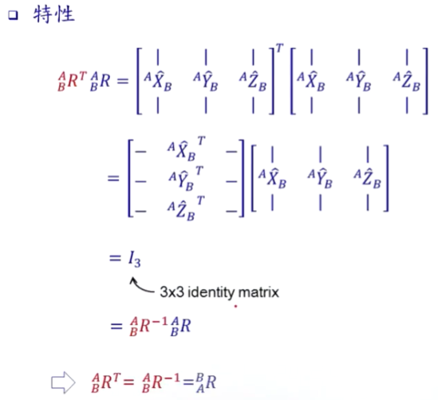

#### 2.旋转矩阵（Rotation Matrix）

* ##### 2.1 特性

  * Rotation Matrix 特性 1

    

    

    

    

  * Rotation Matrix 特性 2

    

    

  * Rotation Matrix 特性 3

    

    

    

  * Rotation Matrix 特性总结

    

---

* **2.2 旋转角**
  * Rotation Matrix 旋转角概述

    

  * Fixed Angles

    * 图解 1

      

    * 举例 1

      以 Fixed Angles 旋转 ：[ 先对 X 轴旋转 60 度，后对 Y 轴旋转 30 度 ] 和 [ 先对 Y 轴旋转 30 度，后对 X 轴旋转 60 度 ] 各自的 AB_R 分别是？

      

    * 推算 1

      

      

    * 图解 2

      

    * 举例 2

      以 Euler Angles 旋转 ：[ 先对 X 轴旋转 60 度，后对 Y 轴旋转 30 度 ] 和 [ 先对 Y 轴旋转 30 度，后对 X 轴旋转 60 度 ] 各自的 AB_R 分别是？

      

    * 验证 2

      

    * 图解 3

      

      

    * 举例 3

      

  * Rotation Matrix 旋转角总结

    

