#### 4.机械手臂（Manipulator）

* ##### 4.1 顺向运动学（Manipulator Forward Kinematics）

  * 运动学（Kinematics）

    * 讨论运动状态本身，未连接到产生运动的 力

    * 位置（x）、速度（v）、加速度（a）和时间（t）之间的关系
      $$
      \large v = \frac{d}{dt}x \qquad a = \frac{d}{dt}v \qquad
      \large a = \frac{d^2}{dt^2}x \qquad vdv = ads
      $$

    * 移动/转动

      * 位置/姿态
      * 速度、角度
      * 加速度/角加速度

  * 动力学（Dynamics）

    * 讨论 力/力矩 如何产生运动

    * Newton's 2^nd Law

    * Work & energy

    * Impulse & momentum
      $$
      \sum F = ma \qquad T_1 + V_1 + U_{1-2}' = T_2 + V_2 \qquad 
      \int \sum F dt = G_2 - G_1
      $$

  * 机械手臂

    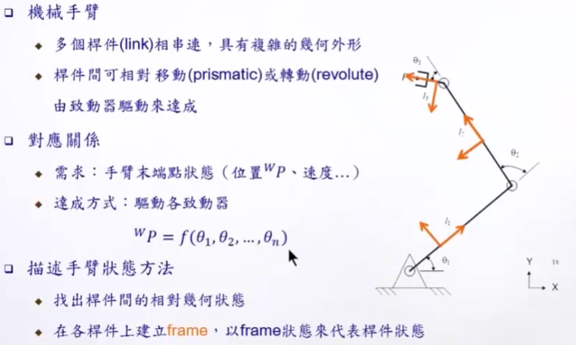

  * 手臂几何描述方式

    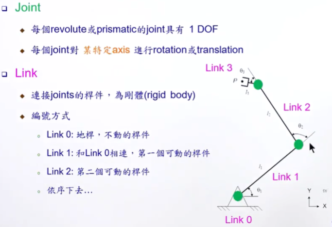

    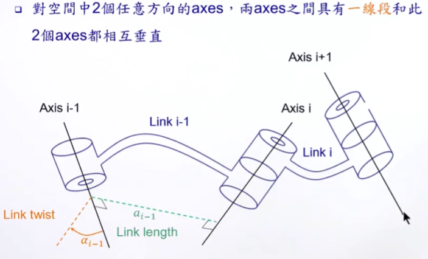

    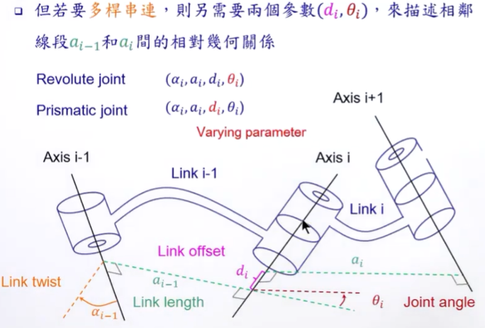

  * 焊件上建立 Frames

    * 概述

      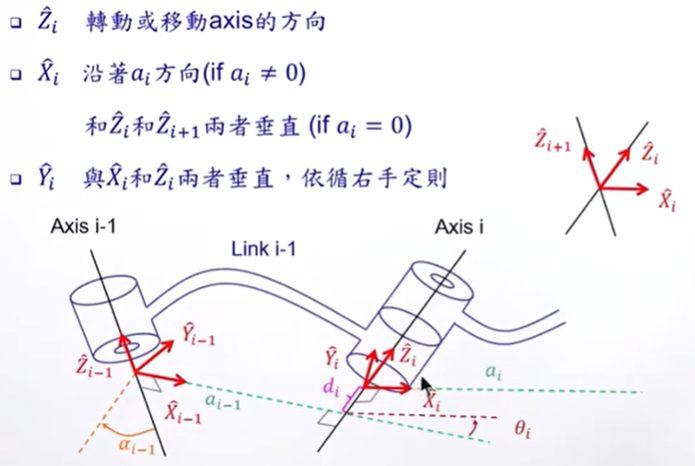

      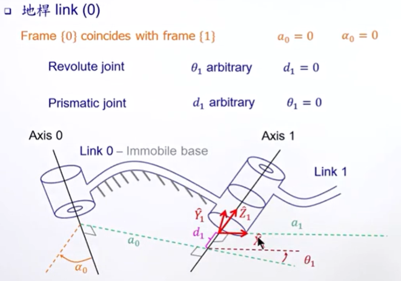

      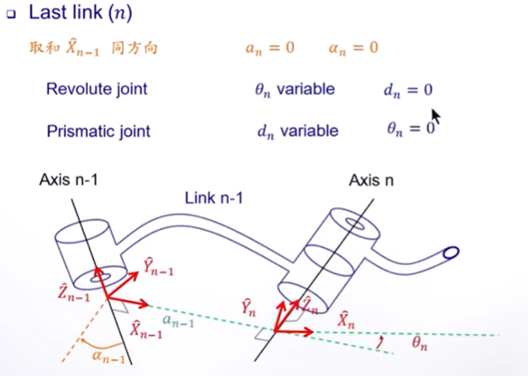

    * Link Transformations

      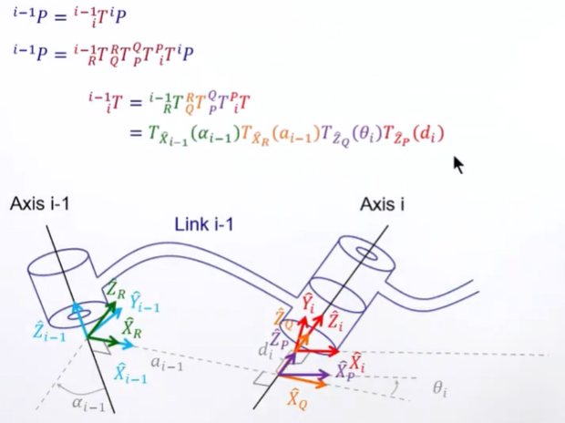

      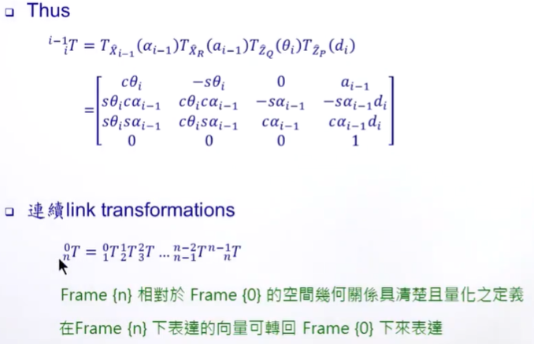

    * 举例

      * A RRR Manipulator - 1

        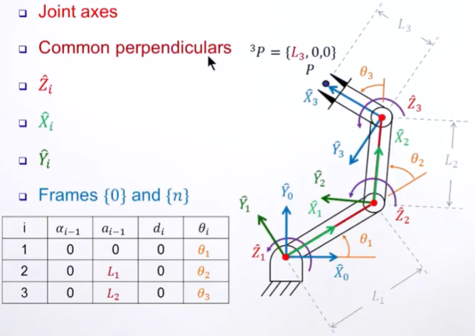

      * A RRR Manipulator - 2

        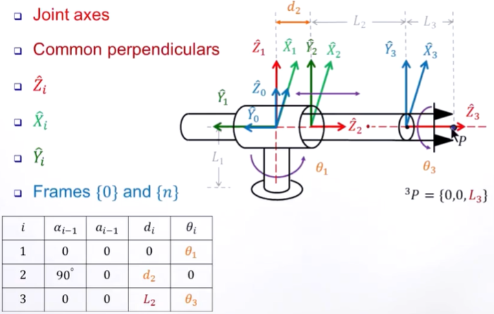

      * A PRRR Manipulator

        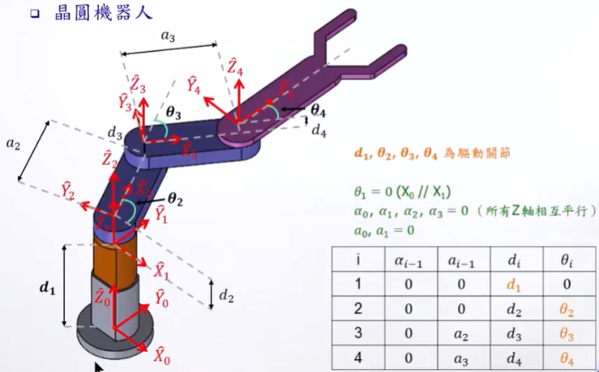

      

  * 驱动器，关节和笛卡尔空间（Actuator, Joint, and Cartesian Spaces）

    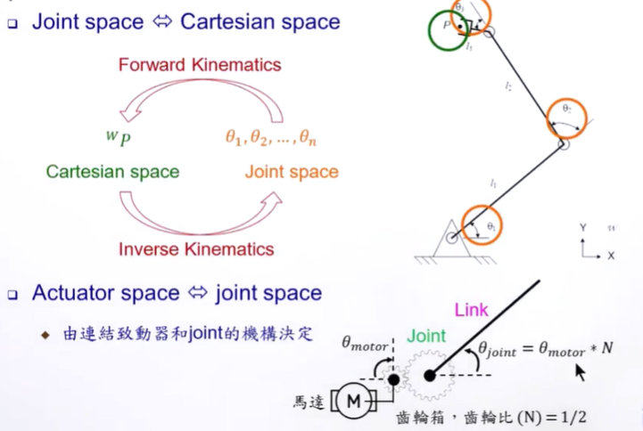

    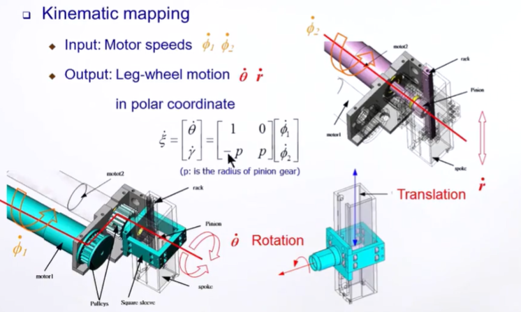

  * Denavit-Hartenberg 表达法

    * Craig version

      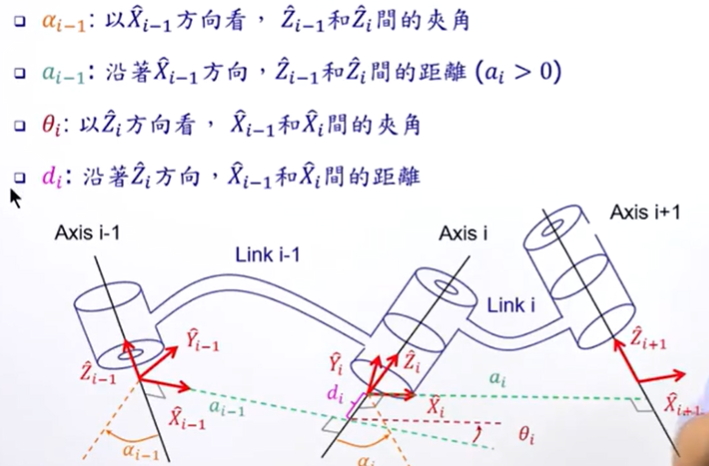

    * Standard

      

