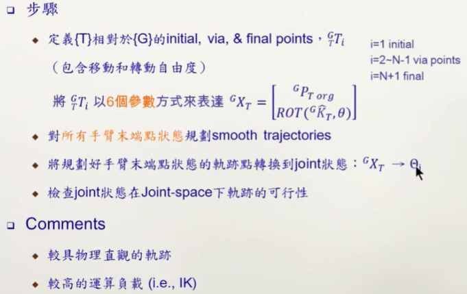
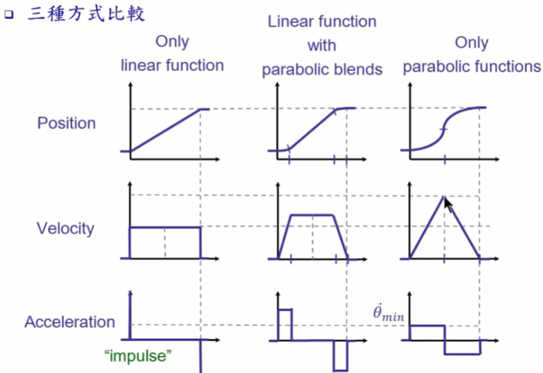

#### 6.机械手臂-轨迹规划（Manipulator Trajectory Planning）

* ##### 6.1 引言

  * 轨迹

    

    
  
  * 轨迹规划
  
    * Joint-space 下的轨迹规划
  
      
  
    * Cartesian-space 下的轨迹规划
  
      

---

* 6.2 轨迹规划架构

  * Cubic Polynomials

    * Cubic Polynomials 说明

      

      

      

      

    * 多段 Cubic Polynomials

      

      

      

      

      

    * General Cubic Polynomials

      

      

      

    * 举例：A RRR Manipulator

      

      

      

    * High-order Polynomials

      

  * Linear Function with Parabolic Belends

    * Linear Function with Parabolic Belends 说明

      

      

      

      

      

    * 多段 Linear Function with Parabolic Belends

      

    

​		

