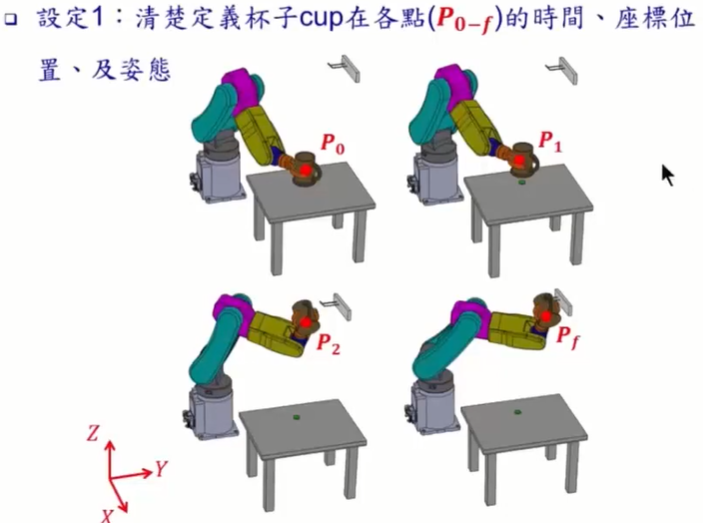
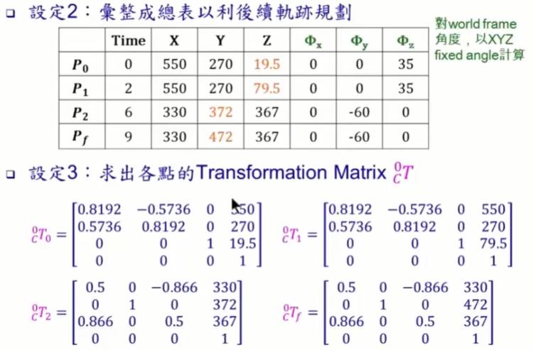
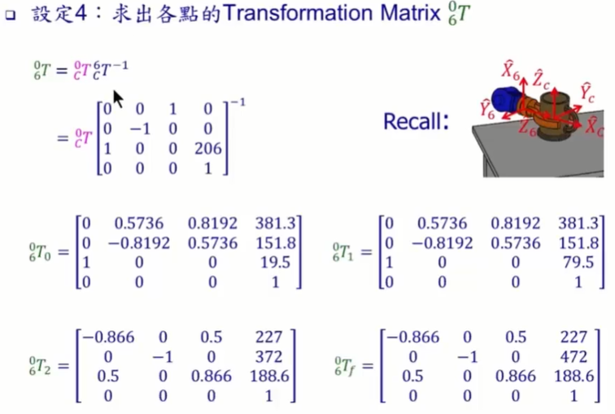
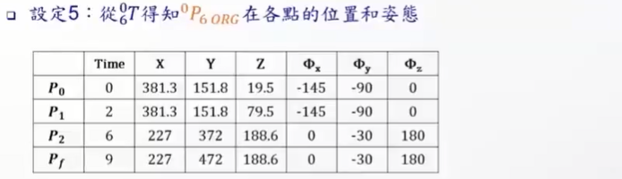

#### 7.机械手臂-轨迹规划实例（Manipulator Trajectory-Planning Example）

* ##### 7.1 实例

  * ##### 任务

    * Revisit 物件取放任务之情景：机械手臂夹住放在桌子上的杯子，移动手臂将杯子挂到墙上的杯架

    * 在IK 的课程中，练习以 IK 计算 RRRRRR 手臂在任务起点 C 的 6 个转角（joint angles），让手臂能顺利夹住杯子
  
  * 任务：规划手臂 将杯子从桌面拿起到放上杯架 间的整段轨迹
  
  * 辅助条件：加上两个 via points
  
    * 垂直拿起杯子一小段距离
      * 到达杯架前，调整到适当姿态，让杯子能顺利放上杯架

    * 条件设定
  
      
  
    
  
    
  
    
  
* 解决方案
  
    * 
  
  
