#### 16.异常检测（Anomaly Detection）

* ##### 16.1 概述

  * Problem Formulation

    

  * 应用

    * Fraud Detection
    * Network Intrusion Detection
    * Cancer Detection

  * 检测

    * Binary Classification

      

    * Categories

      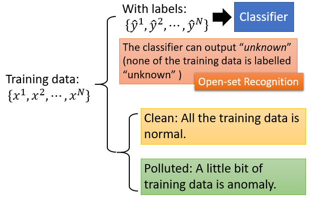

    * 举例

      * Case 1 : With Classifier

        * 使用分类器

          

        * Example Framework

          

        * Evaluation

          * 正确率高并不意味着系统好
          * 一个系统有很高的正确率，但它什么也没有做

      * Case 2  : With Labeled

        * Maximum Likelihood

          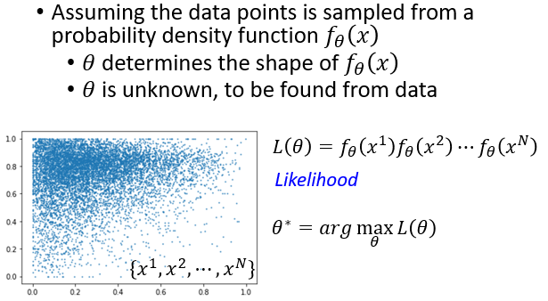

        * Gaussian Distribution

          

          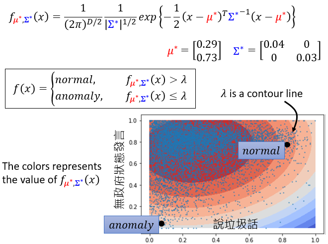

          

---

* **16.2 异常检测的分类方法和应用**
  * Classic Method
    * With Classifier
    
      
    
    * GMM (Gaussian Mixture Model)
    
      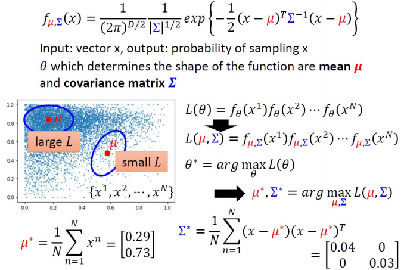
    
      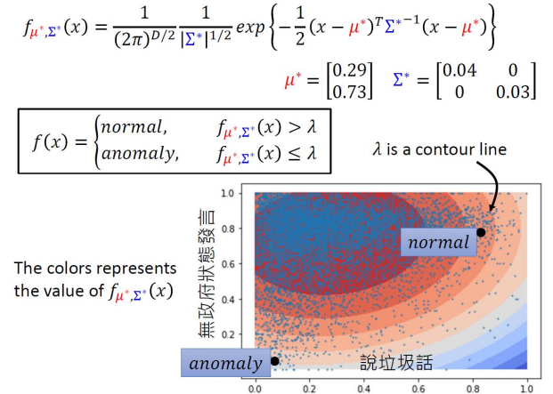
    
    * Auto-Encoder
    
      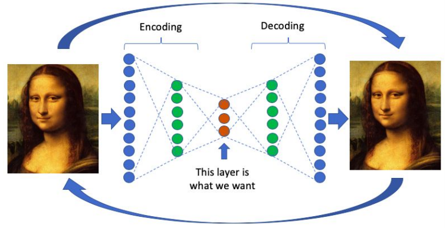
    
    * PCA
    
      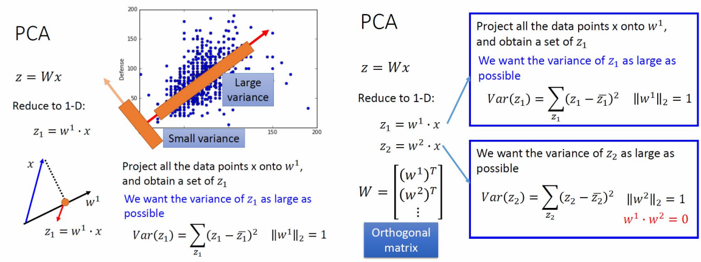
    
    * Isolation Forest
    
      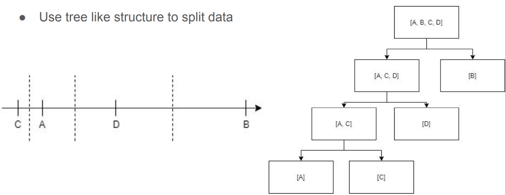
    
  * Anomaly Detection on image
    
    * Typical GANs
    
      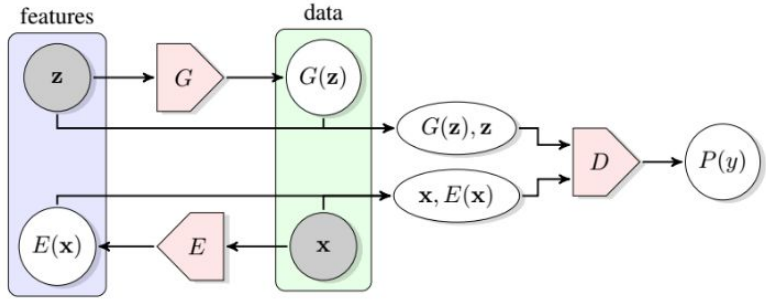
    
    * AnoGAN
    
      * 只对 positive 样本进行标准 GAN 训练
      * Pros
        * 说明 GAN 网络可用于异常检测
        * 引入了一种新的隐空间到输入数据空间的映射方案
        * 使用相同的映射方案定义异常评分
      * Cons
        * 每个新输入都需要 Γ 优化步骤 : 糟糕的测试时间性能
        * GAN 目标没有被修改，以考虑到逆映射学习的需要
        * 异常得分很难解释，不在概率范围
    
      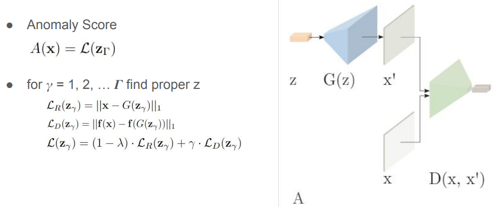
    
    * EGBAD (Efficient GAN-Based Anomaly Detection)
    
      * 只用 positive 样本训练 Bi-GAN
    
      * Pros
    
        * 在对抗性训练中，编码器 E 可以学习如何编码图像
        * 在计算异常评分时，可以绕过 AnoGAN 的 Γ 优化步骤
    
        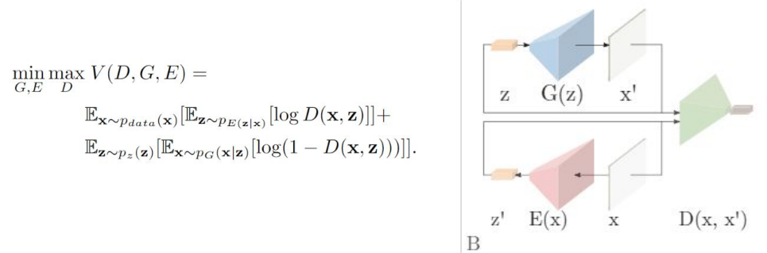
    
    * GANomaly
    
      * 发电机由编码器GE、解码器GD、编码器E组成
    
      * 只接受过正常数据的训练
    
      * Pros
    
        * 一个编码器是在训练过程中学习的，所以它可以绕过 Γ 优化
        * 使用像架构一样的自动编码器(不使用噪声先验)使整个学习过程更快
        * 上下文丢失可用于异常定位
    
      * Cons
    
        * 定义新的异常评分
        * 既可以检测图像空间的异常，也可以检测潜在空间的异常，但结果不匹配 :
          * 只有在潜在空间中计算的更高的异常分数可以与之关联
          * 生成的样本具有较低的上下文损失值，因此与输入非常相似，反之亦然
    
        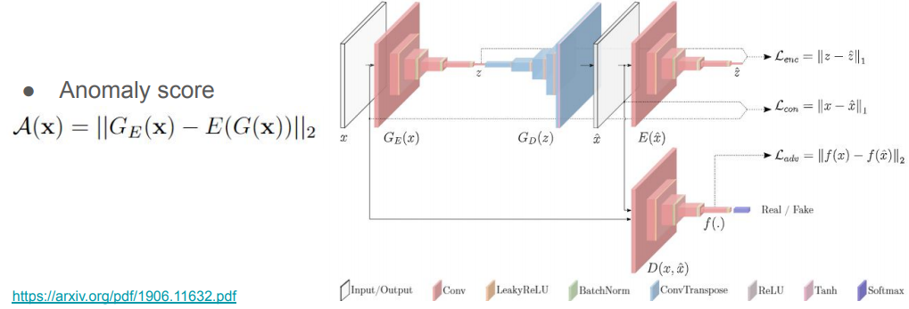
    
  * Anomaly Detection on Audio
    * GMGAN  (Gaussian Mixture GAN)
    
      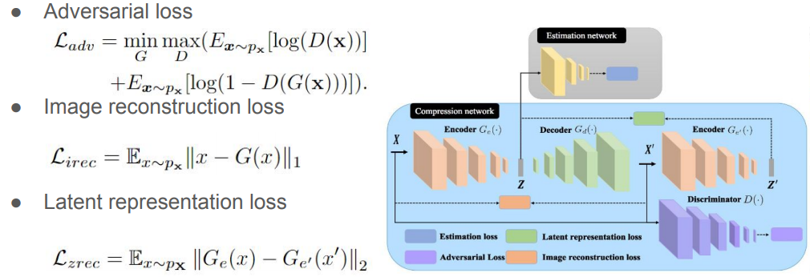
    
      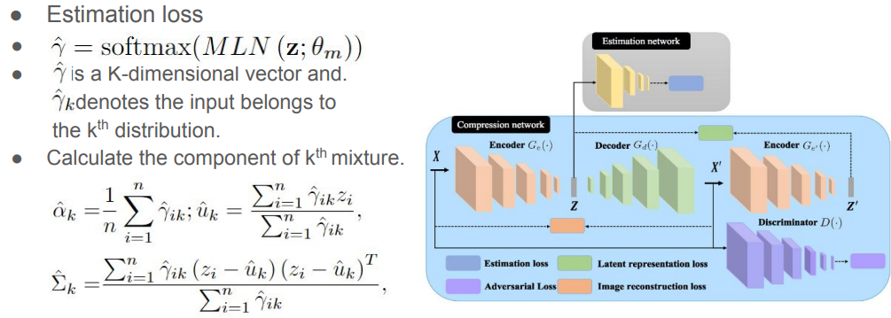
    
      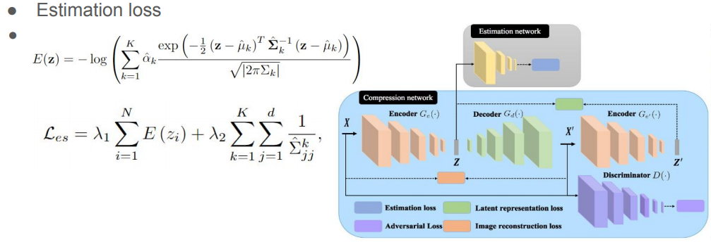

