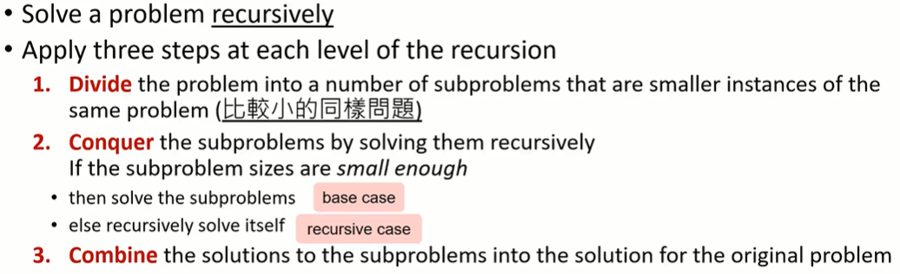
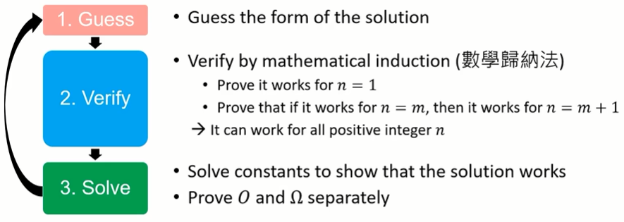
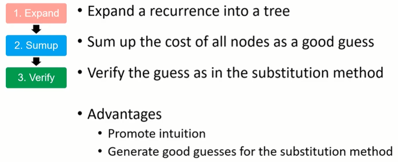
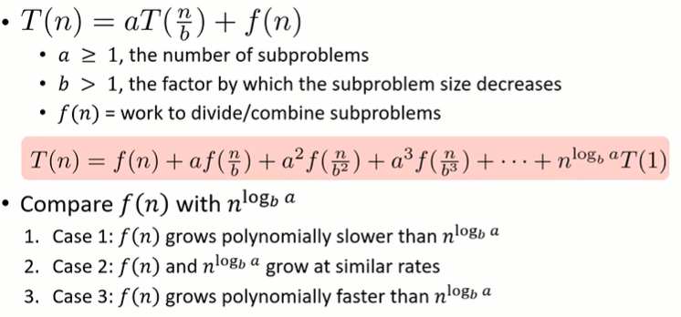
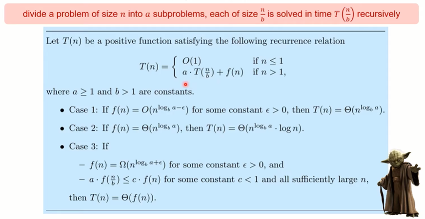
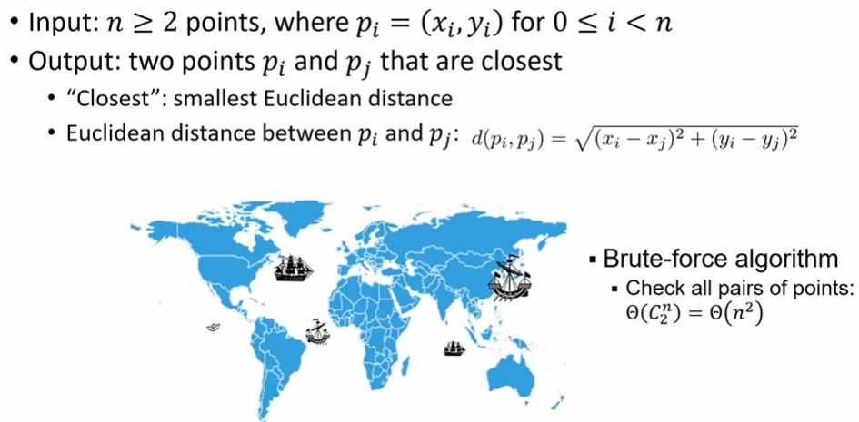

#### 2.分治法（Divide-and-Conquer）

* ##### 2.1 循环（Recurrence）

  * 概述
    * 递归式是一个方程或不等式，它用较小的输入值来描述一个函数
    * 举例：斐波那契数列（Fibonacci sequence）
      * Base case : F(0) = F(1) = 1
      * Recursive case : F(n) = F(n-1) + F(n-2)
  * 优势
    * 定义更容易、更清晰
      * 定义 base case 和 recursive case
      * 定义一个很长的序列
    * 
  * 循环神经网络（Recurrent Neural Network, RNN）
    * 

---

* **2.2 分治法（Divide-and-Conquer）**

  * 概述

    

  * 优势

    * 容易解决困难的问题
    * 容易找到高效率的算法
    * 稳定的平行运算（多核系统）
    * 更高效的内存接入

  * 时间复杂度

    * T(n) : n 个输入的运行时间

    * D(N) : n 个输入的 Divide 时间

    * C(n) : n 个输入的 Combine 时间

    * a : 子问题的个数

    * n/b : 每个子问题的大小
      $$
      T(n) = \{{O(1),\ if\ n \le c \atop aT(n/b) + D(n) + C(n),\ otherwise}
      $$

  * 解决方法

    * Substitution Method（取代法）

      

    * Recursion-Tree Method（循环树法）

      

      

    * Master Method（套公式大法/大师法）

      

  * 情景使用
    * Whether the problem with small inputs can be solved directly
    * Whether subproblem solutions can be combined into the original solution
    * Whether the overall complexity is better than naive
  
  * 举例
  
    * Tower of Hanoi (河内塔)
  
      * Problem : move n disks from A to C

      * Rules

        * Move one disk at a time
        * Cannot place a larger disk onto a smaller disk
  
      * 伪码
  
        ```
        Hanoi (n, src, dest, spare)
        {
        	if n == 1
        		Move disk from src to dest
        	else
        		Hanoi (n-1, src, spare, dest)
        		Move disk from src to dest
        		Hanoi (n-1, spare, dest, src)
        }
        ```
  
      * T(n) = moves with  n disks
        * Base case : T(1) = 1
        * Recursive case (n > 1) : T(n) = 2T(n-1) + 1  
  
    * Bitonic Champion Problem
  
      * Input : A bitonic sequence A[1], A[2], ..., A[n] of distinct positive integers

      * Output : the index i with 1 <= i <= n such that
        $$
        \large A[i] = max_{1 \le j \le n}A[j]
        $$
  
      * 伪码
  
        ```pseudocode
        Champion(i, j)
        {
        	if i == j
        		return i
        	else
        		k = floor((i + j) / 2)
        		l = Champion(i, k)
        		r = Champion(k+1, j)
        		if A[l] > A[r]
        			return l;
        		if A[l] < A[r]
        			return r
        }
        
        Champion-2(i, j)
        {
        	if i == j
        		return i
        	else
        		k = floor((i + j) / 2)
        		if A[k] > A[k+1]
        			return Champion(i, k)
        		if A[k] < A[k+1]
        			return Champion(k+1, j)
        }
        ```
  
    * Maximum Subarray
  
      * 定义
  
        * Input : A sequence A[1], A[2], ..., A[n] of integers
  
        * Output : Two indicex i and j with 1 <= i <= j <= n that maximize
  
          A[i] + A[i+1] + ... + A[j]
  
      * 伪码
  
        ```pseudocode
        MaxSubarray-1 (i, j)
        {
        	for i = 1, ..., n
        		for j = 1, ..., n
        			S[i][j] = -∞
        	
        	for i = 1, ..., n
        		for j = i, i+1, ..., n
        			S[i][j] = A[i] + A[i+1] + ... + A[j]
        			
        	return Champion(S)
        }
        
        MaxSubarray-2(i, j)
        {
        	for i = 1, ..., n
        		for j = 1, ..., n
        			S[i][j] = -∞
        	
        	R[0] = 0
        	for i = 1, ..., n
        		R[i] = R[i-1] + A[i]
        	
        	for i = 1, ..., n
        		for j = i+1, i+2, ..., n
        			S[i][j] = R[j] - R[i-1]
        }
        
        // 分治法
        MaxCrossSubarray(A, i, k, j)
        {
        	left_sum = -∞
        	sum = 0
        	for p = k downto i
        		sum = sum + A[p]
        		if sum > right_sum
        			left_sum = sum
        			max_left = p
        			
        	right_sum = -∞
        	sum = 0
        	for q = k+1 to j
        		sum = sum + A[q]
        		if sum > right_sum
        			right_sum = sum
        			max_right = q;
        	
        	return (max_left, max_right, left_sum + right_sum)
        }
        
        MaxSubarray(A, i, j)
        {
        	if i == j
        		return (i, j, A[i])
        	else
        		k = floor((i + j) / 2)
        		(l_low, l_high, l_sum) = MaxSubarray(A, i, k)
        		(r_low, r_high, r_sum) = MaxSubarray(A, k+1, j)
        		(c_low, c_high, c_sum) = MaxCrossSubarray(A, i, k, j)
        		
        	if l_sum >= r_sum and l_sum >= c_sum
        		return (l_low, l_high, l_sum)
        	else if r_sum >= l_sum and r_sum >= c_sum
        		return (r_low, r_high, r_sum)
        	else
        		return (c_low, c_high, c_sum)
        }
        ```
  
    * Matrix Multiplication

      * 定义

        * Input : two n x n matrices A and B
        * Output : the product matrix C = A x B
  
      * 伪码
  
        ```pseudocode
        MatrixMultiply (n, A, B)
        {
        	if n == 1
        		return AB
        	Divide A and B into n/2 by n/2 submatrices
        	C11 = MatrixMultiply(n/2, A11, B11) + MatrixMultiply(n/2, A12, B21)
        	C21 = MatrixMultiply(n/2, A11, B12) + MatrixMultiply(n/2, A12, B22)
        	C21 = MatrixMultiply(n/2, A21, B11) + MatrixMultiply(n/2, A22, B21)
        	C22 = MatrixMultiply(n/2, A21, B12) + MatrixMultiply(n/2, A22, B22)
        	return C
        }
        
        Strassen (n, A, B)
        {
        	if n == 1
        		return AB
        	Divide A and B into into n/2 by n/2 submatrices
        	M1 = Strassen(n/2, A11+A22, B11+B22)
        	M1 = Strassen(n/2, A21+A22, B11)
           	M1 = Strassen(n/2, A11, B12-B22)
           	M1 = Strassen(n/2, A11+A12, B22)
           	M1 = Strassen(n/2, A11-A21, B11+B12)
           	M1 = Strassen(n/2, A12-A22, B21+B22)
           	C11 = M1 + M4 - M5 + M7
           	C12 = M3 + M5
           	C21 = M2 + M4
           	C22 = M1 - M2 + M3 + M6
           	return C
        }
        ```
  
    * Selection Problem
  
      * 定义

        * Input : 
          * An array A of n distinct integers
          * An index k with 1 <= k <= n
        * Output : The k-th largest number in A
  
      * 伪码
  
        ```pseudocode
        Selection (X, k)
        {
        	if |X| <= 4
        		sort X and return X[k]
        	Divide X into |X|/5 groups with size 5
        	M[i] = median from group i
        	MoM = Selection(M, |M|/2)
        	for i = 1 ... |X|
        		if X[i] > MoM
        			INSERT X[i] into X2
        		else
        			insert X[I] into X1
        		if |X2| == k - 1
        			return x
        		if |X2| > k - 1
        			return Selection(X2, k)
        		return Selection(X1, k - |X2| - 1)
        }
        ```
  
    * Closest Pair of Points Problem
  
      * 定义
  
        
  
      * 伪码
  
        ```pseudocode
        Closest-Pair (P)
        {
        	// termination condition (base case)
        	if |P| <= 3 brute-froce finding closest pair and return it
        	// Divide
        	find a vertical line L s.t. both planes contain half of the points
        	// Conquer (by recursion)
        	left-pair, left-min = Closest-Pair(points in the left)
        	right-pair, right-min = Closest-Pair(points in the right)
        	// Combine
        	delta = min{left-min, right-min}
        	remove points that are delta or more away from L
        	sort remaining points by y-coordinate into p_0, ..., p_k
        	for point p_i :
        		compute distances with p_{i+1}, p{i+2}, ..., p+{i+7}
        		update delta if a closer pair is found
        	return the closest pair and its distance
        }
        ```
  
        
